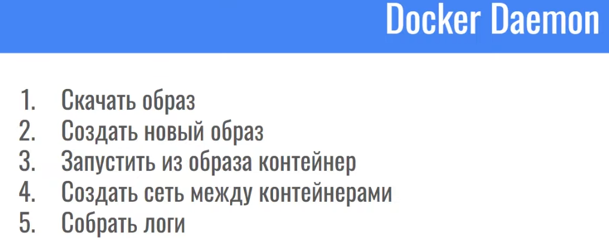
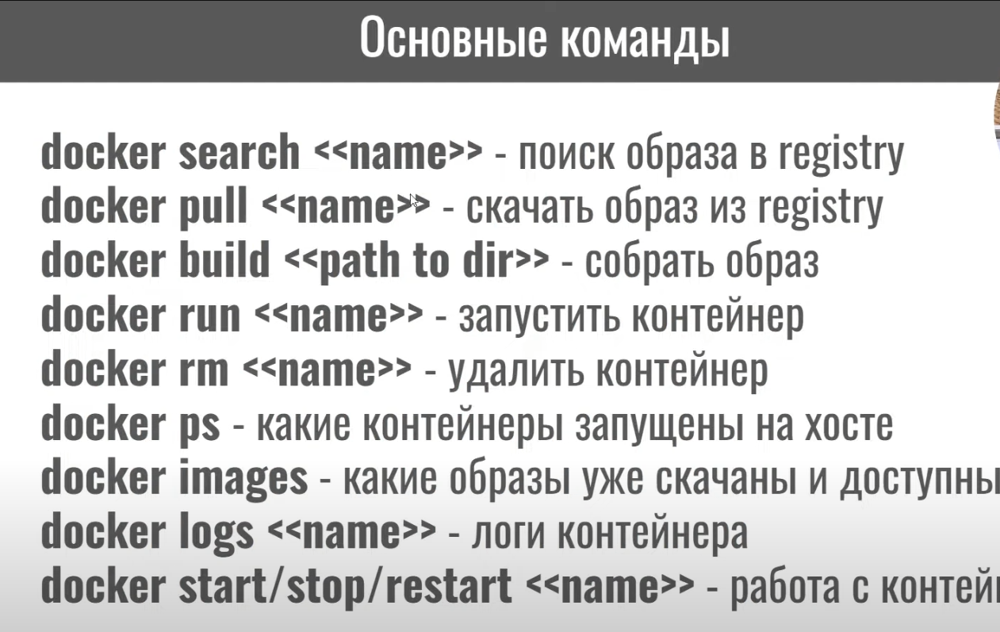
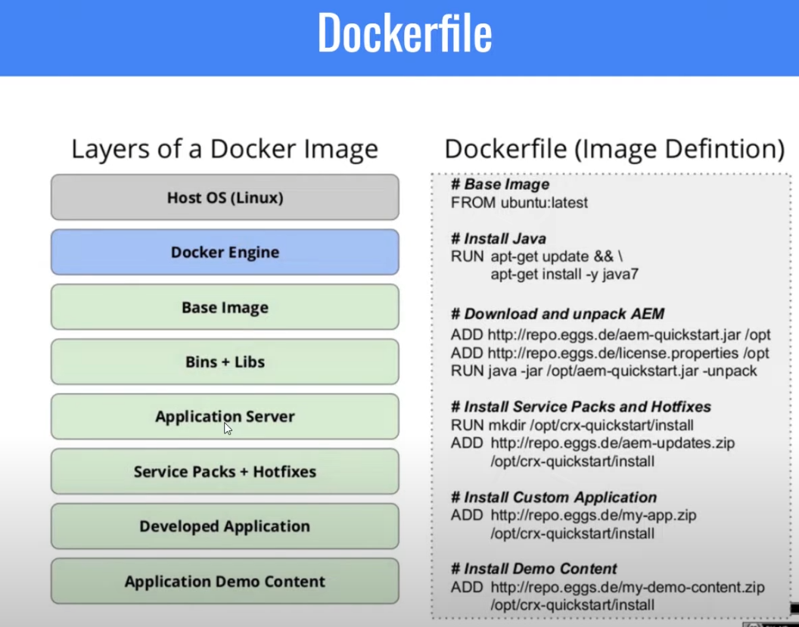
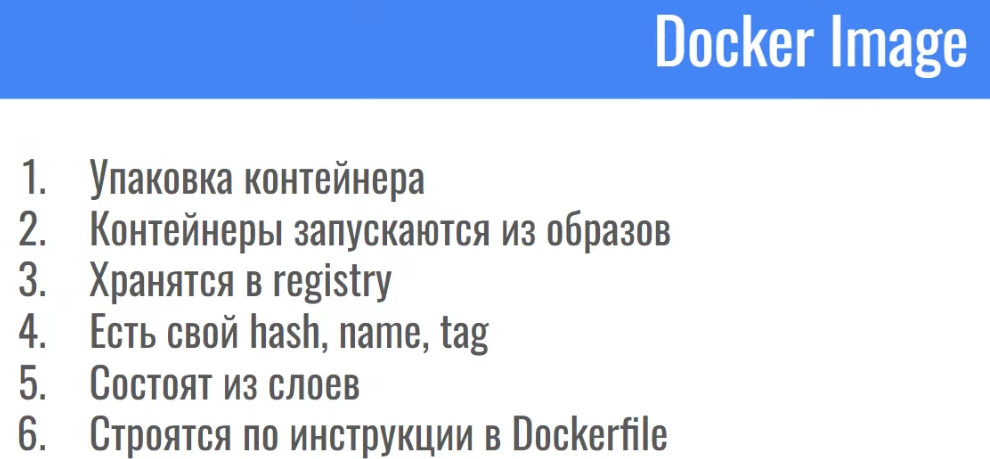
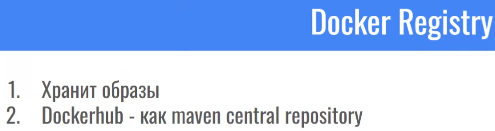
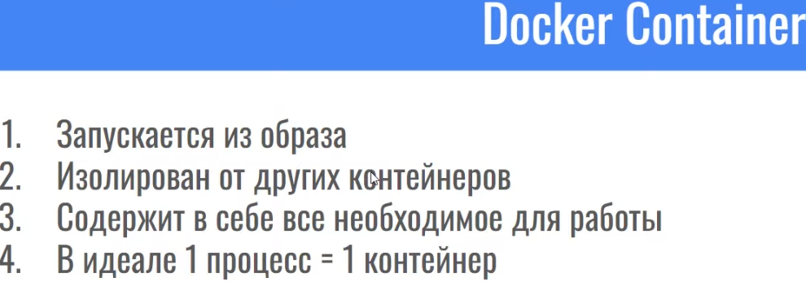

# CICD

[1. CI/CD](#1-cicd)

[2. Как работает Docker. Из чего состоит докер образ?](#2-как-работает-docker-из-чего-состоит-докер-образ)

[3. Что такое слой? Как мы можем создать новый слой?](#3-что-такое-слой-как-мы-можем-создать-новый-слой)

[4. Docker compose](#4-docker-compose)

[5. ARG, ENV. В чем отличия?](#5-arg-env-в-чем-отличия)

[6. Docker cmd vs entrypoint](#6-docker-cmd-vs-entrypoint)

[7. Отличия контейнеризации от виртулизации](#7-отличия-контейнеризации-от-виртулизации)

[8. Поддержка сервиса в продакшене, мониторинг его работы. Общие подходы?](#8-поддержка-сервиса-в-продакшене-мониторинг-его-работы-общие-подходы)

[9. из чего состоит Docker](#9-из-чего-состоит-docker)

[10. Что такое k8](#10-что-такое-k8)

# 1. CI/CD

CI/CD (Continuous Integration / Continuous Delivery) — это набор практик и инструментов для автоматизации интеграции кода и доставки приложений:

+ CI (Continuous Integration): Автоматическое тестирование и интеграция кода в общую ветку. После каждого коммита запускаются тесты, сборка. 
+ CD (Continuous Delivery): Автоматизация процесса доставки приложений на различные среды (dev, staging, production) после успешного тестирования.

[К оглавлению](#CICD)

# 2. Как работает Docker. Из чего состоит докер образ?

Docker — это инструмент, который позволяет упаковывать приложения вместе со всеми их зависимостями в "контейнеры".
Контейнер — это как мини-компьютер внутри основного компьютера, в котором приложение работает отдельно от других программ, не мешая им и не завися от них.

Преимущество в том, что:

Приложение работает одинаково на любом компьютере, где установлен Docker.
Не нужно настраивать окружение вручную.
Удобно запускать, останавливать и переносить приложения.

### Docker-образ состоит из:

+ Базового слоя (например, alpine, ubuntu). 
+ Набора слоёв файловой системы, которые включают установленные пакеты, зависимости и конфигурации. 
+ Манифеста (метаданных) образа, описывающих его слои и зависимости.

[К оглавлению](#CICD)

# 3. Что такое слой? Как мы можем создать новый слой?

Слой — это промежуточный этап, создаваемый при выполнении каждой команды в Dockerfile (RUN, COPY, ADD). Каждый слой является неизменяемым, а Docker использует кэш для уже созданных слоёв.

+ Новый слой создается при выполнении команды в Dockerfile. Например, каждая команда RUN apt-get install ... добавляет новый слой.

[К оглавлению](#CICD)

# 4. Docker compose

Docker Compose — это инструмент для запуска и управления несколькими Docker-контейнерами, описанными в одном файле docker-compose.yml. Он позволяет легко управлять зависимыми сервисами (например, веб-сервер, база данных) в одном окружении.

### Разница между Docker File и Docker Compose

Dockerfile и Docker Compose — это инструменты Docker, но они служат для разных задач:

`Dockerfile`

+ Это файл, где вы описываете, как собрать образ (шаблон) контейнера. 
+ С его помощью можно указать, какие программы устанавливать, какие файлы добавлять и какую команду запускать при старте контейнера. 
+ Применяется для создания одного образа.

Пример:
Вы хотите запустить приложение на Java. В Dockerfile вы указываете, чтобы скачивалась нужная версия JDK, копировался ваш код и запускалось приложение.

`Docker Compose`

+ Это инструмент для управления несколькими контейнерами. Он не создает образы, а работает с уже готовыми. 
+ В файле docker-compose.yml вы описываете, как разные контейнеры будут взаимодействовать: какие порты открыть, какие сети использовать, какие данные хранить. 
+ Применяется для оркестрации нескольких сервисов.

Пример:
Ваше приложение на Java использует базу данных. В Compose вы описываете, чтобы одновременно запускались контейнеры с приложением и с базой данных, а также настраиваете их соединение.

### Ключевая разница:

+ Dockerfile нужен для создания образа одного контейнера. 
+ Docker Compose — для управления и запуска нескольких связанных контейнеров.

[К оглавлению](#CICD)

# 5. ARG, ENV. В чем отличия?

+ ARG: Параметры, которые передаются во время сборки образа. Доступны только во время создания Docker-образа и не сохраняются в контейнере. 
+ ENV: Переменные окружения, которые задаются в контейнере и могут быть использованы приложениями, запущенными в контейнере.

[К оглавлению](#CICD)

# 6. Docker cmd vs entrypoint

+ CMD: Определяет команду по умолчанию, которая выполняется при запуске контейнера. Может быть переопределена при запуске. 
+ ENTRYPOINT: Указывает фиксированную команду, которая всегда будет выполняться. Аргументы могут быть переданы через CMD или командную строку.

[К оглавлению](#CICD)

# 7. Отличия контейнеризации от виртулизации

+ Контейнеризация: Разделение приложений на уровне операционной системы. Контейнеры используют одно ядро ОС и изолируются друг от друга. 
+ Виртуализация: Полная эмуляция аппаратного обеспечения. Каждый виртуальный сервер работает на собственной копии операционной системы.

[К оглавлению](#CICD)

# 8. Поддержка сервиса в продакшене, мониторинг его работы. Общие подходы?

Поддержка сервиса в продакшене включает в себя обеспечение его доступности, производительности и надежности.

### Общие подходы:

`Мониторинг и логирование`:

+ Используйте инструменты мониторинга:
  + Prometheus: Сбор метрик. 
  + Grafana: Визуализация метрик. 
  + ELK Stack (Elasticsearch, Logstash, Kibana): Анализ и хранение логов. 
  + Datadog / New Relic: Для полного мониторинга приложения и инфраструктуры.
+ Настройте логирование:
  + Сохраняйте логи в централизованной системе. 
  + Подключите алерты на аномалии (ошибки, снижение производительности).

`Анализ производительности`:

+ Используйте APM-инструменты (Application Performance Monitoring):
Определение медленных запросов или узких мест.
+ Анализируйте метрики CPU, памяти, I/O, использования сети.

`Управление отказами`:

+ Настройте систему алертов (например, через PagerDuty). 
+ Автоматизируйте перезапуск сервисов с помощью Docker Restart Policies или Kubernetes Deployment Strategies.

`Планы восстановления`:

+ Настройте резервное копирование (базы данных, конфигураций). 
+ Разработайте сценарии восстановления после сбоев.

`Масштабируемость`:

+ Горизонтальное масштабирование с помощью Kubernetes, Docker Swarm или облачных решений (AWS ECS, Azure AKS, Google GKE). 
+ Используйте автоскейлинг для добавления ресурсов в моменты пиковых нагрузок.

`Интеграция CI/CD`:

+ Автоматическое развертывание обновлений с предварительным тестированием. 
+ Настройка этапов отката (rollback) в случае неудачи.

`Health Checks`:

+ Настройте проверки работоспособности сервиса (например, HTTP /health endpoint). 
+ Используйте встроенные механизмы Docker или Kubernetes для мониторинга контейнеров.

### Пример мониторинга сервиса

`Мониторинг метрик`:

+ Настройка Prometheus для сбора данных о запросах, загрузке CPU и использовании памяти. 
+ Визуализация дашбордов в Grafana.

`Логирование`:

+ Логи сервисов собираются через Fluentd или Filebeat и передаются в Elasticsearch.

`Алерты`:

+ Настройка оповещений через Slack или PagerDuty для уведомлений при отказах или аномалиях.

`Проверки здоровья`:

+ Добавление /health endpoint, возвращающего статус 200, если сервис работает корректно.

[К оглавлению](#CICD)

# 9. из чего состоит Docker

Dockerfile - инструкция, как создать образ.

[К оглавлению](#CICD)

# 10. Что такое k8

Kubernetes (сокращённо K8s) — это система (платформа) для автоматического управления (оркестровки) контейнерами, в которых работают приложения (например, в Docker).

Он автоматизирует развертывание, масштабирование, обновление и восстановление приложений.

[К оглавлению](#CICD)