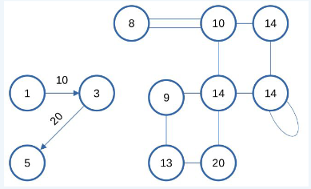
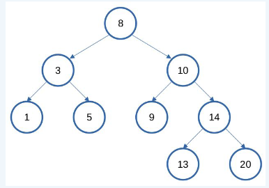
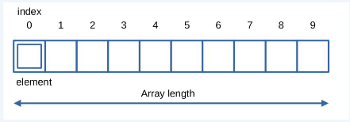
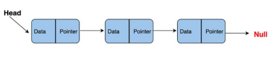
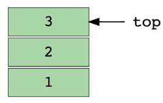
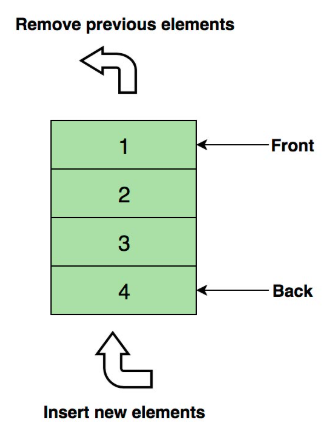
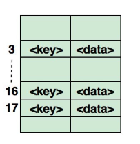
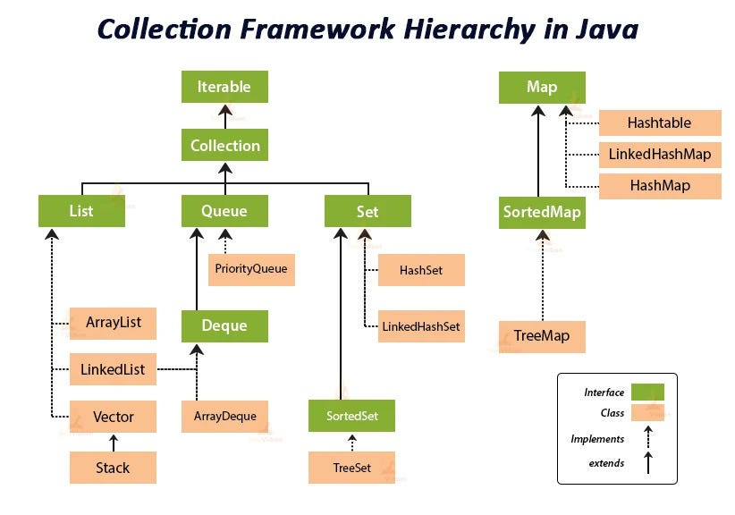
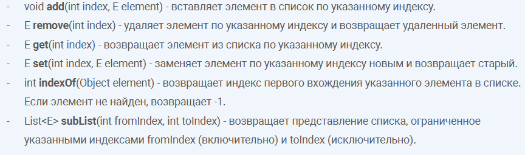

## DataStructuresAndAlgorithms

[1. Что такое структуры данных в программировании? Какие бывают?](#1-что-такое-структуры-данных-в-программировании-какие-бывают)

[2. Что такое Java Collections](#2что-такое-java-collections)

[3. Расскажите про интерфейс Iterable и Iterator](#3-расскажите-про-интерфейс-iterable-и-iterator)

[4. Расскажите про интерфейс List и его реализации](#4-расскажите-про-интерфейс-list-и-его-реализации)

[5. Расскажите про интерфейс Queue](#5-расскажите-про-интерфейс-queue)

[6. Расскажите про интерфейс Deque](#6-расскажите-про-интерфейс-deque)

[7. Расскажите про интерфейс Set и его реализации](#7-расскажите-про-интерфейс-set-и-его-реализации)

[8. Расскажите про интерфейс Map и его реализации](#8-расскажите-про-интерфейс-map-и-его-реализации)

[9. Расскажите про методы Object hashCode и equals?](#9-расскажите-про-методы-object-hashcode-и-equals)

[10. Big O](#10-big-o)

[11. Алгоритмы сортировки и их сложность, какая сортировка используется в java](#11-алгоритмы-сортировки-и-их-сложность-какая-сортировка-используется-в-java)

[12. Алгоритм линейного поиска](#12-алгоритм-линейного-поиска)

[13. Алгоритм бинарного поиска](#13-алгоритм-бинарного-поиска)

[14. Расскажите, что такое коллизии в Map? Как с ними бороться?](#14-расскажите-что-такое-коллизии-в-map-как-с-ними-бороться)

[15. Что такое дженерики. Wildcards. Стирание типов. Как получить инфо о дженерике](#15-что-такое-дженерики-wildcards-стирание-типов-как-получить-инфо-о-дженерике)

# 1. Что такое структуры данных в программировании? Какие бывают?

Структуры данных — это способы организации/хранения/работы с данными, которые
позволяют эффективно выполнять операции над ними (добавление, удаление, поиск, сортировка и т.д.).

#### Какие бывают:

+ Граф - набор объектов(вершин) и их связей (рёбер).



+ Дерево - это иерархическая структура данных, состоящая из узлов (вершин) и ребер (дуг). Деревья по сути связанные
  графы без циклов.



+ Массив - структура данных, хранящая линейную последовательность элементов идентифицируемых по индексу.



+ Связный список – массив, где каждый элемент является отдельным объектом и состоит из двух элементов – данных и ссылки
  на следующий узел.



+ Стек — абстрактный тип данных, представляющий собой список элементов, организованных по принципу LIFO (англ. last in —
  first out, «последним пришёл — первым вышел»).



+ Очередь - абстрактный тип данных, представляющий собой список элементов, организованных по принципу FIFO  (англ. First
  in First Out, «последним пришёл — первым вышел»).



+ Хэш таблица - структура данных, в которой все элементы хранятся в виде пары ключ - значение.



[К оглавлению](#DataStructuresAndAlgorithms)

# 2.Что такое Java Collections

Это набор интерфейсов и классов в Java для хранения и управления группами объектов (данных). Это часть
стандартной библиотеки (java.util.*), которая упрощает работу с данными, предоставляя готовые реализации популярных
структур данных. Нельзя хранить примитивные типы.



Главным набором методов, который важен при рассмотрении любой коллекции является набор CRUD-операций (create, read,
update, delete). На уровне Collection не существует способа обновить запись в коллекции

+ `add(Object o)` - добавляет элемент в коллекцию.
+ `iterator()` - возвращает итератор для перебора элементов коллекции.
+ `remove(Object o)` - удаляет элемент из коллекции.
+ `contains(Object o)` - проверяет, есть ли элемент в коллекции.
+ `size()` - возвращает количество элементов в коллекции.
+ `clear()` - очищает коллекцию (удаляет все элементы).
+ `toArray()` - возвращает массив, содержащий все элементы коллекции

[К оглавлению](#DataStructuresAndAlgorithms)

# 3. Расскажите про интерфейс Iterable и Iterator

+ Iterable корневой интерфейс всех классов коллекций. У интерфейса Iterable определен только один метод iterator().
  Класс, реализующий Iterable, может быть использован в улучшенном
  цикле for-each.
+ Iterator - интерфейс, который предоставляет методы для последовательного доступа к элементам коллекции.
    + `boolean hasNext()` - вернет true, сли в коллекции есть следующий элемент, который можно извлечь методом `next()`
    + `E next()` - вернет следующий элемент из коллекции.
    + `void remove()` - удалит текущий элемент, может быть вызван только после метода `next()`

#### Виды итераторов.

+ `Fail-fast` итераторы бросают исключение `ConcurrentModificationException`, если коллекция модифицируется (добавление,
  удаление, изменение элементов) в процессе итерации любым способом, кроме использования методов самого итератора (
  например, remove() у итератора).

Как работает `fail-fast` механизм: Итераторы `fail-fast` проверяют "структурные модификации" коллекции при каждом вызове
метода, такого как `next()` или `remove()`. Внутри коллекции есть счетчик модификаций (modification count), который
увеличивается при структурных изменениях. Итератор сохраняет значение этого счетчика на момент своего создания и
сравнивает его с текущим значением при каждой операции. Если значения не совпадают (например, элемент был добавлен или
удален через саму коллекцию, а не через итератор), то генерируется `ConcurrentModificationException`.

+ `Fail-safe` итераторы не бросают исключение при модификации коллекции во время итерации. Вместо этого они работают с
  копией данных коллекции, что позволяет избежать конфликтов.

Как работает `fail-safe` механизм: `Fail-safe` итераторы работают с клоном коллекции. Это означает, что любые изменения,
внесенные в коллекцию после создания итератора, не видны итератору. Такие итераторы обеспечивают безопасный доступ, но
изменения в коллекции не отражаются на итераторе.

[К оглавлению](#DataStructuresAndAlgorithms)

# 4. Расскажите про интерфейс List и его реализации

Представляет упорядоченную коллекцию объектов, которая может содержать дублирующиеся элементы. Поддерживает доступ по
индексу(элементы списка можно напрямую получать, добавлять, изменять или удалять, используя индекс, который представляет
позицию элемента в списке.)



#### Реализации.

+ `ArrayList` - реализаций интерфейса List, основанная на динамическом массиве, который автоматически расширяется при
  добавлении элементов. Позволяет хранить любые данные, включая null в качестве элемента. Хранит элементы в массиве
  elementData (тип зависит от generic-параметра E). Размер списка отслеживается полем size. При превышении текущей
  ёмкости массив пересоздаётся с увеличенным размером.
    + Быстрый доступ по индексу (O(1)) — благодаря работе с массивом.
    + Медленная вставка/удаление в середину списка (O(n)) — из-за необходимости сдвигать элементы.

#### Процесс добавления элемента в ArrayList, когда список заполнен:

1) Размер нового массива вычисляется по формуле : `новый_размер = (старый_размер * 1.5) + 1`

2) Все элементы из старого массива копируются в новый массив. Индексы элементов сохраняются.

3) Ссылка на старый массив (elementData) заменяется ссылкой на новый массив. Старый массив помечается для удаления
   сборщиком мусора (GC).

#### Удаление из середины списка:

1) Находим элемент.
2) Удаляем элемент из середины.
3) Все элементы массива перемещаются на одну ячейку влево.

+ `LinkedList` - Позволяет хранить любые данные, включая null. Особенностью реализации данной коллекции является то, что
  в
  её основе лежит двунаправленный связный список (каждый элемент имеет ссылку на предыдущий и следующий). Благодаря
  этому,
  добавление и удаление из середины, доступ по индексу, значению происходит за линейное время O(n), а из начала и конца
  за
  константное O(1).
    + Быстрое добавление элементов в конец и начало списка. Просто меняем ссылки. Если известна позиция узла -
      эффективная вставка\удаление в середину списка.
    + Медленный доступ по индексу — O(n). Требуется последовательный обход узлов от начала или конца.
+ `Vector` - реализация динамического массива объектов. Позволяет хранить любые данные, включая null в качестве
  элемента.
  Vector появился в JDK версии Java 1.0, использовать если требуется достижения потокобезопасности.
+ `Stack` - Позволяет хранить любые данные, включая null. Особенностью реализации данной коллекции является то, что в её
  основе лежит двунаправленный связный список (каждый элемент имеет ссылку на предыдущий и следующий). Благодаря этому,
  добавление и удаление из середины, доступ по индексу, значению происходит за линейное время O(n), а из начала и конца
  за
  константное O(1). Так же, ввиду реализации, данную коллекцию можно использовать как стек или очередь.

[К оглавлению](#DataStructuresAndAlgorithms)

# 5. Расскажите про интерфейс Queue

Queue (очередь) — это коллекция, работающая по принципу FIFO (First-In-First-Out), где элементы добавляются в конец и
удаляются из начала.

+ `add(E element)` Добавляет элемент в конец очереди. IllegalStateException (если очередь заполнена).
+ `offer(E element)` Добавляет элемент в конец очереди. Возвращает false при переполнении.
+ `remove()` Удаляет и возвращает элемент из начала очереди. NoSuchElementException (если пуста).
+ `poll()` Удаляет и возвращает элемент из начала очереди. Возвращает null при пустой очереди.
+ `element()` Возвращает элемент из начала очереди без удаления. NoSuchElementException (если пуста).
+ `peek()` Возвращает элемент из начала очереди без удаления. Возвращает null при пустой очереди.

Популярные реализации:

+ `LinkedList` — базовая реализация (неограниченная очередь).
+ `ArrayBlockingQueue` — очередь с фиксированным размером и блокировками.
+ `PriorityQueue` — очередь с приоритетом (не FIFO!).

[К оглавлению](#DataStructuresAndAlgorithms)

# 6. Расскажите про интерфейс Deque

`Deque` (Double Ended Queue - двусторонняя очередь) - это коллекция, расширяющая интерфейс Queue, которая позволяет
добавлять, удалять и получать элементы как с начала, так и с конца очереди.

`void addFirst(E element)` Добавляет элемент в начало очереди. IllegalStateException при переполнении
`void addLast(E element)` Добавляет элемент в конец очереди. IllegalStateException при переполнении
`boolean offerFirst(E e)` Добавляет элемент в начало очереди. Возвращает false при переполнении
`boolean offerLast(E e)` Добавляет элемент в конец очереди. Возвращает false при переполнении
`E removeFirst()` Удаляет и возвращает первый элемент. NoSuchElementException если пуста
`E removeLast()` Удаляет и возвращает последний элемент. NoSuchElementException если пуста
`E pollFirst()` Удаляет и возвращает первый элемент. Возвращает null если пуста
`E pollLast()` Удаляет и возвращает последний элемент. Возвращает null если пуста
`E getFirst()` Возвращает первый элемент без удаления. NoSuchElementException если пуста
`E getLast()` Возвращает последний элемент без удаления. NoSuchElementException если пуста
`E peekFirst()` Возвращает первый элемент без удаления. Возвращает null если пуста
`E peekLast()` Возвращает последний элемент без удаления. Возвращает null если пуста

Популярные реализации:

+ `ArrayDeque` - реализация на основе массива
+ `LinkedList` - реализация на основе связного списка

[К оглавлению](#DataStructuresAndAlgorithms)

# 7. Расскажите про интерфейс Set и его реализации

Интерфейс Set определяет множество (набор). Set расширяет Collection и определяет поведение коллекции, не допускающей
дублирования элементов, уникальность которых определяется методом equals().

+ `boolean add(E element)` — добавляет элемент, если элемент уже присутствует, возвращает false.
+ `boolean remove(Object element)` — удаляет указанный элемент из множества, если он присутствует. Возвращает true, если
  элемент был удален, и false в противном случае.
+ `boolean contains(Object element)` — проверяет, содержит ли множество указанный элемент. Возвращает true, если элемент
  присутствует, и false в противном случае.
+ `boolean isEmpty()` — проверяет, является ли множество пустым. Возвращает true, если множество не содержит элементов,
  и
  false в противном случае.
+ `boolean addAll/removeAll(Collection<?> elements)` — добавляет/удаляет элементы из указанной коллекции в/из множества.
  Возвращает true, если множество изменилось в результате вызова метода.

#### Реализации:

+ `HashSet` — реализация Set на основе хэш-таблицы. Элементы в HashSet не упорядочены и могут быть доступны в
  произвольном
  порядке. HashSet позволяет хранить null элементы. Особенности:
    + выгода от хеширования состоит в том, что оно обеспечивает постоянное время выполнения операций add(), contains(),
      remove() и size(), даже для больших наборов.
    + класс HashSet не гарантирует упорядоченность элементов, поскольку процесс хеширования сам по себе обычно не
      приводит к созданию отсортированных множеств.
    + под капотом HashSet находится HashMap, а сама структура HashSet — это набор ключей HashMap.
+ `TreeSet` — реализация Set на основе сбалансированного дерева (обычно красно-черного дерева). Элементы в TreeSet
  хранятся в отсортированном порядке по их естественному порядку или с использованием заданного компаратора.
+ `LinkedHashSet` — реализация Set, которая объединяет хэш-таблицы с двусвязным списком. Элементы в LinkedHashSet
  упорядочены в порядке их вставки.

[К оглавлению](#DataStructuresAndAlgorithms)

# 8. Расскажите про интерфейс Map и его реализации

Ассоциативный массив, хранит пары “ключ-значение”. Ключ-уникальный, значение-может повторяться. Уникальность ключей
определяется методом equals(), поэтому предпочтительно использовать immutable(неизменяемые) - класс, экземпляры которого
не могут быть изменены после создания(например String).
Потому что, если изменить объект на котором основан ключ, то у него поменяется хеш-код найти элемент в HashMap-е не
получится. Для корректной работы необходимо переопределить методы equals() и hashCode() Каждая
ячейка массива - бакет(корзина), хранящий в себе односвязный список узлов. Может содержать
один ключ null и любое количество значений null. Не отсортирован и не упорядочен. Возможны коллизии - возникают, когда у
разных объектов одинаковые хеш-коды. Если у односвязного списка node больше 8 элементов (коллизии),
он превращается в красно-чёрное дерево, обратно - если количество элементов в бакете уменьшилось до 6.

+ `V put(K key, V value)` Добавляет пару "ключ-значение" в Map. Если ключ уже существует, заменяет старое значение на
  новое и возвращает старое значение.
+ `V get(Object key)` Возвращает значение, связанное с указанным ключом. Если ключ не найден, возвращает null.
+ `boolean containsKey(Object key)` Проверяет, содержит ли Map указанный ключ. Возвращает true, если ключ существует, и
  false в противном случае.
+ `boolean containsValue(Object value)` Проверяет, содержит ли Map указанное значение. Возвращает true, если значение
  существует, и false в противном случае.
+ `V remove(Object key)` Удаляет пару "ключ-значение" по ключу. Возвращает значение, которое было связано с удаленным
  ключом, или null, если ключ не найден.
+ `void clear()` Очищает Map, удаляя все элементы.
+ `int size()` Возвращает количество пар "ключ-значение" в Map.
+ `boolean isEmpty()` Проверяет, пуст ли Map. Возвращает true, если Map не содержит элементов, и false в противном
  случае.
+ `Set<K> keySet()` Возвращает Set, содержащий все ключи в Map.
+ `Collection<V> values()` Возвращает коллекцию значений, содержащихся в Map.
+ `Set<Map.Entry<K, V>> entrySet()` Возвращает набор (Set) всех записей (пар "ключ-значение") в Map.

#### Сложность операций:

+ Добавление (put) O(1), худшая O(n)
+ Удаление (remove) O(1), худшая O(n)
+ Поиск (get) O(1), худшая O(n)
+ Проверка наличия (containsKey / containsValue) O(1) / O(n) , худшая O(n)
+ Итерация по элементам O(n), худшая O(n)

#### Устройство HashMap

В HashMap бакет — это элемент массива, в котором хранятся записи (ключ-значение). Если у нескольких ключей совпадает
хеш, их записи попадают в один бакет, где организуются в виде связного списка или сбалансированного дерева (в
зависимости от Java версии). Изначально создается 16 бакетов. Если массив бакетов заполнен на 75 процентов - создается
х2 от начального размера.

Чтобы определить номер бакета есть формула: `bucketIndex = (hash & (capacity - 1))`; Операция побитового & (AND)
используется вместо %, так как она быстрее и эффективнее для степеней двойки.

`hash` — хэш-код ключа, который возвращает метод key.hashCode().
`capacity` — текущая ёмкость таблицы (всегда степень двойки, например, 16, 32).
`bucketIndex` — индекс бакета, в котором будет храниться элемент.
`loadFactor` - это коэффициент загрузки, на основании его значения вычисляется предельное количество занятых бакетов.
При
достижении порогового значения размер коллекции увеличивается.

#### Как работает HashMap

1) Добавление элемента (put)

Метод hashCode() ключа вычисляет целочисленный хэш-код. Если бакет пуст, элемент добавляется напрямую. Если бакет уже
содержит элементы (коллизия), происходит:

+ идем по ключам элементов связного списка (или TreeMap) и сравниваем с ключом добавляемого элемента по хеш-коду и
  equals()
+ если ключи равны — перезаписываем значение по этому ключу, если нет — переходим к следующему элементу
+ если не нашли ключ добавляемого элемента (равный и по хеш-коду, и по equals()) — добавляем этот элемент в конец
  связного
  списка (или в TreeMap)

2) Поиск элемента (get)

+ Вычисляется хэш-код ключа, который преобразуется в индекс массива.
+ В указанном бакете ищется ключ, используя метод equals().
    + Если ключ найден, возвращается значение.
    + Если ключ отсутствует, возвращается null.

3) Удаление элемента (remove)

+ Вычисляется индекс бакета для удаления. Поиск ключа с помощью метода equals()

+ Если элемент найден:
    + Удаляется узел.
    + Ссылки обновляются (если использовался связный список).

#### Какова роль equals() и hashCode() в HashMap?

hashCode позволяет определить корзину для поиска элемента, а equals используется для сравнения ключей элементов в списке
корзины и искомого ключа.

[К оглавлению](#DataStructuresAndAlgorithms)

# 9. Расскажите про методы Object hashCode и equals?

Методы, необходимые для определения равенства объектов.
Метод `hashCode()` используется для числового представления объекта, метод `equals()` для сравнения двух объектов.
HashCode() и equals() взаимосвязаны, используются для определения равенства между объектами.

Сначала вычисляется hashCode() объектов, тк эта операция быстрее equals(). Если hashCode равны, то начинается проверка
на equals.
Если hashCode не равны, то дальнейшая проверка на равенство не проводится.

#### Контракт equals + hashcode:

+ Если hashCode() двух объектов возвращает разные значения, то они не могут быть равны
+ Если equals() объектов true, то и хеш-коды должны быть равны
+ Переопределив equals(), всегда переопределять hashCode()
+ Если у объектов одинаковый hashCode(), то они не обязательно equals()
+ При каждом вызове hashCode() для одного и того же объекта должен возвращаться один и тот же хеш-код

#### Свойства equals

- Сравниваемые объекты должны быть одного типа (instanceof())
- Рефлексивность. Объект должен быть равен самому себе (x.equals(x) == true)
- Симметричность. если объект a равен объекту b, то b должен быть равен a. (x.equals(y) == true и y.equals(x) == true)
- Транзитивность. если a равен b, а b равен c, то и a должен быть равен c. (x.equals(y) == true и y.equals(z) == true и x.equals(z) == true)
- Непротиворечивость. результат сравнения объектов не должен изменяться в течение их жизни.
- Для любой ненулевой ссылки на значение х выражение х.equals(null) должно возвращать false

### Свойства hashCode():

+ Согласованность. При каждом вызове hashCode() для одного и того же объекта в рамках одной программы должно
  возвращаться одно и то же значение, если поля объекта, участвующие в расчете хеш-кода, не изменились
+ Равенство и хеш-код. Если два объекта равны по методу equals(), их хеш-коды тоже должны быть равны. Однако обратное не
  обязательно — объекты с одинаковым хеш-кодом могут быть не равны
+ Распределение. Реализация hashCode(), возвращающая разный хеш-код для неравных объектов позволяет увеличить
  эффективность работы с хеш-структурами данных (такими как HashMap или HashSet) за счёт распределения объектов по
  разным корзинам хеш-таблицы

### Что будет, если переопределить equals() не переопределяя hashCode()?

+ Объект, который по equals() равен существующему ключу в HashMap, может не быть найден, если их хеш-коды различаются.
  Это связано с тем, что HashMap сначала использует hashCode() для поиска корзины, а уже потом сравнивает объекты по
  equals().
+ При попытке удалить ключ, который равен другому ключу по equals(), но имеет другой hashCode(), удаление может не
  сработать.

[К оглавлению](#DataStructuresAndAlgorithms)

# 10. Big O

Анализ алгоритма дает нам понимание того, сколько времени займет решение данной задачи при помощи данного алгоритма.
Эффективность алгоритма оценивается его временной сложностью. Временная сложность алгоритма – это функция, позволяющая
определить, как быстро увеличивается время работы алгоритма с увеличением объёма данных. Наиболее часто встречающиеся
классы сложности:

+ O(1) – константная сложность (т.е. константное время);
+ О(n) – линейная сложность;
+ О(log(n)) – логарифмическая сложность;
+ O(n*log(n)) – квазилинейная сложность;
+ O(2n) – экспоненциальная сложность;
+ O(n!) – факториальная сложность.


1. ArrayList (на основе массива)

- Добавление: в конец — амортизированное O(1). Когда массив заполняется, он увеличивается в размере, что требует O(
  n) времени на копирование всех элементов в новый массив.
- Замена: O(1), так как доступ к элементам по индексу осуществляется за константное время.
- Удаление: O(n), так как после удаления элемента все последующие элементы нужно сдвинуть влево.

2. LinkedList (двусвязный список)

- Добавление: В начало или конец — O(1), поскольку требуется изменить только несколько ссылок. В середину — O(n),
  так как нужно сначала найти позицию (линейный обход).
- Замена: O(n), так как нужно сначала найти элемент.
- Удаление: с начала или конца — O(1). В середине — O(n), так как требуется линейный обход до элемента.

3. HashMap (хэш-таблица)

- Добавление/замена: O(1) в среднем, но O(n) в худшем случае при большом количестве коллизий.
- Удаление: O(1) в среднем, но O(n) в худшем случае (опять же из-за коллизий).

4. TreeMap (на основе красно-черного дерева)

- Добавление/замена: O(log n), так как элементы хранятся упорядоченно, и операция требует поиска правильного места.
- Удаление: O(log n), так как удаление требует перестройки дерева.

#### С чем связаны отличия?

- Коллекции используют разные структуры данных, например, массивы, списки, деревья, хэш-таблицы. Это напрямую влияет на
  сложность операций.
- Методы управления памятью: Например, ArrayList использует массивы, которые иногда требуют расширения и копирования,
  что увеличивает сложность операций.
- Необходимость перемещения данных: В ArrayList при удалении требуется перемещать элементы, тогда как в LinkedList
  достаточно изменить ссылки.
- Алгоритмы поиска и вставки: В деревьях и хэш-таблицах используются разные подходы для поиска и вставки, которые
  определяют временные характеристики.

[К оглавлению](#DataStructuresAndAlgorithms)

# 11. Алгоритмы сортировки и их сложность, какая сортировка используется в java

1) Сортировка пузырьком (Bubble Sort): Простой, но неэффективный метод сортировки. В каждом проходе он сравнивает
   соседние
   элементы и меняет их местами, если они в неправильном порядке. Процесс повторяется, пока все элементы не окажутся в
   нужном порядке.

+ В худшем и среднем случае: O(n²)
+ В лучшем случае (если список уже отсортирован): O(n)

2) Сортировка вставками (Insertion Sort): Проходит по списку, вставляя каждый элемент в правильную позицию в уже
   отсортированную часть списка. Эффективен для небольших или почти отсортированных данных.

+ В худшем и среднем случае: O(n²)
+ В лучшем случае (если список уже отсортирован): O(n)

3) Сортировка выбором (Selection Sort): Находит минимальный (или максимальный) элемент в списке и меняет его местами с
   первым элементом. Затем повторяет процесс для оставшейся части списка.

+ В худшем и среднем случае: O(n²)

4) Сортировка слиянием (Merge Sort): Разделяет массив пополам и рекурсивно сортирует каждую половину, затем соединяет их
   обратно в отсортированный массив.

+ В худшем, среднем и лучшем случае: O(n log n)

5) Быстрая сортировка (Quick Sort): Выбирается опорный элемент, массив разделяется на элементы, меньшие и большие
   опорного,
   затем процесс рекурсивно повторяется для каждой из частей.

+ В худшем случае: O(n²) (когда выбор опорного элемента неудачный)
+ В среднем случае: O(n log n)

В java для сортировки используется Timsort, для примитивных типов Dual-Pivot Quick Sort.

+ Dual-Pivot Quick Sort — сортировки, который используется в Java для примитивных
  типов. Он быстрее классического Quick Sort благодаря использованию двух опорных элементов и более эффективному
  разделению массива.(массив делится на 3 части, а у быстрой сортировки на 2)

+ Timsort — это гибридный алгоритм сортировки, который сочетает в себе идеи сортировки вставками (Insertion Sort) и
  сортировки слиянием (Merge Sort).
    + Использует сортировку вставками для небольших подмассивов (так как она эффективна для малых данных).
    + Использует сортировку слиянием для объединения отсортированных подмассивов (так как она эффективна для больших
      данных
      и устойчива).

[К оглавлению](#DataStructuresAndAlgorithms)

# 12. Алгоритм линейного поиска

Линейный поиск — это самый простой способ найти элемент в списке. В этом алгоритме мы начинаем с первого элемента списка
и проверяем каждый элемент по очереди, пока не найдем нужный. Если элемент найден, мы возвращаем его индекс; если мы
прошли весь список, а элемента нет, то возвращаем информацию, что элемент не найден.
Этот алгоритм работает за время O(n), где n — количество элементов в массиве, потому что мы проверяем каждый элемент
один за другим.

#### Реализация

+ Мы проходим по каждому элементу в массиве (или списке).
+ Для каждого элемента сравниваем его с тем, который ищем.
+ Если находим нужный элемент, возвращаем его индекс.
+ Если элемент не найден, возвращаем -1 или другое значение, означающее, что элемент не найден.

```java
public class LinearSearch {
    // Метод для выполнения линейного поиска
    public static int linearSearch(int[] arr, int target) {
        // Проходим по каждому элементу массива
        for (int i = 0; i < arr.length; i++) {
            // Если нашли нужный элемент
            if (arr[i] == target) {
                return i;  // Возвращаем индекс найденного элемента
            }
        }
        return -1;  // Если не нашли элемент, возвращаем -1
    }
}

```

[К оглавлению](#DataStructuresAndAlgorithms)

# 13. Алгоритм бинарного поиска

Бинарный поиск — это эффективный алгоритм поиска элемента в отсортированном списке. Вместо того, чтобы проверять каждый
элемент по очереди, как в линейном поиске, бинарный поиск «делит» список пополам на каждом шаге, сокращая количество
элементов, среди которых нужно искать, вдвое. Это позволяет значительно ускорить поиск, особенно в больших списках.
Массив должен быть отсортированным. Без этого бинарный поиск не будет работать корректно. Время работы бинарного
поиска — O(log n), где n — количество элементов в списке.

#### Реализация:

+ Сначала мы определяем элемент в середине списка.
+ Если этот элемент — искомый, мы нашли его и возвращаем индекс.
+ Если искомое значение меньше текущего элемента, мы будем искать в левой половине списка.
+ Если искомое значение больше текущего элемента, мы будем искать в правой половине списка.
+ Мы продолжаем делить список пополам, пока не найдем искомый элемент или не определим, что его нет в списке.

```java
public class BinarySearch {
    // Метод бинарного поиска
    public static int binarySearch(int[] arr, int target) {
        for (int left = 0, right = arr.length - 1; left <= right; ) {
            int middle = (left + right) / 2;  // Индекс середины

            // Если найден элемент
            if (arr[middle] == target) {
                return middle;  // Возвращаем индекс элемента
            }
            // Если искомое число меньше среднего элемента
            else if (arr[middle] > target) {
                right = middle - 1;  // Ищем в левой половине
            }
            // Если искомое число больше среднего элемента
            else {
                left = middle + 1;  // Ищем в правой половине
            }
        }
        return -1;  // Если элемент не найден
    }
}

```

[К оглавлению](#DataStructuresAndAlgorithms)

# 14. Расскажите, что такое коллизии в Map? Как с ними бороться?                                           

Коллизии в Map возникают, когда несколько различных ключей имеют один и тот же хеш-код. В таких ситуациях разные ключи
оказываются в одном и том же "бакете" в хеш-таблице.

### Почему возникают коллизии?

Когда вы добавляете ключ в HashMap, Java использует метод hashCode() для вычисления хеш-кода этого ключа. Хеш-код — это
число, которое указывает на определённый "бакет" в хеш-таблице, где должен храниться этот ключ. Однако:

+ Хеш-код имеет ограниченный диапазон значений.
+ Количество возможных ключей практически не ограничено.
+ В результате разные ключи могут иметь одинаковые хеш-коды, что приводит к коллизии.

Бакеты (buckets) в HashMap — это элементы внутреннего массива, который используется для хранения данных. Каждый бакет
может содержать одну или несколько пар "ключ-значение".

### Как борятся с коллизиями в HashMap?

+ Цепочки (Chaining):
  Если два ключа попадают в один и тот же "бакет", HashMap создаёт связный список в этом бакете.
  Новые элементы с тем же хеш-кодом добавляются в этот список.
  При доступе к элементам с коллизиями HashMap последовательно проверяет каждый элемент в списке, пока не найдёт нужный
  ключ.
+ Красно-чёрные деревья (с Java 8):Если количество элементов в одном "бакете" (цепочке) превышает определённый порог (
  по умолчанию 8), HashMap начинает использовать красно-чёрное дерево вместо связного списка.
  Это позволяет улучшить производительность поиска, вставки и удаления с O(n) до O(log n) в случае большого количества
  коллизий.
+ Качественная реализация метода hashCode():
  Хороший hashCode() должен распределять ключи равномерно по всем возможным бакетам.
  Избегайте тривиальных реализаций (например, всегда возвращать одно и то же значение).
  Используйте стандартные подходы для вычисления hashCode():
  Для числовых типов: используйте прямые числовые операции.
  Для объектов: комбинируйте hashCode() всех полей, используя простые арифметические операции (например, умножение на
  простое число).

```java

@Override
public int hashCode() {
    int result = 17;
    result = 31 * result + (field1 != null ? field1.hashCode() : 0);
    result = 31 * result + (field2 != null ? field2.hashCode() : 0);
    return result;
}
```

+ Правильная реализация метода equals():
  Ключи в HashMap сравниваются не только по хеш-коду, но и с помощью метода equals().
  Если два ключа имеют одинаковый хеш-код, HashMap использует equals() для окончательной проверки их равенства.
  Убедитесь, что equals() корректно сравнивает все важные поля.
+ Использование достаточного размера таблицы:
  Если таблица слишком мала, вероятность коллизий возрастает.
  HashMap автоматически увеличивает размер таблицы при превышении определённой заполненности (по умолчанию это 0.75 от
  общего размера).
  Чтобы уменьшить коллизии, можно задать начальный размер HashMap, если известно, что она будет хранить много элементов.
+ Использование альтернативных структур данных:
  В некоторых случаях HashMap может не подходить, если коллизий слишком много или важно обеспечить упорядоченность
  ключей.
  Рассмотрите возможность использования:
  TreeMap — хранит элементы отсортированными по ключам.
  LinkedHashMap — сохраняет порядок вставки ключей.
  ConcurrentHashMap — потокобезопасная альтернатива HashMap, оптимизированная для многопоточности.

[К оглавлению](#DataStructuresAndAlgorithms)

# 15. Что такое дженерики. Wildcards. Стирание типов. Как получить инфо о дженерике  

Дженерики это запись, заключенная в скобки `<>`, Они позволяют указать тип элементов,
которые могут храниться в коллекции(типовые параметры(T, E, V, K и тд), классы и интерфейсы, обертки для примитивных
типов), в такую коллекцию можно добавить только
объекты, являющиеся экземплярами класса указанного в угловых скобках. Например, если в угловых скобках указан тип
String, то в коллекцию можно добавить только элементы являющиеся экземпляром класса String, при попытке добавить
экземпляр другого класса - мы получим ошибку компиляции

Дженерики в Java были добавлены в версии 1.5 и активно используются в коллекциях. До появления дженериков все коллекции
работали с типом Object, и при извлечении элементов приходилось выполнять приведение
типов (down-cast) от Object к нужному типу. Если приведение было невозможно, возникала ошибка ClassCastException.
Дженерики устраняют эту проблему, обеспечивая безопастность добавляемых типов на этапе компиляции.

Информация о Generics в Java доступна на этапе компиляции, но не сохраняется в явном виде в скомпилированном байт-коде.
Этот механизм называется Type Erasure (стирание типов).
Type Erasure — это процесс, при котором информация о параметрах типов дженериков удаляется во время компиляции, и
компилятор заменяет их на сырой(например Object) или на ограниченный тип, если были установлены ограничения.

Это означает, что во время выполнения JVM не знает, с каким конкретным типом работает параметризованный класс.
Все типовые параметры заменяются на Object или на верхнюю границу, если такая установлена.

### Почему используется Type Erasure?
Type Erasure применяется для того, чтобы обеспечить обратную совместимость с кодом, написанным до появления дженериков (
до Java 5). Это позволяет использовать новые параметры типов в старом коде, который уже был скомпилирован без поддержки
дженериков.

```java
Пример до и после компиляции

public class Box<T> {
  private T value;

  public void setValue(T value) {
    this.value = value;
  }

  public T getValue() {
    return value;
  }
}

public class Box {
  private Object value;  // T заменён на Object

  public void setValue(Object value) {
    this.value = value;
  }

  public Object getValue() {
    return value;
  }
}
```
Таким образом, вся информация о параметрах типа T стирается, и они заменяются типом Object (или на ограничение, если оно задано, например, Number).

### Почему нельзя получить тип дженериков напрямую?
Из-за стирания типов (type erasure) информация о дженериках удаляется на этапе компиляции. Например, после компиляции
код `List<String>` становится просто `List`, и тип `String` теряется. Это сделано для обратной совместимости с кодом,
написанным до Java 5 (когда дженериков не было).

Если обобщённый тип задан в классе или интерфейсе как параметризованный тип, вы можете получить информацию о нём с
помощью рефлексии. Рефлексия (Reflection) в Java — это механизм, который позволяет программе во время выполнения
получать информацию о своей структуре и манипулировать объектами, классами, методами и полями. Это мощный инструмент,
который дает возможность динамически анализировать и изменять поведение программы, даже если во время компиляции
информация о классах или методах недоступна.

````java
public class GenericTypeDemo<T> {
    public static void main(String[] args) {
        // создается анонимный класс на основе обобщенного класса GenericTypeDemo<String>
        GenericTypeDemo<String> instance = new GenericTypeDemo<String>() {
        };
        // С помощью рефлексии извлекается информация о типе обобщения
        // getClass() возвращает класс анонимного объекта
        // getGenericSuperclass() возвращает обобщенный суперкласс анонимного класса
        Type superclass = instance.getClass().getGenericSuperclass();
        // Проверяется, является ли суперкласс параметризованным типом
        if (superclass instanceof ParameterizedType) {
            ParameterizedType parameterizedType = (ParameterizedType) superclass;
            Type[] typeArguments = parameterizedType.getActualTypeArguments();
            for (Type typeArgument : typeArguments) {
                System.out.println("Тип обобщения: " + typeArgument);
            }
        }
    }

Анонимный класс используется для "захвата" информации о типе обобщения (String),
так как в Java информация о дженериках стирается во время выполнения (type erasure),
но анонимные классы сохраняют эту информацию в своем genericSuperclass.
````

####  Wildcards 
В Java используются в обобщениях для обозначения неизвестного типа. Это удобно, когда вы хотите работать с
различными типами данных, но не хотите жёстко задавать конкретный тип. Wildcards представляются символом вопросительного
знака (?). Используется, когда тип данных может быть абсолютно любым. Не используйте wildcard, если нужно производить
и запись, и чтение, потому что компилятор не может определить, какой тип данных безопасен для добавления.

````java
List<?> list = new ArrayList<>();
`````
+ Ограниченный wildcard с верхней границей (<? extends Type>). Используется, когда тип данных должен быть подтипом (или
  самим типом) указанного класса. Если необходимо читать из контейнера, то
  используйте wildcard с верхней границей "? extends". Например:

````java
List<? extends Number> list = new ArrayList<>();
````

Здесь list может содержать элементы типа Number, Integer, Double, и других классов, которые являются подтипами Number.

+ Ограниченный wildcard с нижней границей (<? super Type>).
  Используется, когда тип данных должен быть суперклассом (или самим типом) указанного класса. Если необходимо
  писать в контейнер, то используйте wildcard с нижней границей "? super". Например:

````java
List<? super Integer> list = new ArrayList<>();
````

В этом случае list может содержать элементы типа Integer, Number, или Object (так как они являются супер классами
Integer).


