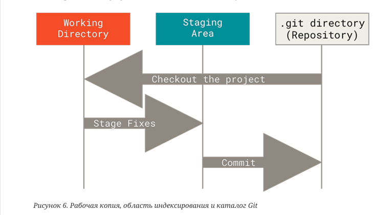

## Git

[1. Что такое Git](#1-что-такое-git)

[2. Что такое индекс?](#2-что-такое-индекс)

[3. Какие состояния файлов бывают в Git](#3-какие-состояния-файлов-бывают-в-git)

[4. Git init](#4-git-init)

[5. Git clone](#5-git-clone)

[6. Git log](#6-git-log)

[7. Git status](#7-git-status)

[8. Git add](#8-git-add)

[9. Git commit](#9-git-commit)

[10. Git push](#10-git-push)

[11. Git pull](#11-git-pull)

[12. Git fetch](#12-git-fetch)

[13. Git merge](#13-git-merge)

[14. Git rebase](#14-git-rebase)

[15. Git stash](#15-git-stash)

[16. Git apply](#16-git-apply)

[17. Git cherry-pick](#17-git-cherry-pick)

# 1. Что такое Git

Git — это распределённая система управления версиями (Version Control System, VCS), которая позволяет отслеживать
изменения в файлах и управлять ими.
Подход Git к
хранению данных похож на набор снимков файловой системы.
Каждый раз, когда вы делаете коммит, то есть сохраняете состояние своего проекта в Git,
система запоминает, как выглядит каждый файл в этот момент, и сохраняет ссылку на этот
снимок. Для увеличения эффективности, если файлы не были изменены, Git не запоминает
эти файлы вновь, а только создаёт ссылку на предыдущую версию идентичного файла,
который уже сохранён. Git представляет свои данные как, скажем, поток снимков.

[К оглавлению](#Git)

# 2. Что такое индекс?

Индекс в Git — это область индексирования(staging area). Это пространство между
рабочим каталогом (где находятся файлы, которые мы редактируем) и репозиторием (где хранятся зафиксированные коммиты).
Что бы просмотреть индекс, используйте git status.

[К оглавлению](#Git)

# 3. Какие состояния файлов бывают в Git

Состояния файлов

- commited - зафиксированный значит,
  что файл уже сохранён в вашей
  локальной базе.

- modified - к изменённым относятся
  файлы, которые поменялись, но ещё
  не были зафиксированы.

- staged - подготовленные файлы — это
  изменённые файлы, отмеченные для
  включения в следующий коммит.

[К оглавлению](#Git)

# 4. Git init

Превращает обычный каталог в Git репозиторий

[К оглавлению](#Git)

# 5. Git clone

На самом деле `git clone` работает как обёртка над некоторыми другими командами. Она
создаёт новый каталог, переходит внутрь и выполняет `git init` для создания пустого
репозитория, затем она добавляет новый удалённый репозиторий `git remote add` для
указанного URL (по умолчанию он получит имя origin), выполняет `git fetch` для этого
репозитория и, наконец, извлекает последний коммит в ваш рабочий каталог, используя
`git checkout`

[К оглавлению](#Git)

# 6. Git log

Команда `git log` используется для просмотра истории коммитов, начиная с самого свежего
и уходя к началу проекта. По умолчанию, она показывает лишь историю текущей ветки,
но может быть настроена на вывод истории других, даже нескольких сразу, веток. Также её
можно использовать для просмотра различий между ветками на уровне коммитов

[К оглавлению](#Git)

# 7. Git status

Команда `git status` показывает состояния файлов в рабочем каталоге и индексе: какие
файлы изменены, но не добавлены в индекс; какие ожидают коммита в индексе. Вдобавок к
этому выводятся подсказки о том, как изменить состояние файлов

[К оглавлению](#Git)

# 8. Git add

Команда `git add` добавляет содержимое рабочего каталога в индекс (staging area) для
последующего коммита.

[К оглавлению](#Git)

# 9. Git commit

Команда `git commit` берёт все данные, добавленные в индекс (staging area) с помощью `git add`, и сохраняет
их снимок во внутренней базе данных, а затем сдвигает указатель текущей ветки на этот
снимок

[К оглавлению](#Git)

# 10. Git push

Команда `git push` используется для установления связи с удалённым репозиторием,
вычисления локальных изменений отсутствующих в нём, и их передачи в
удаленный репозиторий. Этой команде нужно право на запись в репозиторий,
поэтому она использует аутентификацию.

[К оглавлению](#Git)

# 11. Git pull

Команда `git pull` работает как комбинация команд `git fetch` и `git merge`, т.е. Git вначале
забирает изменения из указанного удалённого репозитория, а затем пытается слить их с
текущей веткой

[К оглавлению](#Git)

# 12. Git fetch

Команда git fetch связывается с удалённым репозиторием и забирает из него все
изменения, которых у вас пока нет и сохраняет их локально

[К оглавлению](#Git)

# 13. Git merge

Команда git merge используется для слияния одной или нескольких веток в текущую. Затем
она устанавливает указатель текущей ветки на результирующий коммит

[К оглавлению](#Git)

# 14. Git rebase

Это «автоматизированный» `cherry-pick`. Он выполняет ту же работу, но для
цепочки коммитов, тем самым как бы перенося ветку на новое место

[К оглавлению](#Git)

# 15. Git stash

Команда `git stash` используется для временного сохранения всех незафиксированных
изменений с целью очистки рабочего каталога без необходимости фиксировать
незавершённую работу в текущей ветке

[К оглавлению](#Git)

# 16. Git apply

Команда `git apply` применяет патч (изменения) к файлам в рабочей директории или индексе, но не создаёт коммит. Это
полезно, когда нужно внести изменения из патча без использования полноценного слияния или коммита.

[К оглавлению](#Git)

# 17. Git cherry-pick

Команда `git cherry-pick` берёт изменения, вносимые одним коммитом, и пытается повторно
применить их в виде нового коммита в текущей ветке. Эта возможность полезна в
ситуации, когда нужно забрать парочку коммитов из другой ветки, а не сливать ветку
целиком со всеми внесёнными в неё изменениями

[К оглавлению](#Git)