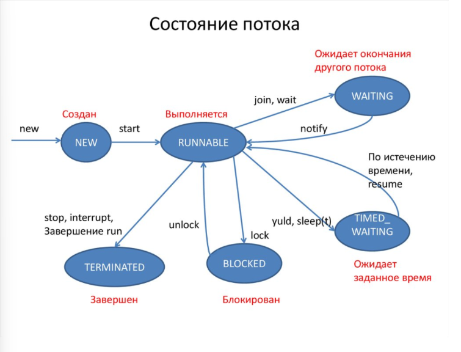

# Multithreading

[Параллельные вычисления](#параллельные-вычисления)

[1. Что такое многопоточность? Что такое поток](#1-что-такое-многопоточность-что-такое-поток)

[2. Чем процесс отличается от потока?](#2-чем-процесс-отличается-от-потока)

[3. Чем Thread отличается от Runnable? Когда использовать Thread, а когда Runnable?](#3-чем-thread-отличается-от-runnable-когда-использовать-thread-а-когда-runnable)

[4. Что такое монитор? Как реализован в Java?](#4-что-такое-монитор-как-реализован-в-java)

[5. Что такое синхронизация? Какие способы синхронизации существуют в Java?](#5-что-такое-синхронизация-какие-способы-синхронизации-существуют-в-java)

[6. Что такое FutureTask? Что такое Future. Что такое CompletableFuture](#6-что-такое-futuretask-что-такое-future-что-такое-completablefuture)

[7. Что такое ExecutorService?](#7-что-такое-executorservice)

[8. Как работать с коллекциями в многопоточном программировании? Почему мы должны использовать потокобезопасные коллекции? CopyOnWriteCollections. Что это? Как происходит запись? ConcurrentHashMap. Что это? Как происходит запись?](#8-как-работать-с-коллекциями-в-многопоточном-программировании-почему-мы-должны-использовать-потокобезопасные-коллекции-copyonwritecollections-что-это-как-происходит-запись-concurrenthashmap-что-это-как-происходит-запись)

[9. SynchronizedCollections. Что это? За счет чего достигается потокобезопасность?](#9-synchronizedcollections-что-это-за-счет-чего-достигается-потокобезопасность)

[10. Что такое Deadlock](#10-что-такое-deadlock)

[11. Что такое Livelock](#11-что-такое-livelock)

[12. Что такое Race condition](#12-что-такое-race-condition)

[13. Atomic vs Volatile. Что это и когда использовать?](#13-atomic-vs-volatile-что-это-и-когда-использовать)

[14. Зачем нужны atomic](#14-зачем-нужны-atomic)

[15. Зачем нужны volatile](#15-зачем-нужны-volatile)

[16. Какие бывают состояния у потока?](#16-какие-бывают-состояния-у-потока)

[17. Collections.synchronizedMap vs ConcurrentHashMap](#17-collectionssynchronizedmap-vs-concurrenthashmap)

[18. Какими способами можем запустить несколько потоков в Java приложении? Как запустить поток в Java?](#18-какими-способами-можем-запустить-несколько-потоков-в-java-приложении-как-запустить-поток-в-java)

[19. Что за интерфейсы Runnable и Callable? В чем между ними отличия?](#19-что-за-интерфейсы-runnable-и-callable-в-чем-между-ними-отличия)

[20. Расскажи про пакет concurrent](#20-расскажи-про-пакет-concurrent)

[21. Способы решения задач для многопоточного доступа](#21-способы-решения-задач-для-многопоточного-доступа)

[22. Чем конкурентность отличается от параллелизма?](#22-чем-конкурентность-отличается-от-параллелизма)

[23. Что такое CAS операции? (Compare And Swap)](#23-что-такое-cas-операции-compare-and-swap)

[24. Асинхронность vs многопоточность](#24-асинхронность-vs-многопоточность)

[25. Зачем нужны пулы потоков?](#25-зачем-нужны-пулы-потоков)

[26. Что значит потокобезопасность?](#26-что-значит-потокобезопасность)

[27. Области памяти в многопоточности?](#27-области-памяти-в-многопоточности)

[28. Executors.newCachedThreadPool()](#28-executorsnewcachedthreadpool)

[29. Что такое happens-before?](#29-что-такое-happens-before)

[30. ForkJoinPool vs FixedThreadPool](#30-forkjoinpool-vs-fixedthreadpool)

# Параллельные вычисления

Есть несколько разных понятий, связанных с областью параллельных вычислений.

+ Конкурентное исполнение (concurrency)
+ Параллельное исполнение (parallel execution)
+ Многопоточное исполнение (multithreading)
+ Асинхронное исполнение (asynchrony)

Каждый из этих терминов строго определен и имеет четкое значение.

`Конкурентность (concurrency)`

Конкурентность (concurrency) - это наиболее общий термин, который говорит, что одновременно выполняется более одной
задачи. Например, вы можете одновременно смотреть телевизор и комментить фоточки в фейсбуке. Винда, даже 95-я могла
одновременно играть музыку и показывать фотки.

`Конкурентное исполнение` - это самый общий термин, который не говорит о том, каким образом эта конкурентность будет
получена: путем приостановки некоторых вычислительных элементов и их переключение на другую задачу, путем действительно
одновременного исполнения, путем делегации работы другим устройствам или еще как-то. Это не важно.

Конкурентное исполнение говорит о том, что за определенный промежуток времени будет решена более, чем одна задача.
Точка.

`Параллельное исполнение`

Параллельное исполнение (parallel computing) подразумевает наличие более одного вычислительного устройства (например,
процессора), которые будут одновременно выполнять несколько задач.

Параллельное исполнение - это строгое подмножество конкурентного исполнения. Это значит, что на компьютере с одним
процессором параллельное программирование - невозможно;)

`Многопоточность`

Многопоточность - это один из способов реализации конкурентного исполнения путем выделения абстракции “рабочего
потока” (worker thread).

Потоки “абстрагируют” от пользователя низкоуровневые детали и позволяют выполнять более чем одну работу “параллельно”.
Операционная система, среда исполнения или библиотека прячет подробности того, будет многопоточное исполнение
конкурентным (когда потоков больше чем физических процессоров), или параллельным (когда число потоков меньше или равно
числу процессоров и несколько задач физически выполняются одновременно).

`Асинхронное исполнение`

Асинхронность (asynchrony) подразумевает, что операция может быть выполнена кем-то на стороне: удаленным веб-узлом,
сервером или другим устройством за пределами текущего вычислительного устройства.

Основное свойство таких операций в том, что начало такой операции требует значительно меньшего времени, чем основная
работа. Что позволяет выполнять множество асинхронных операций одновременно даже на устройстве с небольшим числом
вычислительных устройств.

`CPU-bound и IO-Bound операции`

Еще один важный момент, с точки зрения разработчика - разница между CPU-bound и IO-bound операциями. CPU-Bound операции
нагружают вычислительные мощности текущего устройства, а IO-Bound позволяют выполнить задачу вне текущей железки.

Разница важна тем, что число одновременных операций зависит от того, к какой категории они относятся. Вполне нормально
запустить параллельно сотни IO-Bound операций, и надеяться, что хватит ресурсов обработать все результаты. Запускать же
параллельно слишком большое число CPU-bound операций (больше, чем число вычислительных устройств) бессмысленно.

Возвращаясь к исходному вопросу: нет смысла выполнять в 1000 потоков метод Calc, если он является CPU-Intensive (
нагружает центральный процессор), поскольку это приведет к падению общей эффективности вычислений. ОС-ке придется
переключать несколько доступных ядер для обслуживания сотен потоков. А этот процесс не является дешевым.

Самым простым и эффективным способом решения CPU-Intensive задачи, заключается в использовании идиомы Fork-Join:
задачу (например, входные данные) нужно разбить на определенное число подзадач, которые можно выполнить параллельно.
Каждая подзадача должна быть независимой и не обращаться к разделяемым переменным/памяти. Затем, нужно собрать
промежуточные результаты и объединить их.

[К оглавлению](#Multithreading)

# 1. Что такое многопоточность? Что такое поток

Возможность программы выполнять несколько блоков одновременно.

`Поток (thread)` — это независимая последовательность выполнения инструкций в рамках одной программы. Потоки позволяют выполнять несколько задач одновременно, используя возможности многоядерных процессоров.

### Основные характеристики потока:

+ Поток выполняется в рамках одного процесса и использует его память. 
+ У каждого потока есть своё выполнение 
+ Имеет доступ к общей памяти.

### Зачем нужны потоки?

Потоки нужны для реализации многозадачности, то есть выполнения нескольких операций одновременно. Это особенно полезно для:

+ Увеличения производительности на многоядерных процессорах. 
+ Улучшения отзывчивости программ (например, в GUI приложения можно выполнять долгие операции в фоновом потоке, чтобы интерфейс не зависал). 
+ Асинхронной обработки (например, чтение/запись файлов, работа с сетью).

[К оглавлению](#Multithreading)

# 2. Чем процесс отличается от потока?

`Процесс` - это экземпляр программы во время выполнения, независимый объект, которому выделены системные ресурсы

`Поток` - способ выполнения процесса, определяющий последовательность исполнения кода в процессе. Поток всегда создается в контексте какого-либо процесса

[К оглавлению](#Multithreading)

# 3. Чем Thread отличается от Runnable? Когда использовать Thread, а когда Runnable?

`Thread` - класс-надстройка над физическим потоком. Используйте, если вам нужно управлять самим потоком

`Runnable` - интерфейс, представляющий абстракцию над выполняемой задачей. Используйте, если нужно просто выполнить задачу в потоке. Он более гибок и позволяет переиспользовать логику задачи в разных потоках

[К оглавлению](#Multithreading)

# 4. Что такое монитор? Как реализован в Java?

Монитор - механизм синхронизации потоков, обеспечивающий доступ к общему ресурсу. В Java реализован с помощью ключевого слова synchronized

[К оглавлению](#Multithreading)

# 5. Что такое синхронизация? Какие способы синхронизации существуют в Java?

Синхронизация - процесс, позволяющий выполнять потоки параллельно

### Способы синхронизации в Java:

+ `Блок sychronized`

````
  public class Counter {

  private int count;

  public synchronized void increment() { //Если много потоков инкрементируют поле у одного объекта
  count++;
  }
````

+ `join()` 

Поток вызвавший этот метод будет ждать до тех пор, пока объект, у которого был вызван этот метод - не закончит свое выполнение

````
  public static void main(String[] args) {
  SimpleThread simpleThread = new SimpleThread();
  simpleThread.start();
  try {
        simpleThread.join(); //До тех пор, пока этот поток не завершит свою работу - мы не пойдем дальше
  } catch (InterruptedException e) {
        throw new RuntimeException(e);
  }
  System.out.println(Thread.currentThread().getName());
  }
````

+ `Классы из пакета java.util.concurrent - Lock, Semaphore`. 

Концепция данного подхода заключается в использовании атомарных операций и переменных. Semaphore позволяет задать какое кол-во потоков может получить доступ к ресурсу одновременно

[К оглавлению](#Multithreading)

# 6. Что такое FutureTask? Что такое Future. Что такое CompletableFuture

`FutureTask` — это специальный объект в Java, который выполняет задачу в отдельном потоке и позволяет получить результат этой задачи, когда она завершится. Если задача ещё не закончена, попытка получить результат приостановит (заблокирует) выполнение, пока задача не завершится.

`FutureTask` — это реализация интерфейса RunnableFuture, который объединяет функциональность интерфейсов Runnable и Future. Этот класс позволяет выполнять задачу асинхронно, а затем получать её результат или обработать исключения.

### Что такое Future?

`Future` — интерфейс, который предоставляет методы для работы с асинхронными результатами. Он используется в комбинации с ExecutorService или другими асинхронными API.

### Что такое CompletableFuture?

`CompletableFuture` — это расширенная реализация интерфейса Future, которая добавляет возможность функционального программирования и работы с несколькими асинхронными задачами.

| Особенность            | FutureTask | Future  | CompletableFuture                |
|------------------------|------------|---------|----------------------------------|
| Асинхронное выполнение | Да         | Да      | Да                               |
| Получение результата   | get()      | get()   | Неблокирующие методы (thenApply) |
| Отмена задачи          | Да         | Да      | Да                               |
| Композиция задач       | Нет        | Нет     | Да (thenCombine, allOf, anyOf)   |
| Функциональный стиль   | Нет        | Нет     | Да                               |
| Сложность              | Простая    | Простая | Расширенная функциональность     |

+ FutureTask: Комбинация Runnable и Future, используется для выполнения асинхронных задач вручную. 
+ Future: Интерфейс для асинхронных операций, с базовыми методами (get, cancel). 
+ CompletableFuture: Современный и мощный инструмент для асинхронного программирования с поддержкой композиции и функционального стиля.

[К оглавлению](#Multithreading)

# 7. Что такое ExecutorService?

Это интерфейс в Java, который помогает управлять потоками более эффективно. Вместо создания новых потоков вручную - можно использовать его для выполнения задач в пулах потоков

[К оглавлению](#Multithreading)

# 8. Как работать с коллекциями в многопоточном программировании? Почему мы должны использовать потокобезопасные коллекции? CopyOnWriteCollections. Что это? Как происходит запись? ConcurrentHashMap. Что это? Как происходит запись?

+ Превратить обычную коллекцию - в синхронизированную, с помощью Collections.synchronized()

`List<String> list = Collections.synchronizedList(new ArrayList<>())`

+ Если работа с коллекцией состоит в основном из чтения - CopyOnWriteArrayList<>()

`List<String> list = new CopyOnWriteArrayList<>()`

+ Использование Concurrent-коллекций:
  + Неблокирующие хеш-таблицы (ConcurrentSkipListMap, ConcurrentHashMap, ConcurrentSkipListSet)
  + Неблокирующие очереди (ConcurrentLinkedQueue и ConcurrentLinkedDeque)

### Почему мы должны использовать потокобезопасные коллекции?

Когда несколько потоков одновременно обращаются к одной и той же коллекции, возможно возникновение состояний гонки (race conditions), приводящих к следующим проблемам:

+ Искажение данных — одновременная модификация может нарушить целостность данных.
+ Исключения — например, ConcurrentModificationException, когда один поток перебирает коллекцию, а другой изменяет её структуру.
+ Непредсказуемое поведение — результат работы программы становится нестабильным.

Потокобезопасные коллекции (например, Collections.synchronizedMap или ConcurrentHashMap) предоставляют механизм синхронизации, чтобы исключить подобные проблемы.

### CopyOnWriteCollections. Что это? Как происходит запись?

Это потокобезопасные коллекции (CopyOnWriteArrayList, CopyOnWriteArraySet). Как происходит запись:

+ При добавлении элемента создается новая копия всей коллекции с добавленным изменением 
+ После завершения операции, оригинальная коллекция заменяется на новую копию, а все другие потоки продолжают работать со старой версией, пока новая не станет доступной

Стоит использовать, когда в программе много операций чтения

### ConcurrentHashMap. Что это? Как происходит запись?

Это потокобезопасная реализация хеш-таблицы. Как происходит запись:

+ Хеширование ключа. Сначала вычисляется хеш для ключа, что бы определить, в какой сегмент хеш-таблицы попадет этот элемент 
+ Блокировка сегмента. Блокируется только тот сегмент, в который будет добавлен этот элемент 
+ Добавление элемента. Элемент добавляется - блокировка с сегмента снимается

[К оглавлению](#Multithreading)

# 9. SynchronizedCollections. Что это? За счет чего достигается потокобезопасность?

Это специальные коллекции в Java, которые обеспечивают потокобезопасность. Обеспечивается потокобезопасность за счет того, что все методы помечены как synchronized

[К оглавлению](#Multithreading)

# 10. Что такое Deadlock

Это ситуация, когда два или более потока навсегда блокируются, ожидая ресурсы, которые уже захвачены другими потоками (Thread A ожидает Thread B, а Thread B ожидает Thread A)

[К оглавлению](#Multithreading)

# 11. Что такое Livelock

Несколько потоков попадают в зацикленность при попытке получения каких-либо ресурсов. При этом их состояние постоянно изменяется (Два человека постоянно пытаются уступить друг другу дорогу. Каждый раз когда один делает шаг в сторону, другой делает то же самое)

[К оглавлению](#Multithreading)

# 12. Что такое Race condition

Это ситуация, при которой результат выполнения программы зависит от порядка выполнения потоков. Возникает, когда несколько потоков одновременно обращаются к разделяемым ресурсам, и результат работы зависит от того, какой поток первым выполнит операции

[К оглавлению](#Multithreading)

# 13. Atomic vs Volatile. Что это и когда использовать?

`Atomic` — классы (AtomicInteger, AtomicLong, и т.д.), которые предоставляют атомарные операции для работы с
примитивами. Они используют внутренние механизмы для обеспечения безопасности при изменении значений без блокировок.
Атомарность в таких классах, как AtomicInteger, AtomicLong и других, обеспечивается за счет использования механизма
CAS (Compare-And-Swap), который выполняется на уровне процессора или операционной системы. Это позволяет выполнять
операции с переменными без блокировок, что в свою очередь повышает производительность в многопоточных приложениях,
уменьшая накладные расходы, связанные с синхронизацией.

`Volatile` — ключевое слово, которое гарантирует, что значение переменной всегда будет читаться из памяти, а не из кэша
потока. Каждый поток будет видеть актуальное значение volatile переменной, но если два потока одновременно изменяют
переменную, могут возникнуть проблемы

Когда использовать?

+ volatile:
  Когда нужно гарантировать только видимость изменений.
  Например, для флагов завершения или состояния.

+ Atomic:
Когда требуется атомарность (инкремент, сравнение и установка значений).
Например, для многопоточных счетчиков, индексов, обновлений.

| Характеристика            | volatile                     | Atomic                                   |
|---------------------------|------------------------------|------------------------------------------|
| Гарантия видимости        | Да                           | Да                                       |
| Атомарные операции        | Нет                          | Да                                       |
| Использование             | Для простого чтения/записи   | Для сложных операций (инкремент, CAS)    |
| Пример подходящих случаев | Флаги (boolean isRunning)    | Счётчики (AtomicInteger.incrementAndGet) |
| Производительность        | Выше, так как операции проще | Чуть ниже из-за механизмов синхронизации |

[К оглавлению](#Multithreading)

# 14. Зачем нужны atomic

Классы из пакета java.util.concurrent.atomic (например, AtomicInteger, AtomicLong, AtomicReference) обеспечивают безопасные операции над переменными в многопоточной среде без явной синхронизации.
Они полезны для:
+ Операций над примитивами (инкремент, декремент, сравнение и замена) с гарантией атомарности. 
+ Оптимизации производительности — вместо блокировок используется низкоуровневая атомарность через аппаратные команды процессора.

[К оглавлению](#Multithreading)

# 15. Зачем нужны volatile

Ключевое слово volatile гарантирует, что изменения переменной одним потоком будут немедленно видны другим потокам. Это предотвращает проблему с кешированием переменных в потоках.

### Когда использовать?

Используется для переменных, которые:
+ могут быть изменены несколькими потоками; 
+ читаются часто, но синхронизация сложных операций не требуется.

### Ограничения volatile:

+ Не обеспечивает атомарности операций (например, count++ всё равно небезопасно). 
+ Используется для простых флагов или переменных, где достаточно гарантии чтения/записи.

[К оглавлению](#Multithreading)

# 16. Какие бывают состояния у потока?



[К оглавлению](#Multithreading)

# 17. Collections.synchronizedMap vs ConcurrentHashMap

| Характеристика     | Collections.synchronizedMap                                     | ConcurrentHashMap                                   |
|--------------------|-----------------------------------------------------------------|-----------------------------------------------------|
| Синхронизация      | Синхронизация всего объекта через блокировку                    | Синхронизация на уровне отдельных сегментов         |
| Производительность | Медленнее в условиях конкуренции, так как блокировка глобальная | Быстрее благодаря разделению на сегменты            |
| Итерация           | Требуется вручную синхронизировать блок for или iterator.       | Итерация безопасна без дополнительной синхронизации |
| Применение         | Для простых сценариев с малым количеством потоков               | Для высоконагруженных многопоточных систем          |

[К оглавлению](#Multithreading)

# 18. Какими способами можем запустить несколько потоков в Java приложении? Как запустить поток в Java?

1. Наследование от класса Thread.
Класс Thread уже реализует интерфейс Runnable. Мы можем наследоваться от него и переопределить метод run().
````
public class MyThread extends Thread {
  @Override
  public void run() {
    System.out.println("Thread is running");
}

    public static void main(String[] args) {
        MyThread thread = new MyThread();
        thread.start(); // Запуск потока
    }
}
````

2. Реализация интерфейса Runnable. 
Создаётся класс, реализующий интерфейс Runnable. Затем объект этого класса передаётся в конструктор Thread.

````
public class MyRunnable implements Runnable {
  @Override
  public void run() {
    System.out.println("Runnable is running");
}

    public static void main(String[] args) {
        Thread thread = new Thread(new MyRunnable());
        thread.start(); // Запуск потока
    }
}
````

3. Использование анонимного класса или лямбда-выражения.
Часто используется для краткости, если код в потоке небольшой.

````
public class Main {
  public static void main(String[] args) {
    Thread thread = new Thread(() -> System.out.println("Lambda thread is running"));
    thread.start(); // Запуск потока
  }
}
````

4. Использование интерфейса Callable.
Callable возвращает результат и может выбрасывать исключения. Для выполнения требуется ExecutorService.

````
import java.util.concurrent.Callable;
import java.util.concurrent.ExecutorService;
import java.util.concurrent.Executors;
import java.util.concurrent.Future;

public class CallableExample {
  public static void main(String[] args) throws Exception {
    ExecutorService executor = Executors.newSingleThreadExecutor();
    Callable<String> task = () -> "Callable result";

    Future<String> future = executor.submit(task);
    System.out.println(future.get()); // Получение результата

    executor.shutdown();
  }
}
````

[К оглавлению](#Multithreading)

# 19. Что за интерфейсы Runnable и Callable? В чем между ними отличия?

| Характеристика        | Collections.Runnable                        | Callable                                 |
|-----------------------|---------------------------------------------|------------------------------------------|
| Метод                 | void run()                                  | V call()                                 |
| Возвращаемое значение | Не возвращает (void)                        | Возвращает результат (V)                 |
| Обработка исключений  | Исключения необходимо обрабатывать вручную. | Может выбрасывать проверяемые исключения |
| Использование         | Используется с Thread или Executor          | Используется с ExecutorService           |

[К оглавлению](#Multithreading)

# 20. Расскажи про пакет concurrent

Пакет java.util.concurrent предоставляет набор инструментов для работы с многопоточностью. Основные компоненты:

`Executor и ExecutorService` - Используются для управления потоками и выполнения задач. ExecutorService позволяет управлять пулом потоков.

````
ExecutorService executor = Executors.newFixedThreadPool(2);
executor.submit(() -> System.out.println("Task executed"));
executor.shutdown();
````

`Синхронизированные коллекции` - Потокобезопасные коллекции, такие как:

+ ConcurrentHashMap 
+ CopyOnWriteArrayList 
+ BlockingQueue

`Locks` - Более гибкая альтернатива синхронизированным блокам.

+ ReentrantLock — предоставляет явное управление блокировками. 
+ ReadWriteLock — разделяет блокировки чтения и записи.

`Синхронизаторы` - Объекты для координации потоков:

+ CountDownLatch — ожидание завершения нескольких потоков. 
+ CyclicBarrier — синхронизация нескольких потоков. 
+ Semaphore — ограничение количества одновременно выполняющихся потоков. 
+ Exchanger — обмен данными между двумя потоками.

`Future и CompletableFuture`

+ Future — используется для получения результата от асинхронной задачи. 
+ CompletableFuture — удобный способ построения асинхронных цепочек.

[К оглавлению](#Multithreading)

# 21. Способы решения задач для многопоточного доступа

`Синхронизация (synchronized)` - Использование синхронизированных методов или блоков для контроля доступа к общим ресурсам.

````
public synchronized void method() {
// Потокобезопасный метод
}
````

`Использование Lock` - Более гибкий контроль, чем synchronized, позволяет разблокировать вручную.

````
Lock lock = new ReentrantLock();
lock.lock();
try {
    // Доступ к ресурсу
} finally {
    lock.unlock();
}
````

`Потокобезопасные коллекции`. Например, ConcurrentHashMap или CopyOnWriteArrayList.

`Синхронизаторы`

+ Использование CountDownLatch для ожидания завершения потоков. 
+ Использование Semaphore для ограничения одновременного доступа.

`Atomic-классы`. Например, AtomicInteger, которые обеспечивают атомарные операции над переменными.

`Пул потоков` Управление многопоточностью через ExecutorService позволяет избежать избыточного создания потоков.

[К оглавлению](#Multithreading)

# 22. Чем конкурентность отличается от параллелизма?

| Критерий       | Конкурентность (Concurrency)                                                | Параллелизм (Parallelism)                                             |
|----------------|-----------------------------------------------------------------------------|-----------------------------------------------------------------------|
| Определение    | Способность выполнять несколько задач одновременно, переключаясь между ними | Одновременное выполнение нескольких задач на разных процессорах/ядрах |
| Цель           | Максимально эффективно использовать ресурсы                                 | Ускорение выполнения задачи путем разделения её на части              |
| Взаимодействие | Может быть на одном ядре за счет переключения между задачами.               | Требует нескольких ядер или процессоров                               |
| Пример         | Операционная система, выполняющая множество программ.                       | Большие вычисления, разделенные на потоки, работающие одновременно    |

[К оглавлению](#Multithreading)

# 23. Что такое CAS операции? (Compare And Swap)

CAS (Compare And Swap) — атомарная операция, которая используется для управления многопоточным доступом к данным без использования блокировок.

### Принцип работы:

+ Проверяется, соответствует ли текущее значение ожидаемому. 
+ Если да, то происходит обновление значения. 
+ Если нет, операция повторяется.

### Этапы:

+ Сравнение текущего значения с ожидаемым. 
+ Обновление значения, если они совпадают.

### Пример работы CAS:

````
AtomicInteger atomicInteger = new AtomicInteger(0);
int expectedValue = 0;
int newValue = 1;

// CAS-операция
boolean result = atomicInteger.compareAndSet(expectedValue, newValue);
System.out.println(result); // true, если значение обновлено
````

#### Особенности:

+ Обеспечивает высокую производительность, так как не требует блокировок. 
+ Используется в Atomic классах и потокобезопасных коллекциях (ConcurrentHashMap).

[К оглавлению](#Multithreading)

# 24. Асинхронность vs многопоточность

| Критерий              | Асинхронность                                                                       | Многопоточность                                     |
|-----------------------|-------------------------------------------------------------------------------------|-----------------------------------------------------|
| Определение           | Способ выполнения задач без блокировки текущего потока                              | Одновременное выполнение задач в нескольких потоках |
| Использование потоков | Поток может не использоваться, задачи выполняются позже                             | Всегда использует несколько потоков                 |
| Пример                | Асинхронное чтение файла: выполнение задачи продолжается при готовности результата. | Вычисления на нескольких потоках одновременно       |
| Области применения    | Сетевые запросы, работа с I/O (например, базы данных)                               | Распараллеливание вычислительных задач              |

[К оглавлению](#Multithreading)

# 25. Зачем нужны пулы потоков?

Пулы потоков (Thread Pools) — это управление группой потоков, которые переиспользуются для выполнения задач.
Они предоставляются классами Executors и ExecutorService.

### Основные причины использования:

+ Управление ресурсами:
Избегают создания большого количества потоков, которые могут привести к недостатку памяти.
Ограничивают максимальное количество одновременно выполняемых потоков.
+ Повышение производительности:
Потоки переиспользуются, что уменьшает затраты на их создание и уничтожение.
+ Контроль задач:
Позволяют планировать задачи, добавлять их в очередь или ограничивать выполнение.

````
ExecutorService executor = Executors.newFixedThreadPool(2);
executor.submit(() -> System.out.println("Task 1"));
executor.submit(() -> System.out.println("Task 2"));
executor.shutdown();
````

[К оглавлению](#Multithreading)

# 26. Что значит потокобезопасность?

Потокобезопасность означает, что объект или метод корректно работает при одновременном доступе из нескольких потоков.

Без потокобезопасности возможны гонки данных (race conditions), что приводит к некорректной работе программы.

[К оглавлению](#Multithreading)

# 27. Области памяти в многопоточности?

В Java память разделена на несколько областей, которые управляются JVM и могут влиять на многопоточное программирование. Основные из них:

`Heap (Куча)` – общая память для всех потоков. Здесь хранятся объекты и ссылки на них.

`Stack (Стек потока)` – отдельная область для каждого потока, где хранятся локальные переменные и вызовы методов.

`Метаспейс (Metaspace)` – область для хранения информации о классах.

`Рабочая память потока (Thread Working Memory)` – кэш каждого потока, который может отличаться от данных в основной памяти.

Пример проблемы:
Если один поток изменяет объект в Heap, а другой читает старые данные из Thread Working Memory, может произойти рассинхронизация (data race).

Как избежать?

+ Использовать volatile, чтобы изменения в одной нити были видны другим. 
+ Применять synchronized и Lock для атомарных операций.

[К оглавлению](#Multithreading)

# 28. Executors.newCachedThreadPool()

newCachedThreadPool() создает гибкий пул потоков:

+ Без ограничения количества потоков (создает новые при необходимости).
+ Потоки переиспользуются при их простое (idle timeout ≈ 60 сек). 
+ Подходит для кратковременных и легковесных задач.

````
Пример:

import java.util.concurrent.ExecutorService;
import java.util.concurrent.Executors;

public class CachedThreadPoolExample {
  public static void main(String[] args) {
    ExecutorService executor = Executors.newCachedThreadPool();

    for (int i = 1; i <= 5; i++) {
        final int taskId = i;
        executor.submit(() -> System.out.println(Thread.currentThread().getName() + " выполняет задачу " + taskId));
        }

    executor.shutdown();
    }
}

Вывод (примерный):

pool-1-thread-1 выполняет задачу 1
pool-1-thread-2 выполняет задачу 2
pool-1-thread-3 выполняет задачу 3
pool-1-thread-4 выполняет задачу 4
pool-1-thread-5 выполняет задачу 5
````

#### Плюсы:
+ Автоматическое управление потоками. 
+ ️ Хорош для задач с непредсказуемой нагрузкой.

### Минусы:
+ Может создать слишком много потоков и перегрузить систему.

[К оглавлению](#Multithreading)

# 29. Что такое happens-before?

`happens-before` — это правило в Java Memory Model (JMM), определяющее порядок видимости изменений между потоками.

`Если одно действие “happens-before” другого, то первое гарантированно видно второму! Если happens-before нет, потоки могут видеть старые значения!`

### Основные правила happens-before:

`Монитор (synchronized)`:
````
synchronized (lock) { x = 10; }  // Happens-before  
synchronized (lock) { System.out.println(x); }  // Видит изменение
````

`Запись в volatile`:

````
volatile int x = 0;
x = 10;   // Happens-before  
System.out.println(x);  // Видит изменение
````

`Thread.start() и Thread.join()`:

````
thread.start();  // Happens-before  
thread.join();   // Видит все изменения
````
🔹 Если happens-before нет, потоки могут видеть старые значения!

[К оглавлению](#Multithreading)

# 30. ForkJoinPool vs FixedThreadPool

| Свойство                | ForkJoinPool                               | FixedThreadPool                  |
|-------------------------|--------------------------------------------|----------------------------------|
| Когда использовать      | Разделение задач (recursion)               | Фиксированное число потоков      |
| Размер пула             | Автоматически настраивается                | Фиксированное число потоков      |
| Поддержка work-stealing | Да (потоки крадут задачи у других потоков) | Нет                              |
| Тип задач               | Разделяемые (RecursiveTask)                | Независимые (Runnable, Callable) |

```java
Пример ForkJoinPool (разбиение задачи)

import java.util.concurrent.*;

class SumTask extends RecursiveTask<Integer> {
    private final int[] array;
    private final int start, end;

    SumTask(int[] array, int start, int end) {
        this.array = array;
        this.start = start;
        this.end = end;
    }

    @Override
    protected Integer compute() {
        if (end - start <= 2) {
            return array[start] + array[end - 1]; // Базовый случай
        }

        int mid = (start + end) / 2;
        SumTask leftTask = new SumTask(array, start, mid);
        SumTask rightTask = new SumTask(array, mid, end);

        leftTask.fork();
        return rightTask.compute() + leftTask.join();
    }
}

public class ForkJoinExample {
    public static void main(String[] args) {
        ForkJoinPool pool = new ForkJoinPool();
        int[] numbers = {1, 2, 3, 4, 5, 6, 7, 8};

        int sum = pool.invoke(new SumTask(numbers, 0, numbers.length));
        System.out.println("Сумма: " + sum); // 36
    }
}
```

### Плюсы ForkJoinPool
+ Разбивает задачи на подзадачи (divide-and-conquer). 
+ Work-stealing увеличивает производительность.

### Минусы ForkJoinPool
+ Не подходит для независимых задач (лучше FixedThreadPool).

[К оглавлению](#Multithreading)