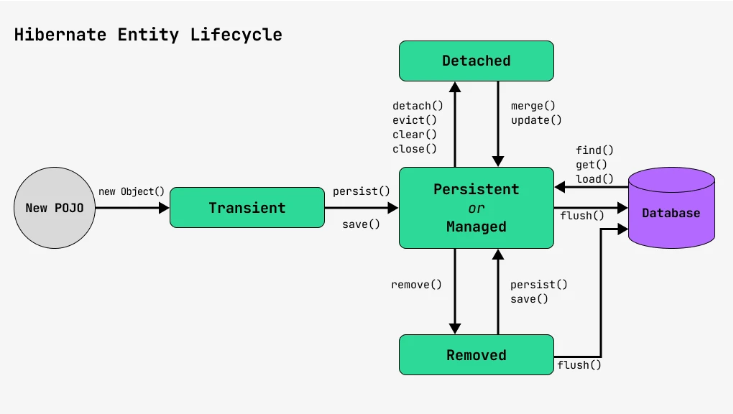

# ORM

[Что такое Hibernate, JPA, JDBC, ORM?](#что-такое-hibernate-jpa-jdbc-orm)

[Плюсы и минусы ORM](#плюсы-и-минусы-orm)

[Как создать Entity и что это такое?](#как-создать-entity-и-что-это-такое)

[Может ли Entity наследоваться от не-Entity классов?](#может-ли-entity-наследоваться-от-не-entity-классов)

[Может ли Entity наследоваться от других Entity классов?](#может-ли-entity-наследоваться-от-других-entity-классов)

[Почему мы не можем использовать final классы в качестве Entity?](#почему-мы-не-можем-использовать-final-классы-в-качестве-entity)

[Что такое Proxy и для чего используется?](#что-такое-proxy-и-для-чего-используется)

[FetchType](#fetchtype)

[Жизненный цикл сущности](#жизненный-цикл-сущности)

[Кэширование](#кэширование)

[HQL и JPQL](#hql-и-jpql)

[EntityManager + EntityManagerFactory / SessionFactory + session](#entitymanager--entitymanagerfactory--sessionfactory--session)

[Проблема N + 1. Способы решения проблемы](#проблема-n--1-способы-решения-проблемы)

[ Что такое Entity Graph?](#что-такое-entity-graph)

[Statement, Prepared statement, Callable statement](#statement-prepared-statement-callable-statement)

[Связи между таблицами в ORM](#связи-между-таблицами-в-orm)

[LazyInitializationException ](#lazyinitializationexception)

[Что такое SQL-инъекция?](#что-такое-sql-инъекция)

[Проблемы JOIN FETCH](#проблемы-join-fetch)

[Логи в Hibernate](#логи-в-hibernate)

[Аннотация @Query, что это такое?](#аннотация-query-что-это-такое)

[Как Hibernate генерирует SQL запросы?](#как-hibernate-генерирует-sql-запросы)

[Hibernate. Что хранится в Persistence Context? Сколько времени объект хранится в Persistence Context?](#hibernate-что-хранится-в-persistence-context-сколько-времени-объект-хранится-в-persistence-context)

[Hibernate и Lombok](#hibernate-и-lombok)

[](#)

# Что такое Hibernate, JPA, JDBC, ORM?

+ Hibernate - это ORM Framework (один из самых распространённых JPA реализаций)
+ JPA - это спецификация Java, которая предоставляет набор интерфейсов/аннотаций
+ ORM - процесс преобразования объектно-ориентированной модели в реляционную и наоборот
+ JDBC - низкоуровневый API для взаимодействия с базами данных.

[К оглавлению](#ORM)

# Плюсы и минусы ORM

Плюсы:
+ Позволяет бизнес методам обращаться не к БД, а к Java классам 
+ Ускоряет разработку приложения 
+ Основан на JDBC 
+ Сущности основаны на бизнес-задачах, а не на струкруре БД 
+ Управление транзакциями

Минусы:
+ Потенциальная потеря производительности — автоматическая генерация SQL-запросов может быть менее оптимальной, чем ручное написание запросов. 
+ Сложные запросы — ORM плохо справляется с очень сложными SQL-запросами, такими как сложные агрегатные функции или многоуровневые JOIN’ы.

[К оглавлению](#ORM)

# Как создать Entity и что это такое?

Это класс, помеченный аннотацией `@Entity`, нужен для маппинга Java объектов в БД объекты и наоборот. Она должна соответствовать следующим условиями:

+ Должен иметь пустой конструктор 
+ Не может быть вложенным, интерфейсом, ENUM, или final 
+ Не может содержать final полей 
+ Хотя бы одно поле помеченное аннотацией @Id 
+ Аннотация `@Entity` над классом 
+ Должен быть `POJO` (все поля private + getter-ы и setter-s к ним)

[К оглавлению](#ORM)

# Может ли Entity наследоваться от не-Entity классов?

Да. Может

[К оглавлению](#ORM)

# Может ли Entity наследоваться от других Entity классов?

Да. Может

[К оглавлению](#ORM)

# Почему мы не можем использовать final классы в качестве Entity?

Превращение Entity в final ограничивает способность Hibernate использовать прокси, что в свою очередь, не позволяет
Hibernate применять ленивую загрузку. Потому что, прокси-класс должен наследоваться от класса-сущности, чтобы заменить
его настоящим объектом при необходимости, но т.к final запрещает наследование от классов - мы этого сделать не можем

[К оглавлению](#ORM)

# Что такое Proxy и для чего используется?

`Hibernate Proxy` — это объект-заместитель (placeholder) для реального объекта, который загружается “лениво” (lazy
loading). Это значит, что Hibernate создает прокси-объект вместо настоящего объекта из базы данных, и реальные данные
загружаются только при первом доступе к ним. Это помогает оптимизировать производительность, загружая данные только
тогда, когда они действительно нужны.

### В какой момент создается Proxy?

Proxy в Hibernate создаётся в момент, когда мы запрашиваем объект из базы данных, но фактически данные этого объекта ещё
не загружаются (ленивая загрузка, lazy loading). Вместо реального объекта возвращается прокси-объект, который является
подставным объектом, созданным для отложенной загрузки данных.

+ Механизм: Hibernate создаёт наследника запрашиваемого класса или реализацию интерфейса, который переопределяет методы,
  обеспечивая загрузку данных только при их вызове.

```java
Session session = sessionFactory.openSession();
User user = session.get(User.class, 1); // Полный объект
User lazyUser = session.load(User.class, 2); // Proxy-объект

В случае session.get() объект загружается сразу.
При использовании session.load() объект заменяется Proxy 
до момента фактического обращения к данным.
```

### Как создается Proxy

`Как Hibernate создает Proxy?`

Когда сущность аннотирована `@OneToMany`, `@ManyToOne`, `@OneToOne` или `@ManyToMany` с `fetch = FetchType.LAZY`, Hibernate
подменяет объект на прокси-класс (подкласс реального объекта).

```java
@Entity
class User {
    @Id @GeneratedValue
    private Long id;
    private String name;

    @OneToMany(mappedBy = "user", fetch = FetchType.LAZY)
    private List<Order> orders;
}

@Entity
class Order {
    @Id @GeneratedValue
    private Long id;
    private String product;

    @ManyToOne
    @JoinColumn(name = "user_id")
    private User user;


Hibernate создает прокси для orders, загружая их только при первом доступе.
}
```

```java
Как проверить, прокси это или нет?

Session session = sessionFactory.openSession();
User user = session.get(User.class, 1L);

System.out.println(user.getOrders().getClass());
// class com.sun.proxy.$Proxy...
```

### Проблемы с Proxy в Hibernate

+ LazyInitializationException

```java
Session session = sessionFactory.openSession();
User user = session.get(User.class, 1L);
session.close();

user.getOrders().size(); // Ошибка! Доступ к Proxy после закрытия сессии
```

Решение:

Использовать JOIN FETCH. Открыть сессию вручную (OpenSessionInView)

```java
Использование JOIN FETCH

List<User> users = session.createQuery(
    "SELECT u FROM User u JOIN FETCH u.orders", User.class
).getResultList();
```

+ Hibernate Proxy – лениво загружает связанные сущности (Lazy Loading). 
+ Spring Proxy – управляет транзакциями, AOP и безопасностью. 
+ JDK Proxy – работает с интерфейсами. 
+ CGLIB Proxy – работает с классами без интерфейсов.

### Виды прокси

1. Прокси для сущностей (Entity Proxy)
+ Описание: Прокси-сущности создаются для объектов, которые загружаются лениво (lazy loading). Это стандартный тип
  прокси, который Hibernate создаёт для каждого объекта, если его загрузка происходит с использованием ленивой загрузки.
+ Когда используется: Прокси-сущности создаются при использовании метода session.load() (или когда указано fetch =
  FetchType.LAZY для полей сущности).
```java
@Entity
public class User {
    @Id
    private Long id;
    
    private String name;
    
    // Ленивое подключение к связанной сущности
    @ManyToOne(fetch = FetchType.LAZY)
    private Address address;
    
-----------------------------

  Если вы используете:

  User user = session.load(User.class, 1L);  // Возвращает прокси, а не реальный объект
  
  Прокси-сущность будет загружена только при 
  первом доступе к полям объекта, таким как user.getName().
}
```
2. Прокси для коллекций (Collection Proxy)
+ Описание: Прокси для коллекций используются для ленивой загрузки ассоциированных коллекций объектов (например, списков
  или наборов). Если коллекция имеет аннотацию fetch = FetchType.LAZY, Hibernate создаёт прокси для этой коллекции.
+ Когда используется: Прокси для коллекций обычно создаются, когда вы работаете с ассоциациями, например, с коллекциями
  в сущности (один ко многим или многие ко многим).
+ Как работает: При доступе к коллекции происходит подгрузка данных только при фактическом обращении к коллекции (
  например, при вызове getOrders()).
```java
@Entity
public class User {
    @Id
    private Long id;
    
    @OneToMany(fetch = FetchType.LAZY)
    private List<Order> orders;  // Прокси для коллекции
}

В этом случае, коллекция orders будет загружена только 
при первом обращении к методу getOrders().
```
3. Прокси для интерфейсов (Interface Proxy)
+ Описание: Hibernate может создавать прокси для интерфейсов, если сущность реализует интерфейс. Прокси будет
  реализовывать этот интерфейс, что позволяет использовать прокси-объекты в виде интерфейсов, а не в виде реальных
  классов.
+ Когда используется: Прокси для интерфейсов применяются, когда объект сущности реализует интерфейс, и Hibernate может
  создать прокси-объект, который будет реализовывать этот интерфейс.
+ Как работает: Прокси для интерфейсов работают так же, как и обычные прокси-сущности, но вместо того, чтобы наследовать
  класс, они реализуют интерфейс. Это даёт гибкость при работе с сущностями.
```java
public interface Identifiable {
    Long getId();
}

@Entity
public class User implements Identifiable {
    @Id
    private Long id;
    
    @Override
    public Long getId() {
        return id;
    }
}

В данном случае, Hibernate может создать прокси-объект, 
который будет реализовывать интерфейс Identifiable.
```
4. Прокси с использованием bytecode-enhancement (Bytecode Enhancement Proxy)

+ Описание: Это особый тип прокси, который используется для оптимизации работы с объектами в Hibernate. Прокси с
  использованием изменения байт-кода (bytecode enhancement) не создают отдельный класс для прокси, а изменяют байт-код
  сущности, добавляя функциональность ленивой загрузки.
+ Когда используется: Этот тип прокси применяется, когда включено улучшение байт-кода (например, с использованием таких
  инструментов, как Javassist или CGLIB). Прокси с использованием улучшения байт-кода позволяют улучшить
  производительность, поскольку не требуют создания дополнительного класса для прокси.
+ Как работает: Прокси с bytecode enhancement может быть использован для более эффективного доступа к полям сущности без
  явного создания прокси-классов.


[К оглавлению](#ORM)

# FetchType

+ `LAZY` - данные поля будут загружены не сразу, а только при обращении к ним. `@OneToMany @ManyToMany` - по-умолчанию
  применяется FetchType.LAZY
+ `EAGER` - связанные сущности загружаются сразу вместе с основной сущностью. `@ManyToOne @OneToOne` - по-умолчанию
  применяется FetchType.EAGER

[К оглавлению](#ORM)

# Жизненный цикл сущности

В Hibernate сущность может находиться в одном из четырех состояний:



+ `Transient (Переходное состояние) (new)`
Сущность только что создана с помощью оператора new, но еще не сохранена в базе данных
````
User user = new User(); // объект пока не связан с БД
user.setName("John");
````
+ `Persistent (Постоянное состояние) (save,persist,update,get)`
Когда объект сохранен в базе данных через EntityManager или Session, он становится постоянным. В этом состоянии Hibernate следит за объектом. Любые изменения в объекте автоматически синхронизируются с базой данных
````
Session session = sessionFactory.openSession();
session.beginTransaction();
session.save(user); // объект теперь в состоянии persistent
````
+ `Detached (Отсоединённое состояние) (session close)`
Когда сессия закрыта, объект переходит в состояние detached. Он по-прежнему связан с данными в базе, но больше не синхронизируются с ней
````
session.close(); 

объект можно использовать, но изменения не будут сохранены в бд
````
+ `Removed (Удалённое состояние) (delete(obj))`
Когда сущность удалена из базы данных она переходит в состояние removed. В этом состоянии объект по-прежнему существует в памяти, но уже удален из базы данных
````
session.delete();
````
[К оглавлению](#ORM)

# Кэширование

+ Кэш 1-го уровня

  + Этот кэш всегда включен и работает на уровне сессии (у каждой сессии свой кэш и нельзя получить доступ к нему из другой сессии)
  + В кэше хранятся только сущности, у которых состояние persistent 
  + Отслеживаемые сущности (persistent) хранятся в мапе, где ключ - ID сущности, а значение - сами объекты-сущности 
  + При повторных запросах Hibernate использует кэшированные данные вместо выполнения нового запроса к базе данных 
  + При закрытии сессии - кэш удаляется
  
+ Кэш 2-го уровня

  + Это дополнительный кэш, который надо включать вручную 
  + Работает на уровне SessionFactory 
  + Используется для кэширования данных между сессиями, что позволяет повторно использовать данные, уже загруженные из базы данных 
  + После закрытия SessionFactory - весь кэш, связанный с ним, умирает

+ Кэш 3-го уровня

  + Кэширует результаты запросов на уровне SQL-запросов (кэширует результаты выборки)

[К оглавлению](#ORM)

# HQL и JPQL

Являются объектно-ориентированными языками запросов, схожими по природе с SQL

+ HQL полностью объектно-ориентирован и расширяет JPQL

+ JPQL - это стандарт JPA, который поддерживается всеми реализациями JPA, а HQL - реализация Hibernate

[К оглавлению](#ORM)

# EntityManager + EntityManagerFactory / SessionFactory + session

Разница в том, где они используются.

+ EntityManager и EntityManagerFactory - это JPA.

+ Session и SessionFactory - Hibernate.

Session - основной интерфейс для взаимодействия с базой данных в Hibernate. Создается из SessionFactory

[К оглавлению](#ORM)

# Проблема N + 1. Способы решения проблемы

Это проблема, которая возникает, когда приложение делает слишком много запросов к базе данных, когда можно обойтись одним.

### Пример:

Представь, что у тебя есть две связанные сущности: User (пользователь) и Order (заказ). Каждый пользователь может иметь много заказов.

Допустим, ты хочешь получить список всех пользователей и их заказов. Проблема N+1 возникает, когда вместо одного запроса к базе данных для получения всех пользователей и их заказов приложение сначала делает 1 запрос, чтобы получить всех пользователей, а затем делает N дополнительных запросов — по одному для каждого пользователя, чтобы получить его заказы
```java
@Entity
public class User {
    @Id
    private Long id;

    private String name;

    @OneToMany(mappedBy = "user", fetch = FetchType.LAZY)
    private List<Order> orders;
}

@Entity
public class Order {
    @Id
    private Long id;

    private String item;

    @ManyToOne
    @JoinColumn(name = "user_id")
    private User user;
}
```
### Как избежать проблемы N + 1

+ JOIN FETCH. Это способ сказать Hibernate загрузить связанные данные вместе с основными (типа обычного JOIN-а)
````
@Query("SELECT u FROM User u JOIN FETCH u.orders")
List<User> findAllUsersWithOrders();
````
+ Использовать FetchType.EAGER вместо FetchType.LAZY
+ Использовать EntityGraph. Указываем, какие данные загружать в конкретных запросах, не изменяя сущности (как в случае с жадной загрузкой)
````
@EntityGraph(attributePaths = {"orders"})
List<User> findAll();
````
[К оглавлению](#ORM)

#  Что такое Entity Graph?

`Entity Graph` — это механизм в JPA, который позволяет управлять стратегией загрузки данных, определяя, какие связанные сущности должны быть загружены сразу (eager) или отложенно (lazy). Это дает гибкость в выборе полей для загрузки в зависимости от запроса.

### Как создать?

Создается аннотацией `@NamedEntityGraph` на уровне сущности или динамически через API.

#### Что под капотом?

Entity Graphы работают на уровне SQL-запросов, добавляя нужные JOIN-ы и выбирая необходимые поля.

### Как им пользоваться?
````
Использование имени графа:

EntityManager entityManager = ...;

Map<String, Object> properties = new HashMap<>();
properties.put("javax.persistence.loadgraph", entityManager.getEntityGraph("User.withRoles"));

User user = entityManager.find(User.class, 1L, properties);
````
````
Использование динамического графа:

EntityManager entityManager = ...;

EntityGraph<User> entityGraph = entityManager.createEntityGraph(User.class);
entityGraph.addAttributeNodes("roles");

Map<String, Object> properties = new HashMap<>();
properties.put("javax.persistence.loadgraph", entityGraph);

User user = entityManager.find(User.class, 1L, properties);
````
````
Использование в Spring Data JPA:

@Repository
public interface UserRepository extends JpaRepository<User, Long> {

    @EntityGraph(attributePaths = {"roles"})
    User findByName(String name);
}
````

[К оглавлению](#ORM)

# Statement, Prepared statement, Callable statement

+ Statement - объект, который используется для формирования простых SQL запросов. Уязвим к SQL инъекциям

+ PreparedStatement

  + Добавляет возможность динамической вставки входных параметров 
  + Предотвращает SQL инъекции 
  + Быстрее чем Statement, потому что использует кэширование
+ CallableStatement - для вызова хранимых процедур

[К оглавлению](#ORM)

# Связи между таблицами в ORM

+ OneToOne
+ OneToMany, ManyToOne
+ ManyToMany

### Как реализована связь ManyToMany?

Для реализации такого вида связи создается промежуточная таблица для хранения идентификаторов обеих сущностей Пример: Учителя могут преподавать несколько предметов, каждый предмет может преподаваться несколькими преподавателями
````
@Entity
public class Student {
@Id @GeneratedValue
private Long id;

    @ManyToMany
    @JoinTable(
        name = "student_course",
        joinColumns = @JoinColumn(name = "student_id"),
        inverseJoinColumns = @JoinColumn(name = "course_id")
    )
    private List<Course> courses;
}

@Entity
public class Course {
@Id @GeneratedValue
private Long id;

    @ManyToMany(mappedBy = "courses")
    private List<Student> students;
}
````
### Как реализована связь OneToMany?

Одному объекту одной сущности соответствует множество объектов другой сущности.
````
@Entity
public class Department {
@Id @GeneratedValue
private Long id;

    @OneToMany(mappedBy = "department", cascade = CascadeType.ALL)
    private List<Employee> employees;
}

@Entity
public class Employee {
@Id @GeneratedValue
private Long id;

    @ManyToOne
    private Department department;
}
````
### Как реализована связь ManyToOne?

Множеству объектов одной сущности соответствует один объект другой сущности.
````
@Entity
public class Employee {
@Id @GeneratedValue
private Long id;

    @ManyToOne
    @JoinColumn(name = "department_id")
    private Department department;
}

@Entity
public class Department {
@Id @GeneratedValue
private Long id;
}
````

### В чем отличия между связями?

| Тип связи  | Пример отношений         | Особенности                                                      | Реализация в базе данных               |
|------------|--------------------------|------------------------------------------------------------------|----------------------------------------|
| OneToOne   | Паспорт и владелец       | Каждая сущность связана с одной другой сущностью                 | Один из объектов содержит внешний ключ |
| OneToMany  | Департамент и сотрудники | Один объект связан с несколькими объектами другой сущности       | Один внешний ключ на стороне “многих”  |
| ManyToOne  | Сотрудники и департамент | Обратное отношение к OneToMany                                   | Внешний ключ на стороне “многих”       |
| ManyToMany | Студенты и курсы         | Множеству объектов одной сущности соответствует множество другой | Промежуточная таблица                  |

### OneToMany: разница между List и Set

| Характеристика          | List                           | Set                                |
|-------------------------|--------------------------------|------------------------------------|
| Уникальность            | Допускает дубликаты            | Гарантирует уникальность элементов |
| Порядок                 | Сохраняет порядок добавления   | Не гарантирует порядок             |
| Производительность      | Медленнее при проверке наличия | Быстрее при проверке наличия       |
| Используемая реализация | ArrayList или LinkedList       | Обычно HashSet или TreeSet         |

### Плюсы и минусы Cascade

Cascade в JPA определяет, что делать с зависимыми объектами при изменении основного объекта.

```java
@Entity
class Parent {
    @Id @GeneratedValue
    private Long id;

    @OneToMany(mappedBy = "parent", cascade = CascadeType.ALL)
    private List<Child> children;
}

@Entity
class Child {
    @Id @GeneratedValue
    private Long id;

    @ManyToOne
    @JoinColumn(name = "parent_id")
    private Parent parent;
}

Если удалить Parent, то все Child объекты тоже удалятся!
```

### Основные типы CascadeType

| Тип     | Описание                                                             |
|---------|----------------------------------------------------------------------|
| ALL     | Применяет все виды каскада (PERSIST, REMOVE, MERGE, REFRESH, DETACH) |
| PERSIST | Автоматически сохраняет зависимые сущности                           |
| REMOVE  | Удаляет зависимые сущности                                           |
| MERGE   | Обновляет зависимые сущности                                         |
| REFRESH | Перезаписывает зависимые сущности из БД                              |
| DETACH  | Удаляет зависимые сущности из контекста (но не из БД)                |

+ Плюсы:

  + Упрощает работу с зависимыми объектами 
  + Автоматизирует save() и delete()
  + Уменьшает количество EntityManager вызовов

+ Минусы:

  + Может неожиданно удалить важные данные (REMOVE без проверки)
  + ALL может привести к непредвиденным каскадным операциям 
  + Может нагружать базу данных, если слишком много зависимостей

[К оглавлению](#ORM)

# LazyInitializationException

Это происходит, когда объект был загружен с ленивой загрузкой, но его данные пытаются быть использованы после закрытия сессии
````
public void printAuthorBooks(Long authorId) {
Session session = sessionFactory.openSession();
Author author = session.get(Author.class, authorId);
session.close();

// Попытка доступа к ленивой коллекции после закрытия сессии
System.out.println(author.getBooks());  // Может вызвать LazyInitializationException
}
````
### Как решить?
+ JOIN FETCH. Это способ сказать Hibernate загрузить связанные данные вместе с основными (типа обычного JOIN-а)
+ Использовать EntityGraph. Указываем, какие данные загружать в конкретных запросах, не изменяя сущности (как в случае с жадной загрузкой)


[К оглавлению](#ORM)

# Что такое SQL-инъекция?

Это тип уязвимости, которая позволяет злоумышленникам вмешиваться в запросы к базе данных, чтобы выполнить вредоносные команды

```java
SELECT * FROM users WHERE username = 'user' OR '1'='1' AND password = 'password';
```

+ Последствия SQL инъекций:

  + Войдет в систему обходя проверку логина и пароля 
  + Возможность удалить важные данные из БД 
  + Возможность изменить данные в БД 
  + Доступ к конфиденциальной информации
+ Как избежать:
  + Использовать PreparedStatement 
  + Использовать Hibernate

[К оглавлению](#ORM)

# Проблемы JOIN FETCH

+ Проблема - Дублирование данных. При загрузке основной сущности с её связанными сущностями результаты могут содержать дубликаты
+ Решение - Использование Set для хранения связных элементов. Использовать DISTINCT, чтобы избежать дубликатов
````
SELECT DISTINCT o FROM Order o JOIN FETCH o.items
````

[К оглавлению](#ORM)

# Логи в Hibernate

Hibernate предоставляет детализированные логи через категорию org.hibernate.SQL. Это помогает отслеживать сгенерированные SQL-запросы, параметры и выполнение транзакций. Включение логов может помочь отладить проблемы с производительностью или запросами, но может замедлить выполнение при большом количестве запросов.
````
log4j.logger.org.hibernate.SQL=DEBUG
log4j.logger.org.hibernate.type.descriptor.sql.BasicBinder=TRACE
````

[К оглавлению](#ORM)

# Аннотация @Query, что это такое?

Аннотация @Query используется в Spring Data JPA для определения кастомных SQL-запросов, которые могут быть выполнены в репозиториях.

Эта аннотация может быть использована в интерфейсе репозитория для выполнения произвольных запросов, либо в виде JPQL (Java Persistence Query Language), либо в виде SQL-запросов напрямую.

### Основные возможности использования @Query:

1. JPQL-запросы (Java Persistence Query Language)
````
public interface UserRepository extends JpaRepository<User, Long> {

    // Использование JPQL для выборки данных
    @Query("SELECT u FROM User u WHERE u.name = :name")
    List<User> findByName(@Param("name") String name);
}
````
2. SQL-запросы
````
public interface UserRepository extends JpaRepository<User, Long> {

    // Использование SQL-запроса
    @Query(value = "SELECT * FROM users WHERE name = :name", nativeQuery = true)
    List<User> findByNameNative(@Param("name") String name);
}
````

3. Параметры в запросах
````
@Query("SELECT u FROM User u WHERE u.name = :name")
List<User> findByName(@Param("name") String name);
````

[К оглавлению](#ORM)

# Как Hibernate генерирует SQL запросы?

Hibernate генерирует SQL-запросы для выполнения операций с сущностями на основе конфигурации и аннотаций, таких как @Entity, @OneToMany, @ManyToOne, и других. Основные SQL-запросы включают INSERT, SELECT, UPDATE, DELETE. Также Hibernate поддерживает использование JPQL для запросов на уровне сущностей и нативных SQL-запросов для выполнения специфических операций.

+ Hibernate анализирует метамодель сущностей, чтобы понять, как объекты сопоставляются с таблицами. 
+ Тип операции (CRUD) определяет, какой SQL-запрос нужно сгенерировать. 
+ Диалект базы данных задаёт особенности синтаксиса SQL. 
+ Запросы строятся с учётом аннотаций (@Lazy, @Eager) и используемого API (JPQL, Criteria или Native SQL). 
+ Hibernate оптимизирует SQL-запросы с учётом связей, ленивой загрузки и кэширования.

[К оглавлению](#ORM)

# Hibernate. Что хранится в Persistence Context? Сколько времени объект хранится в Persistence Context?

Persistence Context (контекст персистентности) в Hibernate — это хранилище, где управляемые сущности находятся в памяти в рамках одной транзакции или сессии. Оно выступает как промежуточный слой между объектами Java и базой данных, позволяя Hibernate отслеживать изменения объектов и синхронизировать их с базой данных.

### В контексте персистентности хранятся:

+ Управляемые сущности (managed entities):

  + Это объекты, которые были загружены из базы данных или сохранены в ней в текущей сессии. 
  + Эти объекты Hibernate отслеживает (tracking) для автоматической синхронизации с базой данных.
  
+ Кэш первого уровня (First Level Cache):

  + Все управляемые сущности и их состояние сохраняются в кэше первого уровня, привязанном к конкретной сессии. 
  + Если вы запросите объект по первичному ключу, Hibernate сначала проверит наличие его в кэше, прежде чем выполнять SQL-запрос.

+ Копии состояний объектов:

  + Hibernate сохраняет начальное состояние объекта при его загрузке. Это используется для сравнения текущего состояния объекта и определения, были ли внесены изменения (dirty checking).

+ Контроль идентичности:

  + Hibernate гарантирует, что один и тот же объект не будет загружен дважды в пределах одной сессии.

+ Отложенные запросы (Lazy Loading):
  + Hibernate может хранить прокси-объекты для ленивой загрузки связанных сущностей. Эти прокси заменяются реальными объектами только при их использовании.
  
### Сколько времени объект хранится в Psersistence Context?

+ До окончания сессии.
+ До явного удаления (evict или clear). 
+ До того, как объект становится отсоединённым.

[К оглавлению](#ORM)

# Hibernate и Lombok

### Проблема аннотации @Data в Hibernate

Lombok аннотация @Data автоматически генерирует:
+ getter и setter 
+ toString() 
+ equals() и hashCode()

Но при работе с Hibernate она может привести к проблемам из-за ленивой загрузки (FetchType.LAZY).

### Проблема с toString()

Если в @Data есть @OneToMany(fetch = FetchType.LAZY), то Hibernate создает прокси-объект, а Lombok автоматически вызывает toString(), что приводит к LazyInitializationException.
````
@Entity
@Data
public class User {
@Id @GeneratedValue
private Long id;
private String name;

    @OneToMany(mappedBy = "user", fetch = FetchType.LAZY)
    private List<Order> orders;
}
````

Ошибка:

````
User user = session.get(User.class, 1L);
System.out.println(user); // ❌ LazyInitializationException
````

Решение:

+ Использовать @ToString.Exclude или @EqualsAndHashCode.Exclude

````
@Entity
@Data
public class User {
@Id @GeneratedValue
private Long id;
private String name;

    @OneToMany(mappedBy = "user", fetch = FetchType.LAZY)
    @ToString.Exclude
    @EqualsAndHashCode.Exclude
    private List<Order> orders;
}
````

### Проблема с equals() и hashCode()

Lombok использует все поля, включая @OneToMany, что может привести к бесконечной рекурсии.

Решение: Использовать @EqualsAndHashCode(onlyExplicitlyIncluded = true).

````
@Entity
@Data
@EqualsAndHashCode(onlyExplicitlyIncluded = true)
public class User {
@Id @GeneratedValue
@EqualsAndHashCode.Include
private Long id;

    private String name;

    @OneToMany(mappedBy = "user", fetch = FetchType.LAZY)
    @ToString.Exclude
    private List<Order> orders;
}
````

Теперь equals() и hashCode() будут использовать только id, а toString() не вызовет LazyInitializationException.

[К оглавлению](#ORM)

# Как JPA делает запросы?

JPA выполняет запросы через EntityManager, который управляет сущностями и взаимодействует с Hibernate.

### Методы EntityManager

| Метод                    | Описание                                                            |
|--------------------------|---------------------------------------------------------------------|
| find(Class, id)          | Загружает сущность по id (выполняет SELECT * FROM ... WHERE id = ?) |
| persist(entity)          | Сохраняет новую сущность (INSERT INTO ...)                          |
| merge(entity)            | Обновляет существующую сущность (UPDATE ... SET ... WHERE id = ?)   |
| remove(entity)           | Удаляет сущность (DELETE FROM ... WHERE id = ?)                     |
| createQuery("HQL/JPQL")  | Выполняет JPQL-запросы                                              |
| createNativeQuery("SQL") | Выполняет SQL-запросы                                               |

```java
Пример:

User user = entityManager.find(User.class, 1L); // SELECT * FROM users WHERE id = 1
entityManager.remove(user); // DELETE FROM users WHERE id = 1
```

### Запросы в Hibernate: JPQL и HQL

+ JPQL (Java Persistence Query Language) – используется в JPA. 
+ HQL (Hibernate Query Language) – расширенная версия JPQL

```java
JPQL пример:

TypedQuery<User> query = entityManager.createQuery(
    "SELECT u FROM User u WHERE u.name = :name", User.class
);
query.setParameter("name", "Alex");
List<User> users = query.getResultList();

-Конвертируется в SQL:

SELECT * FROM users WHERE name = 'Alex';

-HQL поддерживает специфичные функции Hibernate:

List<User> users = session.createQuery(
    "FROM User u WHERE u.name LIKE :name", User.class
)
.setParameter("name", "%Alex%")
.getResultList();
```

### Как Hibernate выполняет SQL-запросы?

Hibernate использует 3 этапа:

+ Запрос создается в HQL/JPQL.
+ Hibernate конвертирует его в SQL.
+ Выполняется SQL-запрос к БД.

```java
Пример:

User user = session.get(User.class, 1L);

-Hibernate переводит это в SQL:

SELECT * FROM users WHERE id = 1;
```

[К оглавлению](#ORM)