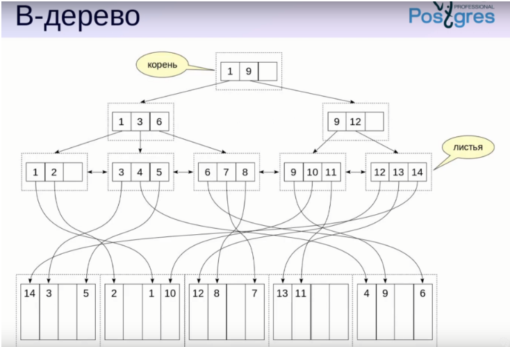
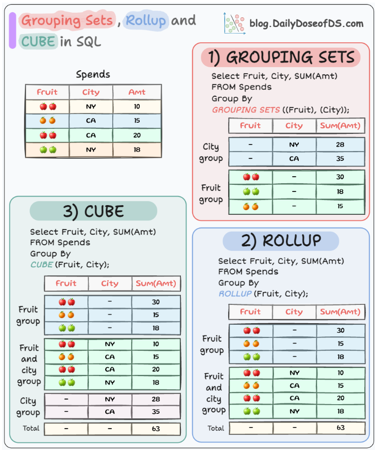

# SQL

[Что такое транзакции?](#что-такое-транзакции)

[Расскажите про ACID](#расскажите-про-acid)

[Проблемы параллельных транзакций](#проблемы-параллельных-транзакций)

[Уровни изолированности (read uncommitted, read committed, repeatable read, serializable)](#уровни-изолированности-read-uncommitted-read-committed-repeatable-read-serializable)

[Виды JOIN. Как работает каждый JOIN?](#виды-join-как-работает-каждый-join)

[Индексы в SQL. Что это?](#индексы-в-sql-что-это)

[Нормализация и денормализация. Перечислите формы](#нормализация-и-денормализация-перечислите-формы)

[Что такое внешний ключ?](#что-такое-внешний-ключ)

[Чем WHERE отличается от HAVING?](#чем-where-отличается-от-having)

[Чем отличается MySQL от PostgreSQL?](#чем-отличается-mysql-от-postgresql)

[Оптимизация запросов. Какие инструменты?](#оптимизация-запросов-какие-инструменты)

[EXPLAIN vs EXPLAIN ANALYZE](#explain-vs-explain-analyze)

[PostgreSQL. Какой инструмент для сбора статистики?](#postgresql-какой-инструмент-для-сбора-статистики)

[Что такое селективность?](#что-такое-селективность)

[Ключевое слово LATERAL](#ключевое-слово-lateral)

[Оконные функции. PARTITION BY](#оконные-функции-partition-by)

[cube, rollup, groupBy](#cube-rollup-groupby)

[Хранимые процедуры](#хранимые-процедуры)

[Как работает Serializable?](#как-работает-serializable)

[View, materialized view. представлениями, материализованными представлениями?](#view-materialized-view-представлениями-материализованными-представлениями)

[C помощью SQL блокировка строки? - SELECT FOR UPDATE](#c-помощью-sql-блокировка-строки---select-for-update)

[UNION vs UNION ALL](#union-vs-union-all)

[Расскажи про ключевое слово DISTINCT?](#расскажи-про-ключевое-слово-distinct)

[Что такое табличные выражения?](#что-такое-табличные-выражения)

[Для чего используется Database Connection Pool? (Hikari) Переполнение connection pool](#для-чего-используется-database-connection-pool-hikari-переполнение-connection-pool)

[Блокировки и локи. Оптимистичная и Пессимистичная](#блокировки-и-локи-оптимистичная-и-пессимистичная)

[БД. Constraint. Какие существуют?](#бд-constraint-какие-существуют)

[Primary Key](#primary-key)

[Foreign Key](#foreign-key)

[DELETE vs TRUNCATE](#delete-vs-truncate)

# Что такое транзакции?

Это набор логически связанных запросов. Транзакция либо выполнится полностью(commit), либо откатится(rollback)

[К оглавлению](#SQL)

# Расскажите про ACID

Это набор свойств, гарантирующих надежность транзакции:

+ A - Атомарность. Все операции внутри транзакции либо выполняются полностью, либо не выполняются вообще
+ C - Согласованность. После выполнения транзакции данные должны соблюдать все правила целостности (правила целостности
  определяются бизнес-логикой)
+ I - Изолированность. Во время выполнения транзакции параллельные транзакции не должны оказывать влияние на ее
  результат
+ D - Долговечность. Независимо от проблем (потеря питания, сбой и т.д), изменения, сделанные успешно завершенной
  транзакцией, должны остаться сохранёнными в базе данных

[К оглавлению](#SQL)

# Проблемы параллельных транзакций

+ `Потерянное обновление`. При одновременном изменении одних и тех же данных разными транзакциями - в силу вступают
  только изменения в последней транзакции(Rapeatable read, и все что выше
+ `Грязное чтение`. Транзакция A обновляет значение в базе данных, но еще не закоммитила их. Транзакция B считывает это
  значение, не зная, что изменения могут быть отменены. Если транзакция A отменяется, значение, прочитанное транзакцией
  B, было “грязным”, так как оно не отражает окончательное состояние базы данных (Read commited, и всё что выше)
+ `Неповторяющееся чтение`. Возникает в результате изменения самих данных! Транзакция A читает значение X из базы
  данных. Транзакция B обновляет значение X и фиксирует изменения. Транзакция A повторно читает значение X, но теперь
  оно изменено транзакцией B (Repeatable read и всё что выше)
+ `Фантомное чтение`. Возникает в результате изменения кол-ва данных! Транзакция A выполняет запрос на выборку всех
  записей. Транзакция B добавляет запись и фиксирует изменения. Транзакция A снова выполняет тот же запрос, и теперь
  результат включает новую запись, которая была добавлена транзакцией B (Serializable)

[К оглавлению](#SQL)

# Уровни изолированности (read uncommitted, read committed, repeatable read, serializable)

+ `Read uncommited`. Транзакции могут читать данные, которые еще не зафиксированы другими транзакциями (использовать,
  когда все транзакции на чтение)
+ `Read commited`. Транзакции могут читать только те данные, которые уже зафиксированы другими данными (решает грязное
  чтение)
+ `Repeatable read`. В пределах одной транзакции, если вы дважды запрашиваете одну и ту же запись, то независимо от
  изменений, сделанных другими транзакциями, данные не изменятся. (решает грязное и неповторяющееся чтение и потерянное
  обновление)
+ `Serializable`. Самый строгий уровень изоляции. Транзакции выполняются так, как будто происходят последовательно, одна
  за другой (решает всё, но бьет по производительности)

### Какой уровень изолированности стоит по умолчанию в MySQL?

+ Repeatable read

### Уровни изоляции транзакций в Postgres

В Postgres Pro вы можете запросить любой из четырёх уровней изоляции транзакций, однако внутри реализованы только три
различных уровня, то есть режим Read Uncommitted в Postgres Pro действует как Read Committed. Причина этого в том, что
только так можно сопоставить стандартные уровни изоляции с реализованной в Postgres Pro архитектурой многоверсионного
управления конкурентным доступом.

### Зависимость скорости работы БД и уровня изоляции

| Уровень изоляции | Описание                                                                                      | Влияние на производительность                                                               |
|------------------|-----------------------------------------------------------------------------------------------|---------------------------------------------------------------------------------------------|
| Read Uncommitted | Транзакции могут читать данные, которые ещё не зафиксированы.                                 | Самый быстрый, но данные могут быть неконсистентными.                                       |
| Read Committed   | Транзакции читают только зафиксированные данные.                                              | Средняя производительность, баланс между скоростью и консистентностью.                      |
| Repeatable Read  | Гарантирует, что данные, прочитанные транзакцией, не изменятся, пока транзакция не завершена. | Снижает производительность из-за блокировок, но обеспечивает более высокую консистентность. |
| Serializable     | Самый высокий уровень изоляции, предотвращает все виды аномалий.                              | Самый медленный, так как использует полные блокировки.                                      |

[К оглавлению](#SQL)

# Виды JOIN. Как работает каждый JOIN?

Это такой оператор, позволяющий связать данные из двух таблиц. Бывают:

+ `INNER JOIN`. Выдаст общее для левой и правой таблицы
+ `LEFT JOIN`. Выдаст все значения с левой таблицы и все подходящие с правой
+ `RIGHT JOIN`. Выдаст все значения с правой таблицы и все подходящие с левой
+ `FULL JOIN`. Все записи, которые присутствуют в таблицах
+ `CROSS JOIN`. Создаст декартово произведение двух таблиц (если в первой таблице 5 строк, а во второй 3, то вернет 5 x
  3 = 15)
+ `NATURAL JOIN`. Объединяет таблицы по столбцам с одинаковыми именами, если значения в этих столбцах совпадают
+ `SELF JOIN`. Соединяет таблицы с самой собой

### Как реализовать JOIN?

+ `INNER JOIN`

Возвращает только те строки, которые совпадают в обеих таблицах.

```java
SELECT employees.name, departments.name AS department_name
FROM employees
INNER JOIN departments ON employees.department_id = departments.id;

Результат: Только сотрудники, у которых есть совпадающий отдел.
```

+ `LEFT JOIN (LEFT OUTER JOIN)`

Возвращает все строки из левой таблицы и совпадающие строки из правой таблицы. Если совпадения нет, то в правых колонках будет NULL.

```java
SELECT employees.name, departments.name AS department_name
FROM employees
LEFT JOIN departments ON employees.department_id = departments.id;
Результат: Все сотрудники, даже если они не привязаны к отделу.
```

+ `RIGHT JOIN (RIGHT OUTER JOIN)`

Возвращает все строки из правой таблицы и совпадающие строки из левой таблицы. Если совпадения нет, то в левых колонках будет NULL.
```
SELECT employees.name, departments.name AS department_name
FROM employees
RIGHT JOIN departments ON employees.department_id = departments.id;
Результат: Все отделы, даже если в них нет сотрудников.
```

+ `FULL JOIN (FULL OUTER JOIN)`

Возвращает все строки из обеих таблиц. Если совпадений нет, в соответствующих колонках будет NULL.

```
SELECT employees.name, departments.name AS department_name
FROM employees
FULL JOIN departments ON employees.department_id = departments.id;
Результат: Все сотрудники и все отделы, включая несвязанные.
```

+ `CROSS JOIN`

Возвращает декартово произведение таблиц (каждая строка из первой таблицы объединяется с каждой строкой из второй таблицы).

```
SELECT employees.name, departments.name AS department_name
FROM employees
CROSS JOIN departments;
Результат: Все возможные комбинации сотрудников и отделов.
```

+ `SELF JOIN`

Применяется для объединения таблицы самой с собой.

```
SELECT e1.name AS employee1, e2.name AS manager
FROM employees e1
INNER JOIN employees e2 ON e1.manager_id = e2.id;
Результат: Список сотрудников и их менеджеров.
```

[К оглавлению](#SQL)

# Индексы в SQL. Что это?

Индекс это ключ, построенный из одного или нескольких столбцов в базе данных, который ускоряет выборку. При этом, чем больше дубликатов в столбце - тем хуже работает индекс.

### Плюсы и минусы индексов

Плюсы:
+ Улучшают производительность для select и сортировки по определенным полям

Минусы:
+ Ухудшается производительность, когда нужно вставлять, обновлять или удалять данные 
+ Требуется дополнительное место и чем больше/длиннее ключ - тем больше размер индекса

### Какие виды индексов знаешь?

| Уровень изоляции                                         | Описание                                                                                        | Использование                                                                                           |
|----------------------------------------------------------|-------------------------------------------------------------------------------------------------|---------------------------------------------------------------------------------------------------------|
| B-дерево (B-tree)                                        | Стандартный индекс, используемый в большинстве СУБД. Данные хранятся в сбалансированном дереве. | Для поиска, сортировки, диапазонных запросов.                                                           |
| Индекс с несколькими столбцами (Composite Index)         | Индекс, включающий несколько столбцов. Ускоряет запросы, использующие несколько фильтров.       | Когда запросы фильтруют по нескольким столбцам одновременно.                                            |
| Индекс полного текста (Full-Text Index)                  | Индекс для быстрого поиска по тексту, включая ключевые слова и фразы.                           | Поиск по длинным текстовым полям, например, в статьях или документах.                                   |
| Хеш-индекс (Hash Index)                                  | Использует хеш-функцию для поиска точных совпадений.                                            | Для быстрого поиска по уникальным значениям (например, ID).                                             |
| Индекс с уникальными значениями (Unique Index)           | Индекс, обеспечивающий уникальность значений в столбце.                                         | Для обеспечения уникальности значений (например, email).                                                |
| Индекс обратного списка (Bitmap Index)                   | Индекс с битовыми картами для колонок с малым числом уникальных значений.                       | Для столбцов с ограниченным числом уникальных значений, например, пол.                                  |
| Инкрементный (Clustered Index)                           | Индекс, при котором данные таблицы физически упорядочены в соответствии с индексом.             | Когда необходимо хранить данные в порядке индекса, например, по ID.                                     |
| Индекс по выражению (Functional Index)                   | Индекс, основанный на вычисленных значениях или функциях над столбцами.                         | Для запросов, использующих функции или выражения в фильтрах.                                            |
| Индекс на основе дерева (GiST — Generalized Search Tree) | Общий тип дерева, используемый для индексации сложных типов данных.                             | Для индексации географических данных или других сложных типов.                                          |
| Индекс на основе префикса (Prefix Index)                 | Индекс, созданный на части строки, например, на первых символах.                                | Для текстовых полей, где важно индексировать только часть строки (например, первые несколько символов). |

### Почему когда много индексов, это плохо?

| Уровень изоляции                         | Описание                                                                                                                    |
|------------------------------------------|-----------------------------------------------------------------------------------------------------------------------------|
| Увеличение времени записи                | При вставке, обновлении или удалении данных индексы нужно обновлять, что замедляет операции записи.                         |
| Большое использование места              | Индексы занимают дополнительное место на диске, особенно при большом объеме данных.                                         |
| Сложности с выбором оптимального индекса | СУБД может не выбрать лучший индекс для запроса, если их слишком много.                                                     |
| Снижение производительности запросов     | Большое количество индексов может привести к дополнительным вычислениям при планировании запроса, что замедляет выполнение. |
| Усложнение управления                    | Управление большим количеством индексов становится сложным, включая их отслеживание и обслуживание.                         |
| Избыточность индексов                    | Некоторые индексы могут быть избыточными, что не только не ускоряет запросы, но и увеличивает нагрузку на систему.          |
| Сложности с обслуживанием                | Большое количество индексов усложняет операции обслуживания, такие как реорганизация и восстановление.                      |

### Что содержится внутри дерева?



### В индексе ссылка на данные или в самом индексе кешируем данные?

В индексе хранятся ссылки на реальные данные, которые находятся в таблице базы данных. Эти ссылки могут быть представлены в виде:

+ Указателей на строки в таблице, где хранятся данные. 
+ Идентификаторов записей, которые позволяют найти данные в таблице.

Например, в B+-дереве:

+ В листьях дерева хранятся не сами данные, а ссылки на данные в таблице (или другие индексы). 
+ Внутренние узлы дерева содержат только ключи для направления поиска.

### Какие индексы по умолчанию в разных СУБД?

По-умолчанию в большинстве CУБД стоит B-tree

### Сложность поиска с индексом и без индекса

Когда мы ищем данные в базе, скорость выполнения запроса зависит от наличия индекса. Индекс – это структура данных, которая ускоряет поиск, подобно оглавлению книги.

1. `Поиск без индекса (полный перебор, Full Table Scan)`

Если в таблице нет индекса, СУБД просматривает каждую строку (O(N)).
````
Пример без индекса
SELECT * FROM users WHERE email = 'ivan@mail.com';
````
Что происходит?
+ БД перебирает все строки (users) и сравнивает email. 
+ Если записей 1 миллион, придется просмотреть все 1M строк → O(N).

Когда подходит?

+ Для маленьких таблиц (<1000 записей). 
+ Когда нет строгих требований к скорости.

Проблема:
+ Очень медленно на больших таблицах!

2. `Поиск с индексом (O(log N) или O(1))`

Если на поле есть индекс, поиск выполняется намного быстрее.
````
Пример с индексом
Создадим индекс на поле email:
CREATE INDEX idx_email ON users(email);
Теперь запрос:
SELECT * FROM users WHERE email = 'ivan@mail.com';
````
Что происходит?
+ БД использует B-Tree или Hash Index, чтобы быстро найти нужные данные. 
+ Вместо 1M проверок поиск займет O(log N) или O(1) в случае хеш-индекса.

Когда использовать?
+ Частый поиск по полю (WHERE column = value). 
+ Для больших таблиц (>100K записей).

Минусы:
+ Индексы замедляют INSERT/UPDATE/DELETE, так как их нужно обновлять. 
+ Индексы занимают дополнительную память.

[К оглавлению](#SQL)

# Нормализация и денормализация. Перечислите формы

`Нормализация` - процесс преобразования отношений базы данных к виду без избыточной информации. Избыточность - это
ситуация, когда одни и те же данные хранятся в базе в нескольких местах. Нормализация проходит через несколько форм:

+ `1NF` (1ая нормальная форма). Одна ячейка - одно значение 
+ `2NF` (2ая нормальная форма). Все не ключевые зависят от ключа 
+ `3NF` (3ья нормальная форма). Все не ключевые не зависят друг от друга

`Денормализация` - процесс обратный нормализации. Обычно это необходимо для повышения производительности и скорости
извлечения данных, за счет увеличения избыточности данных. Производительность увеличивается за счет уменьшения сложности
запросов

[К оглавлению](#SQL)

# Что такое внешний ключ?

Ключ, который должен совпадать с ключом другой таблицы

[К оглавлению](#SQL)

# Чем WHERE отличается от HAVING?

`WHERE` применяется до выполнения агрегатных функций, а `HAVING` - после

[К оглавлению](#SQL)

# Чем отличается MySQL от PostgreSQL?

`MySQL` — проще, быстрее в базовых операциях, хорош для приложений с высокой нагрузкой на чтение

`PostgreSQL` — мощнее, с расширенными функциями и более строгим соблюдением стандартов, лучше подходит для сложных приложений

[К оглавлению](#SQL)

# Оптимизация запросов. Какие инструменты?

+ `EXPLAIN` – Показывает план выполнения запроса, что позволяет увидеть, как СУБД планирует извлекать данные. 
+ `EXPLAIN ANALYZE` – Выполняет запрос и показывает реальный план выполнения, включая затраченные ресурсы (время, память). 
+ `Indexes` – Индексы ускоряют доступ к данным, особенно при использовании в условиях WHERE. 
+ `pg_stat_statements` (для PostgreSQL) – Модуль для сбора статистики выполнения запросов.

### SQL-запрос у тебя в норме, но выполнение всё равно долгое. Твои действия?

+ Использование индексов – Проверь, правильно ли используются индексы. Возможно, стоит создать или пересмотреть их.
+ Оптимизация плана выполнения – Используй EXPLAIN и EXPLAIN ANALYZE для анализа плана выполнения запроса и поиска
  проблемных мест.
+ Рефакторинг запроса – Перепиши запрос, если есть более эффективный способ получить те же данные. Например, объединение
  нескольких подзапросов или использование более простых JOIN.
+ Проверка ресурсных ограничений – Возможно, проблема не в запросе, а в нехватке ресурсов (CPU, память, диск).

### Sequence Scan - что означает?

`Sequence Scan` (Последовательное сканирование) — это метод доступа к данным в PostgreSQL и других СУБД, при котором сканируются все строки таблицы. Это самый простой и “прямолинейный” способ поиска данных, но он может быть менее эффективным для больших таблиц.

+ Используется, если:
  + Нет индекса, подходящего для выполнения запроса.
  + Запрос возвращает большинство строк таблицы (эффективность индекса становится ниже).
  + Оценка стоимости (cost) последовательного сканирования ниже, чем у индексного сканирования.

[К оглавлению](#SQL)

# EXPLAIN vs EXPLAIN ANALYZE

`EXPLAIN` показывает план выполнения запроса до его фактического выполнения. Он выводит, как СУБД собирается получить данные. Это включает:

+ Какой тип сканирования будет применяться (Seq Scan, Index Scan). 
+ Сортировки и объединения (Nested Loop, Hash Join). 
+ Предполагаемое количество строк и стоимость выполнения на каждом этапе.

### Explain analyze. Как устроен? На что обращать внимание?

`EXPLAIN ANALYZE` не только показывает план выполнения, но и выполняет запрос, выводя фактическое время выполнения каждой операции. Полезные моменты:

+ Фактическое время (Actual Time) – сколько времени заняла операция. 
+ ROWS – реальное количество строк, прошедших через каждый этап. 
+ LOOPS – количество раз, когда этот шаг был выполнен (важно для вложенных циклов).

| Критерий                  | EXPLAIN                                                     | EXPLAIN ANALYZE                                                      |
|---------------------------|-------------------------------------------------------------|----------------------------------------------------------------------|
| Что делает                | Показывает план запроса (как СУБД собирается его выполнять) | Выполняет запрос фактически и показывает реальные затраты            |
| Выполняет ли запрос       | Нет – только формирует план                                 | Да – запрос реально выполняется и собирается статистика              |
| Показывает реальное время | Нет – лишь оцениваемые затраты                              | Да – фактическое время выполнения каждой операции                    |
| Нагрузка на СУБД          | Минимальная (планирование без выполнения)                   | Может быть существенной, т. к. запрос действительно выполняется      |
| Когда использовать        | Быстрая оценка, понять логику оптимизатора                  | Точный анализ производительности (узнать, где “бутылочное горлышко”) |
| Пример использования      | `EXPLAIN SELECT * FROM table;`                              | `EXPLAIN ANALYZE SELECT * FROM table;`                               |
| Дополнительные опции      | `EXPLAIN (FORMAT JSON)` или `EXPLAIN (FORMAT YAML)`         | Аналогично, но с `ANALYZE: EXPLAIN (ANALYZE, BUFFERS)` ...           |

[К оглавлению](#SQL)

# PostgreSQL. Какой инструмент для сбора статистики?

В PostgreSQL используется встроенный модуль `pg_stat_statements` для сбора статистики по запросам. Он сохраняет информацию о том, как часто выполняются запросы, какое время они занимают, и сколько ресурсов потребляют.

[К оглавлению](#SQL)

# Что такое селективность?

Селективность – это доля строк, которые будут отобраны запросом из таблицы. Чем меньше строк будет отобрано (меньше доля от общего количества строк), тем более селективен запрос. Высокая селективность обычно означает, что запрос более эффективен, так как обрабатывается меньше данных.

[К оглавлению](#SQL)

# Ключевое слово LATERAL

LATERAL позволяет использовать данные из каждой строки внешней таблицы в подзапросе (аналог “для каждой строки”).

```java
Пример:
Допустим, у нас есть таблица users и мы хотим 
для каждого пользователя взять его последние 3 транзакции 
из таблицы transactions

SELECT u.id, u.name, t.*
FROM users u,
LATERAL (
  SELECT * 
  FROM transactions t 
  WHERE t.user_id = u.id 
  ORDER BY t.date DESC 
  LIMIT 3
) t;

Для каждой строки таблицы users 
выполняется подзапрос с ограничением (LIMIT 3).
Без LATERAL подзапрос не мог бы ссылаться 
на внешнюю таблицу u.
```

[К оглавлению](#SQL)

# Оконные функции. PARTITION BY

Оконные функции выполняют вычисления над строками, разделёнными на группы (партитивные окна) или на весь набор данных.

### PARTITION BY 
Определяет, как данные будут разбиваться на группы. Аналог GROUP BY, но не агрегирует строки, а позволяет работать с ними индивидуально в пределах группы.

````
Пример:
Пусть есть таблица sales с колонками region, salesperson и sales. 
Мы хотим вычислить сумму продаж в каждом регионе
 и ранжировать сотрудников внутри регионов.

SELECT
region,
salesperson,
sales,
SUM(sales) OVER (PARTITION BY region) AS total_region_sales,
RANK() OVER (PARTITION BY region ORDER BY sales DESC) AS rank_in_region
FROM sales;

PARTITION BY region: Группировка по регионам.
SUM(sales) выполняется для каждой строки, но только в рамках региона.
RANK() присваивает ранг на основе продаж внутри каждого региона.
````

[К оглавлению](#SQL)

# cube, rollup, groupBy

Используются для создания многомерных группировок в SQL



+ `CUBE`

Создаёт все возможные комбинации группировок.
````
SELECT region, product, SUM(sales)
FROM sales
GROUP BY CUBE(region, product);

Результат:
Группировка по region, product.
Группировка только по region.
Группировка только по product.
Общая сумма по всем продажам.
````

+ `ROLLUP`

Создаёт иерархические уровни группировки (сверху вниз).
````
SELECT region, product, SUM(sales)
FROM sales
GROUP BY ROLLUP(region, product);

Результат:
Группировка по region, product.
Группировка только по region.
Общая сумма по всем продажам.
````

+ `GROUPING SETS`

Явно указывает на комбинации группировки.
````
SELECT region, product, SUM(sales)
FROM sales
GROUP BY GROUPING SETS ((region, product), (region), ());

Результат идентичен ROLLUP, но группы можно задать произвольно.
````
+ `GROUP BY`

GROUP BY используется для группировки строк по определённым столбцам и применения агрегатных функций к каждой группе. Это позволяет выполнять расчёты по группам данных, например, подсчёт суммы, среднего значения и т.д.

````
Пример:
Есть таблица sales с колонками region и revenue. Чтобы найти суммарный доход по каждому региону:

SELECT region, SUM(revenue) AS total_revenue
FROM sales
GROUP BY region;

region — группирующий столбец.
SUM(revenue) вычисляется для каждой группы.
Если не использовать GROUP BY, SQL будет рассматривать все строки как одну группу.
````

[К оглавлению](#SQL)

# Хранимые процедуры

Хранимая процедура — это заранее сохранённый набор SQL-команд, выполняющий определённую задачу. Они позволяют повторно использовать код, обрабатывать бизнес-логику и повышать производительность.

### Ключевые особенности:

+ Входные параметры: передача данных в процедуру. 
+ Выходные параметры: возврат результата. 
+ Логика управления потоком: циклы, условные конструкции (IF, WHILE).
````
Пример создания и вызова хранимой процедуры:

CREATE PROCEDURE CalculateBonus (IN employee_id INT, OUT bonus_amount DECIMAL(10,2))
BEGIN
SELECT salary * 0.1 INTO bonus_amount
FROM employees
WHERE id = employee_id;
END;

Вызов:

CALL CalculateBonus(101, @bonus);
SELECT @bonus;

Преимущества:
Снижение трафика между клиентом и сервером.
Лучшая организация кода.
````

[К оглавлению](#SQL)

# Как работает Serializable?

`Serializable` — это самый строгий уровень изоляции транзакций в базах данных.
Он обеспечивает, что транзакции выполняются так, будто они происходят последовательно (по одной за раз), даже если фактически выполняются параллельно.

### Особенности:

Полностью предотвращает:
+ Повторное чтение: изменение данных между повторными чтениями. 
+ Фантомное чтение: появление новых строк, которые соответствуют запросу. 
+ Грязное чтение: чтение данных, которые не были зафиксированы.

### Механизм работы:

+ Использует блокировки или механизм версионирования (MVCC) для управления конкурентным доступом. 
+ Может приводить к снижению производительности из-за увеличения времени ожидания между транзакциями.

````
SET TRANSACTION ISOLATION LEVEL SERIALIZABLE;

BEGIN TRANSACTION;

-- Первая транзакция
SELECT SUM(balance) FROM accounts WHERE account_type = 'savings';

-- Вторая транзакция (ожидание завершения первой)
INSERT INTO accounts (account_type, balance) VALUES ('savings', 500);

COMMIT;
````

[К оглавлению](#SQL)

# View, materialized view. представлениями, материализованными представлениями?

`View (Представление)`:

+ Логический слой над таблицами, который хранит SQL-запрос. 
+ Данные не хранятся физически, каждый раз при обращении к представлению выполняется связанный с ним запрос. 
+ Используется для упрощения работы с данными, ограничения доступа и повторного использования сложных запросов.

````
CREATE VIEW ActiveUsers AS
SELECT id, name, email
FROM users
WHERE status = 'active';

-- Использование представления
SELECT * FROM ActiveUsers;
````

`Materialized View (Материализованное представление)`:

+ Сохраняет результат SQL-запроса физически (в отличие от обычного представления). 
+ Улучшает производительность сложных запросов, так как данные не пересчитываются каждый раз. 
+ Требует обновления (REFRESH), чтобы быть синхронизированным с исходными таблицами.

````
CREATE MATERIALIZED VIEW SalesSummary AS
SELECT region, SUM(revenue) AS total_revenue
FROM sales
GROUP BY region;

-- Обновление данных
REFRESH MATERIALIZED VIEW SalesSummary;
````

[К оглавлению](#SQL)

# C помощью SQL блокировка строки? - SELECT FOR UPDATE

SELECT FOR UPDATE используется для блокировки строк в таблице, чтобы предотвратить их изменение другими транзакциями до тех пор, пока текущая транзакция не завершится (через COMMIT или ROLLBACK).
````
BEGIN;

-- Блокировка строки с id = 1
SELECT * FROM accounts
WHERE id = 1
FOR UPDATE;

-- Делаем обновление
UPDATE accounts
SET balance = balance - 100
WHERE id = 1;

COMMIT;
````

+ В данном случае, строка с id = 1 заблокирована для других транзакций, пока текущая не завершится. 
+ Если другая транзакция попытается заблокировать ту же строку, она будет ожидать завершения текущей транзакции.

[К оглавлению](#SQL)

# UNION vs UNION ALL

UNION и UNION ALL оба объединяют результаты двух или более запросов, но есть ключевые отличия.

| Критерий             | UNION                                 | UNION ALL                                 |
|----------------------|---------------------------------------|-------------------------------------------|
| Удаление дубликатов  | Удаляет дубликаты                     | Не удаляет дубликаты.                     |
| Производительность   | Медленнее из-за проверки дубликатов   | Быстрее, так как не удаляет дубли.        |
| Использование памяти | Может занимать больше памяти.         | Занимает меньше памяти.                   |
| Тип результата       | Только уникальные строки.             | Все строки, включая дубликаты.            |
| Пример               | SELECT * FROM A UNION SELECT * FROM B | SELECT * FROM A UNION ALL SELECT * FROM B |

### Что делает UNION?

+ Объединяет результаты нескольких SELECT-запросов. 
+ Удаляет дубликаты, возвращая уникальные строки. 
+ Требует, чтобы количество и типы столбцов в объединяемых запросах совпадали.

````
SELECT city FROM customers
UNION
SELECT city FROM suppliers;
````

Если оба запроса возвращают city = 'New York', то в результате UNION эта строка появится только один раз. В случае UNION ALL — дважды.

[К оглавлению](#SQL)

# Расскажи про ключевое слово DISTINCT?

Ключевое слово `DISTINCT` в SQL используется для выборки уникальных значений в результатах запроса. Оно устраняет дублирующиеся строки.

[К оглавлению](#SQL)

# Что такое табличные выражения?

Табличные выражения — это временные, именованные наборы данных, создаваемые в рамках запроса. Они помогают структурировать запросы, делая их более читаемыми. Основные виды:

1. `CTE (Common Table Expressions)` — объявляются с помощью ключевого слова WITH

````
WITH recent_sales AS (
SELECT * FROM sales WHERE sale_date > '2023-01-01'
)
SELECT * FROM recent_sales WHERE amount > 1000;
Временная таблица recent_sales доступна только внутри текущего запроса.
````

2. `Подзапросы (Subqueries)`

````
SELECT name
FROM employees
WHERE department_id IN (
SELECT id FROM departments WHERE location = 'New York'
);
````

[К оглавлению](#SQL)

# Для чего используется Database Connection Pool? (Hikari) Переполнение connection pool

Database Connection Pool — это пул соединений с базой данных, который управляет ограниченным числом соединений, чтобы уменьшить нагрузку на сервер базы данных и повысить производительность. Hikari — один из самых популярных Connection Pool.

### Почему нужен пул?

+ Уменьшает накладные расходы на создание/закрытие соединений. 
+ Повышает производительность многопоточных приложений.

Переполнение Connection Pool: Происходит, когда приложению требуется больше соединений, чем разрешено пулом. Возможные причины:

+ Утечка соединений (не закрываются после использования). 
+ Неправильная настройка maxPoolSize. 
+ Избыточная нагрузка на приложение.

Решения:

+ Закрывайте соединения через try-with-resources
+ Увеличьте maxPoolSize, если это оправдано.

[К оглавлению](#SQL)

# Блокировки и локи. Оптимистичная и Пессимистичная

Блокировки (или локи) в базе данных — это механизм, который помогает управлять параллельным доступом к одним и тем же данным, чтобы избежать ошибок и конфликтов. Есть два типа блокировок:

+ Оптимистическая блокировка. При сохранении данных проверяется, не изменились ли они с момента их чтения. Если изменились — происходит ошибка, и нужно повторить транзакцию. 
+ Пессимистическая блокировка. Означает, что данные блокируются сразу, чтобы другие транзакции не могли их изменить, пока текущая транзакция не завершится.

### Оптимистичная блокировка:

+ Используется, когда конфликты редки. 
+ Проверяется, изменились ли данные с момента их чтения.

````
SELECT version FROM orders WHERE id = 1;
-- Обновляем, если версия не изменилась
UPDATE orders
SET status = 'processed', version = version + 1
WHERE id = 1 AND version = 5;
````

### Пессимистичная блокировка:

Блокирует данные, чтобы другие транзакции не могли их изменить.

````
SELECT * FROM orders WHERE id = 1 FOR UPDATE;
````

| Характеристика       | Оптимистичные локи             | Пессимистичные локи       |
|----------------------|--------------------------------|---------------------------|
| Конфликты            | Редкие                         | Частые                    |
| Механизм             | Проверка версии данных         | Блокировка ресурса        |
| Производительность   | Выше при редких конфликтах     | Ниже из-за блокировок     |
| Обработка конфликтов | Требует доп. кода              | Не требуется              |
| Применимость         | Чтение превалирует над записью | Высококонкурентная запись |

[К оглавлению](#SQL)

# БД. Constraint. Какие существуют?

Constraint (ограничение) — это правило, накладываемое на столбцы или таблицы, чтобы обеспечить целостность и корректность данных.

| Характеристика | Описание                                       | Применимость                    |
|----------------|------------------------------------------------|---------------------------------|
| NOT NULL       | Поле обязательно для заполнения                | Идентификаторы, ключевые данные |
| UNIQUE         | Значения в поле уникальны                      | Email, username                 |
| PRIMARY KEY    | Уникально идентифицирует строку                | Основной идентификатор записи   |
| FOREIGN KEY    | Обеспечивает целостность связи между таблицами | Таблицы с зависимыми данными    |
| CHECK          | Устанавливает условия для значений             | Бизнес-правила                  |
| DEFAULT        | Значение по умолчанию                          | Даты, статусы                   |
| AUTO_INCREMENT | Генерация уникальных идентификаторов           | Первичные ключи                 |

[К оглавлению](#SQL)

# Primary Key

Primary Key (PK) — это уникальный идентификатор записи в таблице. Без него сложно эффективно работать с данными, особенно в больших таблицах.

### Зачем нужен PK?

+ Гарантия уникальности: PK обеспечивает, что ни одна запись не будет дублироваться.
+ Связь между таблицами: Используется как основа для создания внешних ключей (FK).
+ Ускорение поиска: PK автоматически индексируется, что ускоряет выборку данных.
+ Идентификация строк: Позволяет уникально идентифицировать каждую запись.

### PK индексирован?

Да, Primary Key автоматически индексируется базой данных. Это индекс:

+ Ускоряет поиск, сортировку и фильтрацию по PK. 
+ Гарантирует уникальность значений в столбце PK.

### Primary Key может быть составным?

Да, Primary Key может быть составным (Composite Primary Key). Составной (Composite) Primary Key – это ключ, который состоит из двух и более столбцов.

```java
Таблица orders, где уникальная запись определяется ID пользователя + ID товара.

CREATE TABLE orders (
    user_id INT,
    product_id INT,
    order_date DATE,
    PRIMARY KEY (user_id, product_id)
);

```

### Когда нужен составной Primary Key?

+ Когда одного поля недостаточно для уникальности. 
+ Когда связка нескольких колонок определяет уникальность (например, лог системы бронирования, связи в Many-to-Many).

Минусы:
+ Сложнее строить индексы и внешние ключи.
+ Увеличивает размер индексов (так как ключ занимает больше места).

### Можно ли создать таблицу без Primary Key?

Да, таблицу можно создать без Primary Key.

```java
Пример таблицы без PK:

CREATE TABLE logs (
    event_id INT,
    event_time TIMESTAMP,
    description TEXT
);
```

### Чем грозит создание таблицы без Primary Key?

1. Дублирование данных

Без PRIMARY KEY ничто не мешает вставить дублирующиеся записи.

````
INSERT INTO logs (event_id, event_time, description)
VALUES (1, '2024-02-10 12:00:00', 'Ошибка сервера');
INSERT INTO logs (event_id, event_time, description)
VALUES (1, '2024-02-10 12:00:00', 'Ошибка сервера'); -- Дубль!
````

Проблема: Дубликаты могут ломать аналитику, бизнес-логику и связи в БД.

2. Замедленный поиск (O(N))

Без PK нет индекса, поэтому БД выполняет полный перебор (Full Table Scan).

````
SELECT * FROM logs WHERE event_id = 1;

Без индекса: O(N) (медленно).
С PK (индексом): O(log N) (намного быстрее).
````

3. Проблемы с внешними ключами (FOREIGN KEY)

Если таблица не имеет PK, другие таблицы не смогут ссылаться на нее через FOREIGN KEY.

````
Пример:

CREATE TABLE orders (
order_id INT PRIMARY KEY
);
CREATE TABLE order_items (
item_id INT PRIMARY KEY,
order_id INT REFERENCES orders(order_id) -- Без PK в orders тут будет ошибка!
);

Проблема: Нарушение ссылочной целостности.
````

4. Усложненная репликация в MySQL

В MySQL репликация (Binlog) работает медленно без PK, так как строки ищутся по всей таблице (UPDATE/DELETE).

[К оглавлению](#SQL)

# Foreign Key

FOREIGN KEY – это ограничение (constraint), которое обеспечивает ссылочную целостность между таблицами. Он указывает, что значение в одном столбце должно соответствовать значению в другой таблице (обычно Primary Key).

```java
Пример:
Таблица orders ссылается на таблицу users:

CREATE TABLE users (
    user_id INT PRIMARY KEY,
    name VARCHAR(100)
);

CREATE TABLE orders (
    order_id INT PRIMARY KEY,
    user_id INT,
    FOREIGN KEY (user_id) REFERENCES users(user_id)
);

Теперь orders.user_id может содержать 
только те значения, которые есть в users.user_id.
```
### Foreign Key может быть составным?

Да, Foreign Key может быть составным (Composite Foreign Key). Составной FOREIGN KEY ссылается на составной PRIMARY KEY (должны совпадать количество и типы колонок).

````
Пример:

CREATE TABLE categories (
category_id INT,
subcategory_id INT,
PRIMARY KEY (category_id, subcategory_id)
);

CREATE TABLE products (
product_id INT PRIMARY KEY,
category_id INT,
subcategory_id INT,
FOREIGN KEY (category_id, subcategory_id) REFERENCES categories(category_id, subcategory_id)
);

Теперь products.category_id, subcategory_id должны 
соответствовать categories.category_id, subcategory_id.
````

Минусы составного FK:
+ Усложняет индексацию.
+ Запросы JOIN становятся менее удобными.

| Характеристика | Primary Key (PK)                       | Foreign Key (FK)                            |
|----------------|----------------------------------------|---------------------------------------------|
| Назначение     | Гарантирует уникальность строк         | Обеспечивает ссылочную целостность          |
| Уникальность   | Всегда уникален                        | Может повторяться                           |
| NULL?          | Нельзя NULL                            | Можно NULL                                  |
| Количество     | Один на таблицу (может быть составным) | Может быть несколько                        |
| Удаление       | Нельзя менять без CASCADE              | ON DELETE CASCADE – удалит зависимые записи |

```java
Пример Primary Key vs Foreign Key:

CREATE TABLE users (
    user_id INT PRIMARY KEY
);

CREATE TABLE orders (
    order_id INT PRIMARY KEY,
    user_id INT,
    FOREIGN KEY (user_id) REFERENCES users(user_id) ON DELETE CASCADE
);

Если удалить пользователя users.user_id = 1, 
то все его заказы удалятся автоматически!
```

[К оглавлению](#SQL)

# DELETE vs TRUNCATE

DELETE и TRUNCATE используются для удаления данных из таблицы, но работают по-разному

+ DELETE — для удаления конкретных строк, можно откатить(Если нужно удалить только часть данных)
+ TRUNCATE — для полного очищения таблицы, быстрее, но без отката(Если нужно очистить всю таблицу быстро)

1. `DELETE`

Плюсы:

+ Удаляет строки из таблицы с возможностью фильтрации (WHERE). 
+ Фиксируется в журнале транзакций (логируется). 
+ Можно откатить (ROLLBACK), если используется TRANSACTION. 
+ Запускает триггеры (AFTER DELETE).

````
Пример: Удаление пользователей старше 30 лет

DELETE FROM users WHERE age > 30;

Можно откатить с ROLLBACK:

START TRANSACTION;
DELETE FROM users WHERE age > 30;
ROLLBACK; -- Вернет данные обратно
````
Минусы:

+ Медленный для больших таблиц (удаляет строки по одной). 
+ Требует много памяти из-за логирования.

2. `TRUNCATE`

Плюсы:

+ Удаляет все строки сразу (без WHERE). 
+ Не логирует каждую строку (работает быстрее). 
+ Сбрасывает автоинкремент (AUTO_INCREMENT). 
+ Полностью очищает таблицу.

````
📌 Пример:

TRUNCATE TABLE users;

Работает быстрее, чем DELETE, 
так как удаляет всю таблицу сразу.
````

Минусы:

+ Нельзя удалить только часть строк (WHERE не работает). 
+ Нельзя откатить (ROLLBACK) в большинстве СУБД. 
+ Не вызывает DELETE-триггеры. 
+ Не работает, если есть Foreign Key с ON DELETE CASCADE.

| Характеристика                  | DELETE                             | TRUNCATE                 |
|---------------------------------|------------------------------------|--------------------------|
| Удаляет данные                  | Да, можно выбрать строки (WHERE)   | Да, но удаляет всё       |
| Можно откатить                  | Да (ROLLBACK)                      | Нет (в большинстве СУБД) |
| Быстродействие                  | Медленнее (логирует каждую строку) | Быстро (не логирует)     |
| Сбрасывает AUTO_INCREMENT       | Нет                                | Да                       |
| Вызов триггеров (AFTER DELETE)? | Да                                 | Нет                      |
| Используется с FOREIGN KEY?     | Да                                 | Нет, если есть FK        |

[К оглавлению](#SQL)
