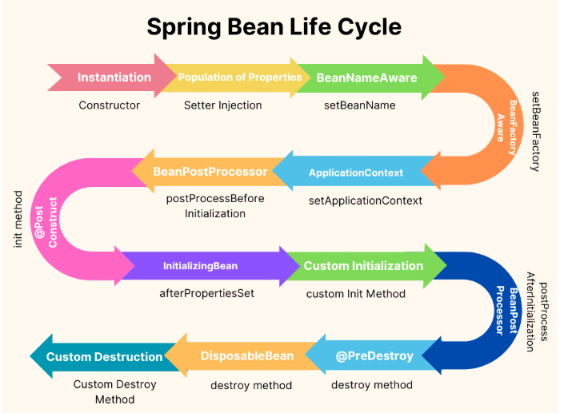

# Spring

[Зачем мы используем Spring? Почему его так любят?](#зачем-мы-используем-spring-почему-его-так-любят)

[Inversion of Control](#inversion-of-control)

[Dependency Injection](#dependency-injection)

[@Autowired](#autowired)

[@Qualifier vs @Primary](#qualifier-vs-primary)

[Что такое Bean?](#что-такое-bean)

[Скоуп бинов. Web скоуп](#скоуп-бинов-web-скоуп)

[Жизненный цикл Bean. Вопросы связанные с классами входящими в жизненный цикл бина](#жизненный-цикл-bean-вопросы-связанные-с-классами-входящими-в-жизненный-цикл-бина)

[@ComponentScan](#componentscan)

[@Conditional в Spring](#conditional-в-spring)

[@Service, @Repository, @Component](#service-repository-component)

[@Controller и @RestController](#controller-и-restcontroller)

[@ResponseBody vs ResponseEntity](#responsebody-vs-responseentity)

[Spring MVC. Что это? Какие проблемы решает?](#spring-mvc-что-это-какие-проблемы-решает)

[Парадигма AOP](#парадигма-aop)

[Циклическая зависимость](#циклическая-зависимость)

[Spring Boot](#spring-boot)

[Spring JDBC](#spring-jdbc)

[Spring Data JPA](#spring-data-jpa)

[Блокировка по умолчанию в Spring](#блокировка-по-умолчанию-в-spring)

[@Transactional. Как работает?](#transactional-как-работает)

[@Async](#async)

[Starter в Spring. Плюсы и минусы](#starter-в-spring-плюсы-и-минусы)

[Spring Criteria API](#spring-criteria-api)

[@Scheduled](#scheduled)

[Понятие Controller и Servlet в Java. Это одно и то же? Если разное, в чем отличия?](#понятие-controller-и-servlet-в-java-это-одно-и-то-же-если-разное-в-чем-отличия)

[Что такое объект Filter? В какой момент вызывается?](#что-такое-объект-filter-в-какой-момент-вызывается)

[Что такое ApplicationContext?](#что-такое-applicationcontext)

[Зачем нужны аннотации @RequestParam и @PathVariable?](#зачем-нужны-аннотации-requestparam-и-pathvariable)

[@ConfigurationProperties? ConfigurationProperties vs Value](#configurationproperties-configurationproperties-vs-value)

[@Value. Что это?](#value-что-это)

[Как работает DispatcherServlet?](#как-работает-dispatcherservlet)

[Варианты обработки Exceptions в Spring](#варианты-обработки-exceptions-в-spring)

[@Configuration. Является Configuration компонентом? Какую доп логику Configuration реализует?](#configuration-является-configuration-компонентом-какую-доп-логику-configuration-реализует)

[@PostConstruct](#postconstruct)

[Dependency management в Spring boot](#dependency-management-в-spring-boot)

[Spring Security, как хранить пароль пользователя?](#spring-security-как-хранить-пароль-пользователя)

[Spring Profiles как с ними работать?](#spring-profiles-как-с-ними-работать)

[Виды proxy в Spring](#виды-proxy-в-spring)

[@Lookup](#lookup)

# Зачем мы используем Spring? Почему его так любят?

Spring — это один из самых популярных фреймворков для разработки приложений на Java. Его используют благодаря широкому
набору возможностей, гибкости и модульности, что упрощает разработку корпоративных приложений.

[К оглавлению](#Spring)

# Inversion of Control

Это принцип, при котором мы передаем управление созданием и настройкой объектов Spring-у

[К оглавлению](#Spring)

# Dependency Injection

Dependency Injection (внедрение зависимостей) — это способ предоставления объекту его зависимостей извне, вместо того
чтобы объект создавал их самостоятельно. DI упрощает управление зависимостями и делает код более модульным, тестируемым
и легко расширяемым.

### Dependency Injection vs dependency lookup

| Критерий              | Dependency Injection                                              | Dependency Lookup                                       |
|-----------------------|-------------------------------------------------------------------|---------------------------------------------------------|
| Суть                  | Зависимости предоставляются извне (контейнером или фреймворком).  | Объект сам запрашивает зависимости (чаще из контекста). |
| Простота тестирования | Легче тестировать, зависимости можно заменять mock-объектами.     | Требует мокирования контекста или фабрики для тестов.   |
| Уровень контроля      | Контейнер управляет зависимостями, объект их не создаёт.          | Объект сам решает, как получить зависимости.            |
| Пример                | Spring внедряет зависимость через аннотации или XML-конфигурацию. | Вручную вызов метода ApplicationContext.getBean(...).   |

### Какие способы внедрения зависимостей знаешь?

| Способ             | Описание                                                                    | Плюсы                                                                               | Минусы                                                                                  | Примеры использования                                         |
|--------------------|-----------------------------------------------------------------------------|-------------------------------------------------------------------------------------|-----------------------------------------------------------------------------------------|---------------------------------------------------------------|
| Через конструктор  | Зависимости передаются при создании объекта.                                | Гарантия неизменяемости. Обязательные зависимости явно видны. Высокая тестируемость | Неудобно для большого числа зависимостей. Не подходит для опциональных зависимостей     | Когда зависимости обязательны и не изменяются после создания. |
| Через setter       | Зависимости устанавливаются с помощью метода после создания объекта.        | Подходит для опциональных зависимостей. Зависимости можно изменять в runtime.       | Возможна ситуация, когда объект используется без установленной зависимости. Менее явный | Когда зависимости опциональны или могут изменяться.           |
| Через поля (field) | Зависимости внедряются напрямую в поля объекта, обычно с помощью аннотаций. | Минимум кода. Простота при использовании фреймворков (Spring, CDI).                 | Сложнее тестировать. Нарушение принципа явности зависимостей. Отсутствие контроля.      | Быстрое внедрение в Spring через @Autowired.                  |

### Почему лучше использовать конструктор?

+ Неизменяемость: Зависимости устанавливаются один раз при создании объекта, и их невозможно изменить. 
+ Обязательность зависимостей: Устанавливает чёткое требование, что объект не может существовать без переданных зависимостей. 
+ Тестируемость: Проще создавать mock-объекты для тестов. 
+ Явность: Видно, какие зависимости требуются для работы объекта.

### Когда пригодится способ внедрения через setter?

+ Опциональные зависимости: Зависимость не обязательна для работы объекта и используется только в некоторых сценариях. 
+ Динамическое изменение зависимостей: Когда требуется сменить зависимость во время выполнения программы. 
+ Библиотеки или старый код: Для интеграции с кодом, где нельзя контролировать процесс создания объектов.

[К оглавлению](#Spring)

# @Autowired

Автоматически внедряет бины. Аннотацией @Autowired помечают:

+ Сеттер 
+ Поле 
+ Конструктор

[К оглавлению](#Spring)

# @Qualifier vs @Primary

Если есть два одинаковых бина (по типу и имени) Spring не знает какой именно использовать и выдает exception. Если над
одним из этих бинов установлена @Primary, то его использовать предпочтительнее. Но если нам нужно использовать в работе
оба этих бина, можно над каждым поставить @Qualifier и задать имя, для идентификации этих бинов (работает только с
@Autowired)

| Аннотация  | Описание                                                 | Когда использовать                                                 |
|------------|----------------------------------------------------------|--------------------------------------------------------------------|
| @Primary   | Указывает бин по умолчанию при выборе среди нескольких.  | Когда нужен бин, который используется чаще всего.                  |
| @Qualifier | Явно указывает, какой бин использовать среди нескольких. | Когда нужно внедрить конкретный бин, несмотря на наличие @Primary. |

[К оглавлению](#Spring)

# Что такое Bean? 

Bean в Spring — это объект, управляемый контейнером Spring IoC. Это основной строительный блок приложения, который
регистрируется и конфигурируется контейнером.

Аннотация @Bean используется для указания метода, который возвращает объект(бин) и эти бины в дальнейшем можно внедрять
в другие компоненты.

Аннотация @Bean используется для явного объявления бина в Java-конфигурации (в классе, помеченном как @Configuration).

Также можно использовать методы по умолчанию для определения бинов. Это позволяет создавать конфигурации бинов путем
реализации интерфейсов с определениями бинов в методах по умолчанию.

```java
public interface BaseConfig {
    @Bean
    default TransferServiceImpl transferService() {
        return new TransferServiceImpl();
    }
}

@Configuration
public class AppConfig implements BaseConfig {
}
```

### Что такое BeanDefinition?

BeanDefinition — это метаданные, описывающие, как должен быть создан, конфигурирован и управляем конкретный бин.

Он содержит:
+ Класс бина. 
+ Его скоуп (например, singleton или prototype). 
+ Зависимости. 
+ Методы инициализации и уничтожения.

### Как Spring создает бины?

+ Чтение конфигурации: Spring считывает конфигурацию из @Configuration, XML или аннотаций на классах.
+ Создание BeanDefinition: На основе конфигурации Spring формирует BeanDefinition для каждого бина. 
+ Инициализация бина: Вызывается конструктор или фабричный метод. Выполняется внедрение зависимостей (через конструктор, поля или сеттеры).
+ Обработка бина: Постобработка через BeanPostProcessor (например, для работы с @Autowired или @PostConstruct).
+ Добавление в контейнер: Готовый бин помещается в ApplicationContext.

### Как конфигурируется бин?

+ Аннотации (@Bean, @Component, @Value, @Scope).
+ XML-конфигурацию.
+ Java-код (в классе с @Configuration).
+ Средства типа @PostConstruct и @PreDestroy для управления жизненным циклом.

### В чем проблема того, что мы не можем final поле сделать в Bean-е?

Если в бине есть final поле, то оно должно быть инициализировано в момент создания объекта. Spring может не знать
значения для этого поля на этапе создания объекта, так как внедрение зависимостей происходит после вызова конструктора (
например, через @Autowired).

### Можно вставить Bean в статическое поле?

Нет, Spring не поддерживает внедрение зависимостей в статические поля напрямую. Решение: Используйте вручную сеттер или
вызовите контекст через ApplicationContext.

### Как сделать ленивую инициализацию бина?

Используйте аннотацию @Lazy.

### Какие есть способы донастройки бина?

Spring предоставляет несколько способов для настройки (customization) бинов перед их использованием в приложении.

| Метод                                 | Описание                                                      |
|---------------------------------------|---------------------------------------------------------------|
| @PostConstruct                        | Метод вызывается после создания бина и внедрения зависимостей |
| @PreDestroy                           | Метод вызывается перед удалением бина                         |
| InitializingBean#afterPropertiesSet() | Метод вызывается после установки свойств                      |
| DisposableBean#destroy()	             | Метод вызывается перед уничтожением бина                      |
| @Bean(initMethod, destroyMethod)	     | Указывает методы инициализации и удаления                     |
| BeanPostProcessor                     | Позволяет изменять бины до и после инициализации              |
| ApplicationContextAware               | Дает доступ к ApplicationContext внутри бина                  |

1. @PostConstruct и @PreDestroy

Аннотации, которые позволяют выполнить код перед инициализацией бина и перед его уничтожением.

````
@Component
public class MyBean {
    @PostConstruct
    public void init() {
        System.out.println("Бин создан!");
}

    @PreDestroy
    public void destroy() {
        System.out.println("Бин будет удален!");
    }
}

Вывод:

Бин создан!
Бин будет удален!
```` 

2. Реализация InitializingBean и DisposableBean

Интерфейсы, которые позволяют управлять жизненным циклом бина.

````
@Component
public class MyBean implements InitializingBean, DisposableBean {
    @Override
    public void afterPropertiesSet() {
        System.out.println("Бин инициализирован!");
}

    @Override
    public void destroy() {
        System.out.println("Бин уничтожается!");
    }
}
````

Используется редко, так как @PostConstruct и @PreDestroy удобнее.

3. @Bean(initMethod, destroyMethod)

В @Configuration можно указать методы инициализации и уничтожения бина.

````
@Configuration
public class AppConfig {
    @Bean(initMethod = "init", destroyMethod = "cleanup")
    public MyBean myBean() {
        return new MyBean();
    }
}

class MyBean {
    public void init() {
        System.out.println("Инициализация через initMethod");
}

    public void cleanup() {
        System.out.println("Удаление через destroyMethod");
    }
}

Вывод:
Инициализация через initMethod
Удаление через destroyMethod
````

4. BeanPostProcessor

Позволяет изменять бины до и после их инициализации.

````
@Component
public class CustomBeanPostProcessor implements BeanPostProcessor {
    @Override
    public Object postProcessBeforeInitialization(Object bean, String beanName) {
        System.out.println("Before init: " + beanName);
    return bean;
}

    @Override
    public Object postProcessAfterInitialization(Object bean, String beanName) {
        System.out.println("After init: " + beanName);
        return bean;
    }
}

Вывод:
Before init: myBean
After init: myBean
````

5. ApplicationContextAware

Дает доступ к ApplicationContext внутри бина.

````
@Component
public class MyBean implements ApplicationContextAware {
private ApplicationContext applicationContext;

    @Override
    public void setApplicationContext(ApplicationContext applicationContext) {
        this.applicationContext = applicationContext;
        System.out.println("ApplicationContext установлен!");
    }
}
````

Полезно для получения других бинов внутри класса.

### Как создать несколько бинов одного типа Singleton?

По умолчанию в Spring бины создаются в единственном экземпляре (Singleton). Однако, можно создать несколько бинов одного типа.

1. Разные имена в @Bean

````
@Configuration
public class AppConfig {
    @Bean("bean1")
    public MyBean myBean1() {
        return new MyBean("Первый бин");
}

    @Bean("bean2")
    public MyBean myBean2() {
        return new MyBean("Второй бин");
    }
}

class MyBean {
    private String name;

    public MyBean(String name) {
        this.name = name;
    }
}
````

Теперь можно получить два разных бина:

````
@Autowired
@Qualifier("bean1")
private MyBean myBean1;
````

2. Использование @Primary и @Qualifier

Если есть несколько бинов одного типа, можно указать приоритетный бин с @Primary.

````
@Component
@Primary
public class FirstService implements MyService {}

@Component
public class SecondService implements MyService {}
````

Теперь @Autowired будет использовать FirstService.
Если нужен SecondService, то используем @Qualifier:

````
@Autowired
@Qualifier("secondService")
private MyService myService;
````

3. Использование @Profile

Можно загружать разные бины в зависимости от профиля окружения.

````
@Component
@Profile("dev")
public class DevBean implements MyBean {}

@Component
@Profile("prod")
public class ProdBean implements MyBean {}
````

Запуск с -Dspring.profiles.active=dev создаст DevBean, а с -Dspring.profiles.active=prod — ProdBean.

### Где хранятся бины?

Контейнер Spring – ApplicationContext

Spring создает и хранит бины в контейнере IoC (ApplicationContext). Когда Spring загружается, он:

+ Сканирует классы с аннотациями @Component, @Service, @Repository. 
+ Создает бины и помещает их в ApplicationContext. 
+ Управляет их жизненным циклом (инициализация, использование, удаление).

### Как получить бин из ApplicationContext?

````
ApplicationContext context = new AnnotationConfigApplicationContext(AppConfig.class);
MyBean myBean = context.getBean(MyBean.class);
````

### Как вывести все бины?
````
String[] beanNames = context.getBeanDefinitionNames();
for (String beanName : beanNames) {
System.out.println(beanName);
}
````

Выведет все бины, зарегистрированные в контейнере.

[К оглавлению](#Spring)

# Скоуп бинов. Web скоуп

+ Singleton

  + Для каждого бина создается только один экземпляр на весь контекст приложения и переиспользуется везде, где он требуется 
  + Используется по-умолчанию 
  + Жизненный цикл бина начинается при загрузке контекста, и заканчивается при его завершении

+ Prototype

  + Каждый раз, когда запрашивается бин, создается новый экземпляр 
  + Бины со скоупом prototype не уничтожаются Spring, так как они выходят из его контроля сразу после создания 
  + НЕ ХРАНЯТСЯ в контексте Spring-а

Web скоуп:

| Скоуп       | Описание                                                                                           | Жизненный цикл                                               |
|-------------|----------------------------------------------------------------------------------------------------|--------------------------------------------------------------|
| request     | Создаётся один экземпляр бина на каждый HTTP-запрос                                                | Бин существует только в рамках одного HTTP-запроса.          |
| session     | Создаётся один экземпляр бина на каждую HTTP-сессию                                                | Бин живёт в течение одной HTTP-сессии.                       |
| application | Создаётся один экземпляр бина на весь ServletContext (аналогично синглтону, но для веб-приложения) | Бин существует в рамках всего времени работы веб-приложения. |
| websocket   | Создаётся один экземпляр бина на каждую WebSocket-сессию.                                          | Бин живёт в течение времени существования WebSocket-сессии   |

### Как создать свой Скоуп

1. Реализуйте интерфейс Scope:
````
public class CustomScope implements Scope {
    private Map<String, Object> beans = new HashMap<>();

    @Override
    public Object get(String name, ObjectFactory<?> objectFactory) {
        return beans.computeIfAbsent(name, k -> objectFactory.getObject());
    }

    @Override
    public Object remove(String name) {
        return beans.remove(name);
    }
    // Реализуйте другие методы...
}
````

2. Зарегистрируйте его в контексте:

````
@Bean
public static CustomScopeConfigurer customScopeConfigurer() {
    CustomScopeConfigurer configurer = new CustomScopeConfigurer();
    configurer.addScope("customScope", new CustomScope());
    return configurer;
}
````

[К оглавлению](#Spring)

# Жизненный цикл Bean. Вопросы связанные с классами входящими в жизненный цикл бина

Spring управляет созданием, инициализацией и уничтожением бинов в рамках контейнера IoC. Этот жизненный цикл можно разделить на несколько этапов.

`Создание бина -> Внедрение зависимостей -> Постобработка -> Инициализация -> Использование -> Уничтожение`



+ Сначала мы предоставляем наши Bean Definitions IoC контейнеру 
+ IoC-контейнер сортирует Bean Definitions чтобы сначала создавать те, которые не имеют зависимостей, и затем те, которые зависят от других бинов 
+ Затем итерируется по всем Bean Definitions и инициализирует их 
+ Далее вызываются PostConstruct методы 
+ Перед и после инициализации вызываются методы BeanPostProcessor 
+ На выходе получаем готовый бин. Если у этого бина скоуп singleton - храним его в ассоциативном массиве IoC контейнера. Если же другой скоуп - бин сразу же возвращается 
+ Для всех бинов, которые находятся в IoC контейнере, перед его завершением вызывается @PreDestroy метод

| Этап                   | Описание                                                                                                                 | Методы/Аннотации                                                                                     |
|------------------------|--------------------------------------------------------------------------------------------------------------------------|------------------------------------------------------------------------------------------------------|
| Создание бина          | Spring создает экземпляр бина, используя конструктор или фабричный метод                                                 | Конструктор бина (или фабричный метод).                                                              |
| Внедрение зависимостей | После создания, Spring внедряет все необходимые зависимости (через конструктор, поля, или сеттеры).                      | @Autowired, @Inject, конструкторы, сеттеры.                                                          |
| Постобработка          | Бин проходит через постобработчики перед инициализацией. Это этап, на котором можно изменить состояние бина.             | BeanPostProcessor — postProcessBeforeInitialization, postProcessAfterInitialization.                 |
| Инициализация          | Если бин реализует интерфейсы InitializingBean или использует аннотации @PostConstruct, вызываются методы инициализации. | afterPropertiesSet(), @PostConstruct, пользовательские методы инициализации через @Bean(initMethod). |
| Использование          | Бин доступен для использования в приложении. Это этап, когда бин полностью готов для работы.                             | Использование бина через @Autowired или прямые вызовы методов.                                       |
| Уничтожение            | Когда контейнер Spring уничтожает бин (особенно для синглтонов), вызываются методы очистки.                              | destroy(), @PreDestroy, пользовательские методы уничтожения через @Bean(destroyMethod).              |

[К оглавлению](#Spring)

# @ComponentScan

Аннотация @ComponentScan указывает Spring где искать классы, помеченные аннотацией @Component или его производной (
@RestController, @Controller, @Repository, @Service и т.д)

[К оглавлению](#Spring)

# @Conditional в Spring

Аннотация @Conditional в Spring используется для того, чтобы условно подключать бины или выполнять конфигурации только
при соблюдении определённых условий. Она позволяет гибко управлять поведением приложения, включая или исключая
определенные компоненты на основе внешних или внутренних условий.

### Что такое @ConditionalOnBean, @ConditionalOnProperty?

1. @ConditionalOnBean

Аннотация @ConditionalOnBean указывает, что бин или конфигурация должны быть зарегистрированы в контексте только если
определённый бин уже существует.

### Основное использование

Вы хотите зарегистрировать бин или выполнить конфигурацию только в том случае, если в контексте приложения уже есть бин
определённого типа или с определённым именем.

```java
@Configuration
public class MyConfig {

    @Bean
    public MyService myService() {
        return new MyService();
    }

    @Bean
    @ConditionalOnBean(MyService.class)
    public DependentService dependentService() {
        return new DependentService();
    }
}
```

+ Если бин MyService существует в контексте, будет создан бин DependentService. 
+ Если бина MyService нет, DependentService не будет создан.

2. @ConditionalOnProperty

Аннотация @ConditionalOnProperty указывает, что бин или конфигурация должны быть зарегистрированы в контексте только
если определённое свойство в файле конфигурации имеет нужное значение.

### Основное использование

Вы хотите активировать или деактивировать бин в зависимости от свойства, определённого в файле конфигурации (
application.properties или application.yml).

```java
# application.properties
feature.enabled=true
```

```java
@Configuration
public class MyConfig {

    @Bean
    @ConditionalOnProperty(prefix = "feature", name = "enabled", havingValue = "true", matchIfMissing = false)
    public FeatureService featureService() {
        return new FeatureService();
    }
}
```

+ Если feature.enabled=true в конфигурации, бин FeatureService будет зарегистрирован. 
+ Если feature.enabled=false или свойство отсутствует, бин не будет создан (если matchIfMissing=false).

| Аннотация              | Условие регистрации бина                                                                 | Тип проверки               |
|------------------------|------------------------------------------------------------------------------------------|----------------------------|
| @ConditionalOnBean     | Проверяет наличие другого бина в контексте                                               | Проверка наличия бина      |
| @ConditionalOnProperty | Проверяет значение свойства из конфигурации (application.properties или application.yml) | Проверка значения свойства |

[К оглавлению](#Spring)

# @Service, @Repository, @Component

| Аннотация   | Описание                                                                                       | Использование                     | Семантика                                                                                                                                                                            |
|-------------|------------------------------------------------------------------------------------------------|-----------------------------------|--------------------------------------------------------------------------------------------------------------------------------------------------------------------------------------|
| @Component  | Общая аннотация для обозначения компонента, который будет управляться контейнером Spring       | Для обычных бинов.                | Может быть использована для любых типов компонентов. Обычно используется, когда нет более точного типа                                                                               |
| @Service    | Специализация @Component, указывающая, что бин представляет собой сервисный слой.              | Для сервисов                      | Используется для классов, реализующих бизнес-логику. По сути, это более семантическое обозначение, чем @Component                                                                    |
| @Repository | Специализация @Component, указывающая, что бин представляет собой слой доступа к данным (DAO). | Для классов, работающих с данными | Используется для классов, которые инкапсулируют логику доступа к данным (например, через JDBC или JPA). Аннотация также может активировать обработку исключений, специфичных для DAO |

### Singleton-антипаттерн. Если мы на класс поставим @Service, это будет Singleton?

Если вы ставите аннотацию @Service, Spring создаёт бин по умолчанию синглтон. Однако это не является Singleton-антипаттерном, поскольку Spring управляет жизненным циклом и внедрением зависимостей, что решает многие проблемы, присущие обычному Singleton

### @Bean vs @Component

+ `@Bean`

+ Используется в конфигурационных классах (@Configuration). 
+ Определяет бин программно (через метод). 
+ Позволяет настраивать бин перед его созданием.

```java
@Configuration
public class AppConfig {
    @Bean
    public MyService myService() {
        return new MyServiceImpl();
    }
}
```

Когда использовать?

+ Если создание бина требует сложной логики. 
+ Если бин не может быть помечен @Component (например, библиотечный класс).

+ `@Component`

+ Используется для автоматического сканирования компонентов (@ComponentScan). 
+ Позволяет Spring автоматически обнаруживать бины.

```java
@Component
public class MyServiceImpl implements MyService {
}
```

Когда использовать?

+ Если класс управляется Spring и его можно автоматически найти.

### Основные отличия

| Характеристика     | @Bean                                | @Component                     |
|--------------------|--------------------------------------|--------------------------------|
| Где используется   | В @Configuration классе              | На классе                      |
| Как создается бин  | Программно                           | Автоматически (@ComponentScan) |
| Гибкость настройки | Высокая (можно передавать параметры) | Меньшая                        |
| Где применяется    | Когда нужен сложный бин              | Когда класс управляется Spring |

[К оглавлению](#Spring)

# @Controller и @RestController

+ @Controller В основном используется для возврата веб-страниц. Если нужно вернуть данные (например, JSON), нужно
  добавить @ResponseBody к методу
+ @RestContoller Это комбинация @Controller и @ResponseBody. Используется в REST. Всегда возвращает данные (например,
  JSON или XML) в теле HTTP-ответа. Нет необходимости добавлять @ResponseBody к каждому методу.

[К оглавлению](#Spring)

# @ResponseBody vs ResponseEntity

+ ResponseEntity — это объект, который содержит как тело ответа, так и HTTP-статус (например, 200 OK, 404 Not Found) и
  заголовки. Используется для более гибкого управления HTTP-ответами
+ @ResponseBody Аннотация, которая указывает, что результат метода контроллера должен быть возвращен как тело
  HTTP-ответа (например, JSON, XML)

[К оглавлению](#Spring)

# Spring MVC. Что это? Какие проблемы решает?

Spring MVC — это один из модулей Spring Framework, предназначенный для разработки веб-приложений на основе шаблона
Model-View-Controller. Решает следующие проблемы

+ Чёткое разделение логики. Разбиваем логику на MVC 
+ Поддержка различных шаблонизаторов. JSP, Thymeleaf и т.д 
+ Упрощает обработку HTTP-запросов через контроллеры

[К оглавлению](#Spring)

# Парадигма AOP

AOP - это способ добавить в программу дополнительные функции, не трогая основной код программы. Например, у нас есть
метод, который что-то делает. Но нам нужно, чтобы перед началом и в конце работы этого метода писался лог. Вместо того
чтобы добавлять этот код логирования в каждый метод руками - можно вынести его в отдельное место (аспект), а Spring сам
“вставит” его туда, где нужно, без изменений основного кода.

[К оглавлению](#Spring)

# Циклическая зависимость

Циклическая зависимость - это когда два класса взаимно ссылаются друг на друга через аннотацию @Autowired. Это может
вызвать проблему циклической зависимости, которую Spring Framework не сможет разрешить. Для решения этой проблемы можно
использовать один из следующих подходов:

+ Внедрять зависимости через set-ер 
+ Использование @Lazy. Аннотация @Lazy откладывает создание бина до момента его использования, что позволяет разорвать
круг

```java
@Component
public class BeanA {
    private final BeanB beanB;

    @Autowired
    public BeanA(@Lazy BeanB beanB) {
        this.beanB = beanB;
    }
}

@Component
public class BeanB {
    private final BeanA beanA;

    @Autowired
    public BeanB(@Lazy BeanA beanA) {
        this.beanA = beanA;
    }
}
```

[К оглавлению](#Spring)

# Spring Boot

Spring Boot — это фреймворк на основе Spring, который позволяет быстрее и проще создавать готовые к работе приложения.
Ключевые преимущества:

+ Стартеры — это готовые наборы библиотек (модулей), которые включают все необходимые зависимости для работы с конкретными
технологиями 
+ Встроенный сервер - В Spring Boot сервер встроен прямо в приложение. Например, когда вы добавляете стартер
spring-boot-starter-web, Spring Boot автоматически включает Tomcat или Jetty 
+ Автоматическая конфигурация - Spring Boot использует механизм автоматической конфигурации, который анализирует, какие
библиотеки находятся в вашем проекте, и автоматически настраивает необходимые компоненты. 
+ Упрощение сборки - В обычном Spring для развертывания приложения вам нужно собрать WAR файл и развернуть его на сервере. 
+ В Spring Boot приложение собирается в исполняемый JAR файл, который содержит все зависимости и сервер.

### Spring Boot vs Spring

+ Spring — это основной фреймворк с полной конфигурацией и гибкостью. 
+ Spring Boot — это расширение Spring, которое делает процесс разработки проще, автоматизируя конфигурацию и позволяя
быстро запускать приложение с минимальной настройкой.

| Критерий               | Spring                                                   | Spring Boot                                                               |
|------------------------|----------------------------------------------------------|---------------------------------------------------------------------------|
| Цель                   | Мощный фреймворк для создания Java-приложений            | Упрощение разработки с использованием Spring. Автоматизация конфигурации. |
| Конфигурация           | Требуется вручную настроить XML или Java-конфигурацию.   | Автоконфигурация, минимальные настройки для старта проекта                |
| Запуск                 | Нужно вручную настроить веб-сервер (например, Tomcat)    | Встроенные серверы (Tomcat, Jetty, Undertow) для простого запуска.        |
| Гибкость               | Большая гибкость, полная настройка каждого компонента    | Меньше гибкости, но намного быстрее и проще для старта проекта.           |
| Сложность              | Более высокая сложность настройки и конфигурации         | Упрощенная настройка и конфигурация                                       |
| Использование          | Используется, когда нужна полная настройка и контроль    | Используется для быстрого старта и простоты разработки                    |
| Конфигурационные файлы | Использует XML или Java-конфигурацию для настройки бинов | Использует application.properties или application.yml для настройки       |

### Как Spring Boot работает под капотом

1. Автоконфигурация (Auto Configuration):

+ Spring Boot анализирует классы и зависимости в вашем проекте и пытается настроить приложение так, чтобы оно работало
  “из коробки”.
  Например, если в проекте есть зависимость от spring-boot-starter-web, то Spring Boot автоматически настраивает
  DispatcherServlet, который обрабатывает HTTP-запросы.

2. Сканирование компонентов:

+ При запуске приложения Spring Boot сканирует пакеты для поиска аннотированных классов (например, с аннотациями
  @Component, @Service, @Repository, @Controller и т. д.), чтобы зарегистрировать бины.
+ Это сканирование начинается с класса, аннотированного @SpringBootApplication, который обычно находится в корне
  проекта. Пакеты и подпакеты, расположенные ниже этого класса, будут сканироваться на наличие компонентов.

3. Встроенный сервер:

+ Spring Boot может использовать встроенные сервера, такие как Tomcat, Jetty или Undertow, что позволяет запустить
  приложение как самодостаточный исполнимый JAR или WAR файл.

4. Процесс инициализации:

+ Когда приложение запускается, Spring Boot автоматически запускает и настраивает все необходимые компоненты и
  зависимости. Весь процесс инициализации централизован и автоматизирован.

5. Основной класс с @SpringBootApplication:

Этот класс является точкой входа в приложение. Он выполняет несколько задач:

+ Включает автоматическое конфигурирование с помощью @EnableAutoConfiguration.
+ Разрешает сканирование компонентов с помощью @ComponentScan.
+ Включает настройку конфигурации Spring с помощью @Configuration.

### Где Spring Boot ищет бины?

1. Основной класс с @SpringBootApplication:

+ Spring Boot начинает сканировать пакеты с местоположения класса, аннотированного @SpringBootApplication. 
+ Все классы в этом пакете и его подпакетах будут автоматически обработаны на наличие аннотаций для создания бинов (
например, @Component, @Service, @Repository и т. д.).

2. Пакет с @SpringBootApplication:

+ По умолчанию Spring Boot сканирует только текущий пакет и его подпакеты. Поэтому важно, чтобы основной класс с
аннотацией @SpringBootApplication находился в корне пакета, чтобы гарантировать, что все компоненты будут найдены.

3. Дополнительные настройки сканирования:

+ Можно явно указать, какие пакеты нужно сканировать, с помощью аннотации @ComponentScan:

````
@SpringBootApplication
@ComponentScan(basePackages = "com.example.myapp")
public class MyApplication {
    public static void main(String[] args) {
      SpringApplication.run(MyApplication.class, args);
    }
}
````
Это полезно, если компоненты находятся в другом пакете или если вы хотите ограничить область сканирования.

4. Использование профилей:

+ Если в проекте используются разные профили (например, для разных сред), Spring Boot будет также искать компоненты,
соответствующие активному профилю, при условии что они аннотированы как @Profile.

[К оглавлению](#Spring)

# Spring JDBC

Spring JDBC — это модуль Spring, который упрощает взаимодействие с базами данных, используя JDBC (Java Database
Connectivity). Он предлагает упрощённый подход к выполнению SQL-запросов, обработке результатов и управлению ресурсами

[К оглавлению](#Spring)

# Spring Data JPA

Spring Data JPA — это модуль Spring, который упрощает работу с JPA (Java Persistence API) и предоставляет удобные
способы доступа к данным. Он позволяет разработчикам сосредоточиться на бизнес-логике, не заботясь о низкоуровневых
деталях доступа к данным

[К оглавлению](#Spring)

# Блокировка по умолчанию в Spring

В Spring, по умолчанию, используется оптимистичная блокировка для управления конкурентным доступом к данным. Это
означает, что при обновлении сущностей предполагается, что конфликты не произойдут, и изменения вносятся в базу данных
без блокировок.

[К оглавлению](#Spring)

# @Transactional. Как работает?

@Transactional — это аннотация, которая позволяет автоматически управлять транзакциями. Когда метод аннотирован
@Transactional, Spring берет на себя начало, коммит или откат транзакции

### Что можно пометить аннотацией @Transactional?

+ Класс. Все его методы станут @Transactional
+ Метод

### Дефолтный propagation

Propagation.REQUIRED

### Атрибут propagation у @Transactional

+ REQUIRED — применяется по умолчанию. При входе в @Transactional метод будет использована уже существующая транзакция или
создана новая транзакция, если никакой еще нет 
+ REQUIRES_NEW — для внутреннего метода создается своя отдельная транзакция. Пока выполняется внутренний метод, внешняя
транзакция приостанавливается. Результат выполнения внутренней - не повлияет на результат выполнения внешней 
+ NESTED — создаёт под транзакцию внутри основной транзакции. Эта под-транзакция может быть откатана отдельно от основной,
но зависит от успешного завершения основной транзакции. Если основная транзакция откатится, под-транзакция тоже
откатится, даже если она завершилась успешно 
+ MANDATORY — требует внешнюю транзакцию, а иначе выбрасывается исключение 
+ SUPPORTS — метод будет выполняться в рамках транзакции, если она существует. Если ее нет, метод выполнится без
транзакции 
+ NOT_SUPPORTED — метод всегда выполняется вне транзакции, даже если существует текущая транзакция. Текущая транзакция
приостанавливается 
+ NEVER — запрещает выполнение метода в транзакции

### Какие способы управления транзакциями в Spring вы знаете?

+ Аннотация @Transactional 
+ TransactionManager 
+ TransactionTemplate

TransactionManager и TransactionTemplate:
Когда требуется точный контроль над транзакциями (например, управлять несколькими транзакциями в одном потоке)

@Transactional: Когда нужно простое управление транзакциями. Когда транзакция не требует сложной логики управления

### @Transactional повесить на private метод?

Если вы поместите аннотацию @Transactional на private метод, то транзакция не будет создана или применена, потому что
Spring использует прокси-механизм для управления транзакциями.

### Какие есть атрибуты у @Transactional?

Аннотация @Transactional управляет транзакциями в Spring. Она может быть установлена на классе или методе.

| Атрибут       | Описание                                                                  | Значение по умолчанию |
|---------------|---------------------------------------------------------------------------|-----------------------|
| propagation   | Как ведет себя транзакция (создавать новую или использовать существующую) | REQUIRED              |
| isolation     | Уровень изоляции транзакции (как управлять конкурентным доступом)         | DEFAULT               |
| readOnly      | Только для чтения (не позволяет изменять данные)                          | false                 |
| timeout       | Максимальное время выполнения (в секундах)                                | -1 (бесконечно)       |
| rollbackFor   | Перечисляет исключения, при которых делается rollback                     | Пусто                 |
| noRollbackFor | Исключения, при которых rollback не делается                              | Пусто                 |

`propagation – управление транзакциями`

| Значение      | Описание                                                             |
|---------------|----------------------------------------------------------------------|
| REQUIRED      | Использует существующую транзакцию или создает новую (по умолчанию)  |
| REQUIRES_NEW  | Всегда создает новую транзакцию                                      |
| SUPPORTS      | Использует существующую, но если ее нет — выполняется без транзакции |
| NOT_SUPPORTED | Всегда выполняется без транзакции                                    |
| MANDATORY     | Использует существующую, если ее нет — выбрасывает ошибку            |
| NEVER         | Никогда не выполняется в транзакции                                  |

```
@Transactional(propagation = Propagation.REQUIRES_NEW)
public void saveUser() {
    // Эта транзакция создаст новую, даже если уже есть другая
}
```

`isolation – уровень изоляции`

| Значение         | Описание                                                            |
|------------------|---------------------------------------------------------------------|
| DEFAULT          | Использует уровень БД                                               |
| READ_UNCOMMITTED | Позволяет читать неподтвержденные изменения (грязное чтение)        |
| READ_COMMITTED   | Не позволяет читать неподтвержденные изменения                      |
| REPEATABLE_READ  | Не позволяет изменять данные, которые уже были прочитаны            |
| SERIALIZABLE     | Полная изоляция (максимальная защита, но низкая производительность) |

```java
@Transactional(isolation = Isolation.REPEATABLE_READ)
public void processOrder() {
    // Защита от "фантомных" чтений
}
```

`readOnly – транзакция только для чтения`

Если метод только читает данные (например, findById), то readOnly = true ускорит работу

```java
@Transactional(readOnly = true)
public User getUser(Long id) {
    return userRepository.findById(id).orElseThrow();
}
```
+ Не блокирует ресурсы для обновления 
+ Повышает производительность

`rollbackFor – откат при ошибке`

По умолчанию Spring откатывает транзакции только при RuntimeException, но можно указать другие классы исключений

```java
@Transactional(rollbackFor = Exception.class)
public void saveData() throws Exception {
    throw new Exception("Ошибка!"); // Теперь произойдет rollback
}
```

### @Transaction Что будет если вызвать метод из метода в одном классе?

Если вы вызовете метод, помеченный @Transactional, из другого метода того же класса, то транзакция не начнётся или не
будет соблюдена, если вызов происходит напрямую.

Почему?

Вызов внутри класса не проходит через прокси, который отвечает за управление транзакцией. Таким образом, аннотация
@Transactional не будет обработана.

```java
@Service
public class MyService {

    @Transactional
    public void transactionalMethod() {
        // Транзакция активируется, если вызов через прокси
    }

    public void callTransactionalMethod() {
        transactionalMethod(); // Прямой вызов, транзакция НЕ активируется
    }
}
```

### Как исправить?

1. Используйте вызов через другой бин

Если транзакционный метод вызывается из другого бина, вызов пройдёт через прокси, и транзакция будет активирована.
````
@Service
public class MyService {

    @Transactional
    public void transactionalMethod() {
        // Транзакция активируется
    }
}

@Service
public class AnotherService {

    @Autowired
    private MyService myService;

    public void callMethod() {
        myService.transactionalMethod(); // Вызов через прокси, транзакция активируется
    }
}
````

2. Используйте self-injection

Вы можете внедрить бин самого себя, чтобы обойти проблему с прямыми вызовами.

````
@Service
public class MyService {

    @Autowired
    private MyService self;

    @Transactional
    public void transactionalMethod() {
        // Транзакция активируется
    }

    public void callTransactionalMethod() {
        self.transactionalMethod(); // Вызов через прокси, транзакция активируется
    }
}
````

[К оглавлению](#Spring)

# @Async

Аннотация @Async используется в Spring для выполнения методов асинхронно, то есть в отдельном потоке, чтобы не
блокировать основной поток выполнения.

### Как работает @Async

+ Асинхронное выполнение:

  + Метод, помеченный аннотацией @Async, выполняется в отдельном потоке. 
  + Возвращаемый тип может быть void, Future, или CompletableFuture.

+ Spring AOP:
  + Подобно @Transactional, @Async работает через прокси.  
  + Вызов асинхронного метода должен проходить через Spring контейнер (бин), чтобы @Async обработалась.

+ Пул потоков:
  + Асинхронные вызовы используют пул потоков, определённый в настройках. По умолчанию используется пул
SimpleAsyncTaskExecutor, но вы можете настроить свой.

[К оглавлению](#Spring)

# Starter в Spring. Плюсы и минусы

Starters в Spring — это специальные артефакты, которые облегчают конфигурацию и настройку приложений. Они предоставляют
преднастроенные зависимости и настройки для различных функциональностей, что позволяет разработчикам быстро и просто
начать работу с определёнными аспектами Spring-приложения.

Плюсы:

+ Упрощение конфигурации 
+ Согласованность 
+ Сокращение времени разработки 
+ Модульность 
+ Документация и поддержка

Минусы:

+ Избыточные зависимости
+ Меньшая гибкость

### Какие отличия стартера от библиотеки?

Spring Boot Starter – это набор зависимостей, который включает все необходимые библиотеки для работы с определенной технологией.

```java
<dependency>
    <groupId>org.springframework.boot</groupId>
    <artifactId>spring-boot-starter-web</artifactId>
</dependency>

Этот starter включает:

Spring MVC
Tomcat
Jackson
```

Преимущества starter: Упрощает конфигурацию. Автоматически подключает все нужные зависимости

### Чем отличается от обычной библиотеки

| Значение  | Описание                     | Library                  |
|-----------|------------------------------|--------------------------|
| Состав    | Включает набор библиотек     | Одиночная библиотека     |
| Настройка | Автоматическая               | Требует ручной настройки |
| Пример    | spring-boot-starter-data-jpa | hibernate-core           |

[К оглавлению](#Spring)

# Spring Criteria API

[К оглавлению](#Spring)

# @Scheduled

[К оглавлению](#Spring)

# Понятие Controller и Servlet в Java. Это одно и то же? Если разное, в чем отличия?

[К оглавлению](#Spring)

# Что такое объект Filter? В какой момент вызывается?

[К оглавлению](#Spring)

# Что такое ApplicationContext?

[К оглавлению](#Spring)

# Зачем нужны аннотации @RequestParam и @PathVariable?

[К оглавлению](#Spring)

# @ConfigurationProperties? ConfigurationProperties vs Value

[К оглавлению](#Spring)

# @Value. Что это?

[К оглавлению](#Spring)

# Как работает DispatcherServlet?

[К оглавлению](#Spring)

# Варианты обработки Exceptions в Spring

[К оглавлению](#Spring)

# @Configuration. Является Configuration компонентом? Какую доп логику Configuration реализует?

[К оглавлению](#Spring)

# @PostConstruct

[К оглавлению](#Spring)

# Dependency management в Spring boot

[К оглавлению](#Spring)

# Spring Security, как хранить пароль пользователя?

[К оглавлению](#Spring)

# Spring Profiles как с ними работать?

[К оглавлению](#Spring)

# Виды proxy в Spring

[К оглавлению](#Spring)

# @Lookup

[К оглавлению](#Spring)